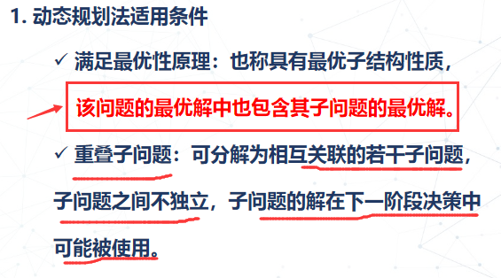
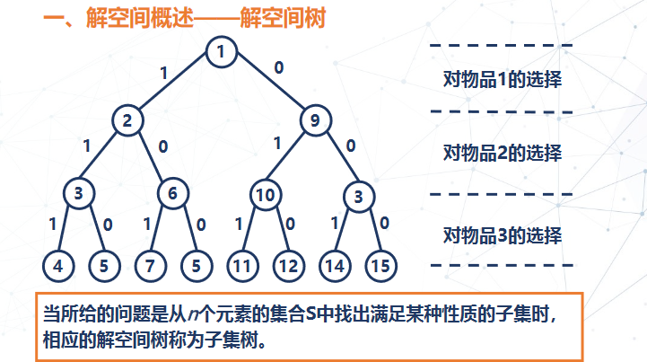
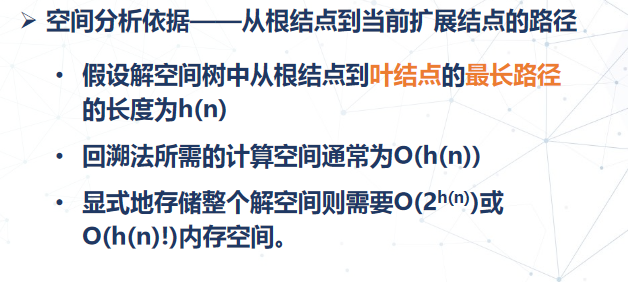

## 1. 分治法

### 1.1 设计思想

 


### 1.2 解题步骤


### 1.3 循环左移问题

```java
package com.keqi.divide_and_conquer;

import java.util.Scanner;

/**
 * 题目内容：
 *  设计分治算法实现将字符数组A[n]中所有元素循环左移k个位置,例如，对abcdefgh循环左移3位得到defghabc。
 *
 * 输入格式:
 *  第一行为数组长度n
 *  第二行为循环左移数k
 *  第三行为数组中元素
 *
 * 输出格式：
 *  循环左移k个位置后的结果
 *
 * 输入样例：
 * 8
 * 3
 * abcdefgh
 *
 * 输出样例：
 * defghabc
 */

public class test1 {
    public static void main(String[] args) {
        Scanner scanner = new Scanner(System.in);

        int str_len = scanner.nextInt();
        int i = scanner.nextInt();
        String str= scanner.next();

        /*char[] chars = new char[str_len];*/
        char[] s = str.toCharArray();
        // 普通
        /*for (int j = i; j < str_len; j++) {
            chars[j - i] = s[j];
        }
        for (int j = 0; j < i; j++) {
            chars[str_len - i + j] = s[j];
        }
        for (char c : chars) {
            System.out.print(c);
        }*/
        LeftReverse(s,0,i - 1);
        LeftReverse(s,i,str_len - 1);
        LeftReverse(s,0,str_len - 1);
        for (char c : s) {
            System.out.print(c);
        }
    }

    public static void LeftReverse(char[] a, int start, int end) {
        for (int i = 0; i < (end - start + 1)/2; i++) {
            char temp = a[end - i];
            a[end - i] = a[start + i];
            a[start + i] = temp;
        }
    }
}

/*
  cba hgfed
  defghabc
 */
```

> /*
>  ` cba hgfed`
>   `defghabc`
>  */
>
> 为什么三次交换 之后的效果是左移n个单位？

### 1.4 逆序数 归并排序

```java
package com.keqi.divide_and_conquer;

import java.util.Scanner;

/**
 * 题目内容：
 * 
 * 设a1, a2,…, an是集合{1, 2, …, n}的一个排列，如果i<j且ai>aj，则序偶(ai, aj)称为该排列的一个逆序。例如，2, 3, 1有两个逆序：(3, 1)和(2, 1)。设计算法统计给定排列中含有逆序的个数。
 * 
 * 输入格式:
 * 第一行输入集合中元素个数n，第二行输入n个集合元素
 * 
 * 输出格式：
 * 含有逆序的个数
 * 
 * 输入样例：
 * 3
 * 2 3 1
 * 
 * 输出样例：
 * 2
 */

public class test2 {
    private static int count = 0;
    private static int[] b = new int[1000];

    public static void main(String[] args) {
        Scanner scanner = new Scanner(System.in);
        int len = scanner.nextInt();
        int[] nums = new int[len];
        for (int i = 0; i < len; i++) {
            nums[i] = scanner.nextInt();
        }

        mergeSort(nums, 0, len - 1);
        System.out.println(count);
    }

    public static void mergeSort(int[] a, int b, int e) {
        if (b < e) {
            int mid = (b + e) / 2;
            mergeSort(a, b, mid);
            mergeSort(a, mid + 1, e);
            merge(a, b, mid, e);
        }
    }

    // a 0 0 1
    public static void merge(int[] a, int begin, int mid, int end) {

        int l = begin, m = mid + 1, r = end, n = 0;
        
        while (l <= mid && m <= r) {
            if (a[l] <= a[m]) {
                b[n++] = a[l];
                l++;
            } else {
                b[n++] = a[m];
                m++;
                count += mid - l + 1;
            }
        }
        
        // 添加上一个循环中没有添加到b中的元素
        while (l <= mid) {
            b[n++] = a[l++];
        }
        while (m <= r) {
            b[n++] = a[m++];
        }
        
        // 排序：使用辅助数组b给a排序
        for (int i = 0; i < n; i++) {
            a[begin++] = b[i];
        }
    }
}
```

> 测试：
>
> 7
> 4 3 1 6 5 5 2
> 10


## 2. 动态规划算法

### 2.1 适用情况

该问题的最优解也包含其子问题的最优解！  -- **最优性原理**

 

### 2.2 设计思想

 

### 2.3 与分治法的异同

 

### 2.4 动态规划法的设计步骤

 


> 正序求解
>
> 逆序求解

### 2.5 拦截炮弹问题

```java
/**
 * 是以后每一发炮弹都不能高于前一发的高度
 *
 * 输入格式：
 * 第一行，输入雷达捕捉到的敌国导弹的数量k（k<=25），第二行，输入k个正整数，表示k枚导弹的高度，按来袭导弹的袭击时间顺序给出，以空格分隔。
 *
 * 输出格式：
 * 输出只有一行，包含一个整数，表示最多能拦截多少枚导弹。
 *
 * 输入样例：
 * 8
 * 300 207 155 300 299 170 158 65
 *
 * 输出样例：
 * 6
 */
package com.keqi.dynamic_programming;

import java.util.Arrays;
import java.util.Scanner;

public class test1 {
    public static void main(String[] args) {
        Scanner scanner = new Scanner(System.in);
        int len = scanner.nextInt();
        int[] nums = new int[len];
        for (int i = 0; i < len; i++) {
            nums[i] = scanner.nextInt();
        }
        System.out.println(intercept(nums));
    }
    public static int intercept(int[] nums) {
        // dp记录当前i 的逆序炮弹数有多少，并不是记录最大逆序炮弹数量
        // 动态规划： 当当前i的高度小于上一个时，那么炮弹数为上一个的炮弹数+自己
        int[] dp = new int[nums.length];
        // 寻找i之前的 高度大于i的炮弹数
        for (int i = 0; i < nums.length; i++) {
            int max = 0;
            for (int j = 0; j < i; j++) {
                if (nums[i] <= nums[j] && dp[j] > max) {
                    max = dp[j];
                }
            }
            // 加上自己
            dp[i] = max + 1;
        }
        Arrays.sort(dp);
        return dp[nums.length - 1];
    }
//9
//300 207 155 300 299 170 158 65 400
}
```

### 2.6 新水果取名

**以前的水果名字`arr1`、`arr2`是新水果名`arr`的子序列**

**名字尽量短**

```java
/**
 * 题目内容：
 * 两种水果杂交出一种新水果，现在给新水果取名，要求这个名字中包含以前两种水果的字母，且名字尽量短，即：以前的水果名字arr1、arr2是新水果名arr的子序列，使用动态规划的思想设计算法得到新水果名arr。

 * 输入格式:
 * 以空格分开两个水果的名字
 *
 * 输出格式：
 * 新水果的名字
 *
 * 输入样例：
 * pear peach
 *
 * 输出样例：
 * pearch
 *
 * 输入样例：
 * peach pear
 *
 * 输出样例：
 * peachr
 */
package com.keqi.dynamic_programming;

import java.util.Arrays;
import java.util.Scanner;

public class test2 {
    private static String s1,s2;
    public static void main(String[] args) {
        Scanner scanner = new Scanner(System.in);
        s1 = scanner.next();
        s2 = scanner.next();

        newName(s1, s2);
        System.out.println("");
    }

    public static void newName(String s1, String s2) {

        int m = s1.length();
        int n = s2.length();
        int[][] dp = new int[m + 1][n + 1];
        int[][] comp = new int[m + 1][n + 1];
        findLCS(dp, comp);
        display(m, n, comp);

    }

    public static void findLCS(int[][] dp,int[][] comp) {

        // 边界条件
        for (int i = 0; i < dp.length ; i++) {
            dp[i][0] = 0;
        }
        Arrays.fill(dp[0], 0);

        //遍历arr1和arr2的所有字符
        for (int i = 1; i < dp.length; i++) {
            for (int j = 1; j < dp[0].length; j++) {
                //比较的字符相同,comp置为0
                if (s1.charAt(i - 1) == s2.charAt(j - 1) ) {
                    dp[i][j] = dp[i - 1][j - 1] + 1;
                    comp[i][j] = 0;
                } else if (dp[i - 1][j] > dp[i][j - 1]) {
                    //当前方格上方的方格大于左侧的方格，comp置为1
                    dp[i][j] = dp[i - 1][j];
                    comp[i][j] = 1;
                } else {
                    //当前方格上方的方格小于等于左侧的方格,comp置为2
                    dp[i][j] = dp[i][j - 1];
                    comp[i][j] = 2;
                }
            }
        }
    }

    public static void display(int i,int j,int[][] comp) {

        if (i == 0 && j == 0) {
            return;
        }
        if (i == 0) {
            display(i, j - 1, comp);
            System.out.print(s2.charAt(j - 1));
            return;
        } else if (j == 0) {
            display(i - 1, j, comp);
            System.out.print(s1.charAt(i - 1));
            return;
        }

        if (comp[i][j] == 0) {
            display(i - 1, j - 1, comp);
            System.out.print(s1.charAt(i - 1));
        } else if (comp[i][j] == 1) {
            display(i - 1, j, comp);
            System.out.print(s1.charAt(i - 1));
        } else {
            display(i, j - 1, comp);
            System.out.print(s2.charAt(j - 1));
        }
    }

}
```

> - 求`LCS`
>
>  `dp`:  (apple peach)
>
>  
>
> ```java
> //遍历arr1和arr2的所有字符
> for (int i = 1; i < dp.length; i++) {
>     for (int j = 1; j < dp[0].length; j++) {
>         //比较的字符相同,comp置为0
>         if (s1.charAt(i - 1) == s2.charAt(j - 1) ) {
>             // 字符相等，增加LCS长度
>             dp[i][j] = dp[i - 1][j - 1] + 1;
>             comp[i][j] = 0;
>         } else if (dp[i - 1][j] > dp[i][j - 1]) {
>             //当前方格上方的方格大于左侧的方格，comp置为1
>             //  当前字母的LCS小于上一个字母的，继承上一个字母的LCS
>             dp[i][j] = dp[i - 1][j];
>             comp[i][j] = 1;
>         } else {
>             //当前方格上方的方格小于等于左侧的方格,comp置为2
>             //  继承左侧，串s2
>             dp[i][j] = dp[i][j - 1];
>             comp[i][j] = 2;
>         }
>     }
> }
> ```

> - 递归输出新水果名
>
> comp: 状态 (apple peach)
>
>  
>
> ```java
> public static void display(int i,int j,int[][] comp) {
>     if (i == 0 && j == 0) {return;} // 0 0
>     if (i == 0) {
>         display(i, j - 1, comp);
>         System.out.print(s2.charAt(j - 1));
>         return;
>     } else if (j == 0) {
>         // 2 0
>         // 1 0
>         display(i - 1, j, comp);
>         System.out.print(s1.charAt(i - 1));
>         return;
>     }
>     if (comp[i][j] == 0) {
>         // 5 2
>         // 输出相等字符
>         // 3 1
>         display(i - 1, j - 1, comp);
>         System.out.print(s1.charAt(i - 1));
>     } else if (comp[i][j] == 1) {
>         // 输出s1中非LCS的字符
>         // 4 1
>         display(i - 1, j, comp);
>         System.out.print(s1.charAt(i - 1));
>     } else {
>         // comp[i][j] == 2
>         // 最后输出相应的字符，s2中的非LCS的字符
>         display(i, j - 1, comp);
>         System.out.print(s2.charAt(j - 1));
>     }
> }
> ```
>
> 


### 2.7 机器人路径规划

```java
/**
 * 题目内容：
 * 一个机器人只能向下和向右移动，每次只能移动一步，设计一个算法求机器人从（1,1）到（m，n）有多少条路径。

 * 输入格式:
 * 以空格分开m，n
 *
 * 输出格式：
 * 路径条数
 *
 * 输入样例：
 * 4 5
 *
 * 输出样例：
 * 35
 */
package com.keqi.dynamic_programming;

import java.util.Scanner;

public class test3 {
    public static void main(String[] args) {
        Scanner scanner = new Scanner(System.in);
        int m = scanner.nextInt();
        int n = scanner.nextInt();
        System.out.println(sumOfPath(m, n));
    }

    public static int sumOfPath(int m, int n) {

        int[][] dp = new int[m][n];
        dp[0][0] = 0;
        // 只能往右 下移动
        // 所以边界 路径条数为1
        for (int i = 1; i < m; i++) {
            dp[i][0] = 1;
        }
        for (int i = 1; i < n; i++) {
            dp[0][i] = 1;
        }
        for (int i = 1; i < m; i++) {
            for (int j = 1; j < n; j++) {
                // 只能往右 下移动，这个点的路径总数等于到达左边和上面的点的路径之和
                dp[i][j] = dp[i - 1][j] + dp[i][j - 1];
            }
        }
        return dp[m - 1][n - 1];
    }
}
```

## 3. 贪心

### 3.1 算法思想

 

 


### 3.2 设计思想

**贪心选择性质：**问题的整体最优解可以由一系列子问题的最优选择，既贪心选择得到。

 

### 3.3 与动态规划对比

 

### 3.4 求解畜栏问题

> **题目内容：**
>
> 有n头牛（1<=n<=50,000)要挤奶。给定每头牛挤奶的时间区间[A,B](1<=A<=B<=1,000,000，A,B为整数)。牛需要呆在畜栏里才能挤奶。一个畜栏同一时间只能容纳一头牛。问至少需要多少个畜栏，才能完成全部挤奶工作，以及每头牛都放哪个畜栏里？注意：在同一个畜栏的两头牛，它们挤奶时间区间不能在端点重合。
>
> **输入格式:**
>
> 第1行：一个正整数N； 
>  第2..N+1行：第i+1行的两个整数给出第i头奶牛的挤奶时间。
>
> **输出格式：**
>
> 第1行：需要畜栏的最小数；
>  第2..N+1行：第i+1行表示第i头奶牛被分配到的畜栏序号
>
> **输入样例：**
>
> 5
>
> 1 10
>
> 2 4
>
> 3 6
>
> 5 8
>
> 4 7
>
> **输出样例：**
>
> 4
>
> 1
>
> 2
>
> 3
>
> 2
>
> 4

```java
//以结束时间为标志，每次从第一个开始循环访问每个畜栏，碰到合适的立刻放入，然后下一头牛重新开始循环，直到每头牛都完成挤奶
package com.keqi.greedy;

import java.util.Scanner;

public class test1 {
    public static void main(String[] args) {
        Scanner scanner = new Scanner(System.in);
        int n = scanner.nextInt(); // 牛数量
        int[][] time = new int[2][n];
        for (int i = 0; i < n; i++) {
            time[0][i] = scanner.nextInt();
            time[1][i] = scanner.nextInt();
        }
        int cl[] = new int[n];
        int ccl[] = new int[n];
        for (int i = 0; i < n; i++) {
            ccl[i] = 0;
        }
        int j = 0;
        int min = 0;  // 最少畜栏数量
        for (; j < n; j++) { // 循环  牛
            for (int i = 0; i < n; i++) {  // 循环畜栏
                if (time[0][j] > ccl[i]) {
                    cl[j] = i + 1;
                    if (cl[j] > min) {
                        min = cl[j];
                    }
                    ccl[i] = time[1][j];
                    break;
                }
            }
        }
        System.out.println(min);
        for (int i : cl) {
            System.out.println(i);
        }
    }
}

```

### 3.5 畜栏问题 + 优先队列

```java
package com.keqi.greedy;

import java.util.Arrays;
import java.util.Comparator;
import java.util.PriorityQueue;
import java.util.Scanner;

public class test1_queue {
    public static void main(String[] args) {
        PriorityQueue<Cow1> pq = new PriorityQueue<Cow1>(cc);
        Scanner sc = new Scanner(System.in);
        int n = sc.nextInt();
        Cow1[] c1 = new Cow1[n];

        for (int i = 0; i < c1.length; i++) {
            c1[i] = new Cow1();
            c1[i].starting = sc.nextInt();
            c1[i].entire = sc.nextInt();
            c1[i].number = i + 1;
        }
        sc.close();

        // 通过Cow1 的比较， 按开始时间排序
        Arrays.sort(c1, new Cow1());
        int index = 1;  //  畜栏的数量
        c1[0].x = 1;    //  x：   牛在哪一个畜栏
        pq.add(c1[0]);  //  加入优先队列，加入的对象会按照 结束时间 小到大排列   cc

        for (int i = 1; i < c1.length; i++) {
            // assert 断言
            // peek element queue[0] 选取队列中头元素（优先级最高的） [peek 没有返回null  element 报异常]
            // poll remove 获取并删除   [前者 null  后者异常]
            // offer add   添加        [前者 false 后者异常]
            assert pq.peek() != null;
            if (c1[i].starting > pq.peek().entire) {
                c1[i].x = pq.peek().x;
                pq.remove();
                pq.add(c1[i]);
            } else {
                index++;
                c1[i].x = index;
                pq.add(c1[i]);
            }
        }

        // 按照number排序，  number，牛最开始的顺序
        Arrays.sort(c1, ccs);
        System.out.println(index);
        for (Cow1 cow1 : c1) {
            System.out.println(cow1.x);
        }

    }

    // 实例化接口的匿名实现类
    static Comparator<Cow1> ccs = new Comparator<Cow1>() {
        public int compare(Cow1 c1, Cow1 c2) {
            if (c1.number > c2.number) return 1;
            return -1;
        }
    };

    // 实例化接口的匿名实现类
    static Comparator<Cow1> cc = new Comparator<Cow1>() {
        @Override
        public int compare(Cow1 c1, Cow1 c2) {
            if (c1.entire > c2.entire)
                return 1;
            return -1;
        }
    };
}

// Comparator<Cow1>  两方法：compare   equals
// Comparable,提供了一个比较的方法
class Cow1 implements Comparator<Cow1> {
    int starting;
    int entire;
    int number;
    int x;

    public int compare(Cow1 c1, Cow1 c2) {
        if (c1.starting > c2.starting)
            return 1;
        return -1;
    }
}
```

### 3.6 区间覆盖问题

> **题目内容：**
>
> 设`x1,x2,... ,xn`是实直线上的n个点。用固定长度的闭区间覆盖这n个点，至少需要多少个这样的固定长度闭区间?设计求解此问题的有效算法。对于给定的实直线上的n个点和闭区间的长度k，编程计算覆盖点集的最少区间数。
>
> **输入格式:**
>
> 输入数据的第一行有2个正整数n和k，表示有n个点，且固定长度闭区间的长度为k。接下来的1行中，有n个整数，表示n个点在实直线上的坐标（可能相同）。
>
> **输出格式：**
>
> 将编程计算出的最少区间数输出。
>
> **输入样例：**
>
> 7 3
>
> 1 2 3 4 5 -2 6
>
> **输出样例：**
>
> 3

```java
package com.keqi.greedy;

import java.util.Arrays;
import java.util.Scanner;

public class test2 {
    public static void main(String[] args) {
        Scanner scanner = new Scanner(System.in);
        int n = scanner.nextInt();
        int k = scanner.nextInt();
        int[] nums = new int[n];
        for (int i = 0; i < n; i++) {
            nums[i] = scanner.nextInt();
        }
        Arrays.sort(nums);

        int begin = nums[0];
        int answer = 1;
        for (int num : nums) {
            if (num - begin > k) {
                answer++;
                begin = num;
            }
        }
        System.out.println(answer);
    }
}
```

## 4. 回溯法

### 4.1 算法思想

   


**解空间**  

 

 


### 4.2 与其他算法比较

 

### 4.3 时空复杂度

 

 

### 4.4 最小机器重量设计问题

> **题目内容：**
>
> 设某一机器由n个部件组成,部件编号为1~n，每一种部件都可以从m个不同的供应商处购得，供应商编号为1~m。设`wij`是从供应商j处购得的部件i的重量,`cij`是相应的价格。对于给定的机器部件重量和机器部件价格，计算总价格不超过d的最小重量机器设计。（注意：输出结果中第一行最后没有空格。比如下面的输出样例中1 3 1后面没有空格。）
>
> **输入格式:**
>
> 第1行输入3个正整数n,m和d。接下来n行输入`wij`（每行m个整数），最后n行输入`cij`（每行m个整数）,这里1≤n、m≤100。
>
> **输出格式：**
>
> 输出的第1行包括n个整数，表示每个对应的供应商编号，第2行为对应的最小重量。
>
> **输入样例：**
>
> 3 3 7                # 三个部件（1 2 3） 三个供应商（1 2 3）    总价格 7 
>
> 1 2 3                # 前三行： `wij`： 从供应商j处，购买部件i的重量    
>
> 3 2 1                   **行为物品   列为供应商**
>
> 2 3 2
>
> 1 2 3                #  这三行，   是对应的价格
>
> 5 4 2					j         i          c
>
> 2 1 2
>
> **输出样例：**
>
> 1 3 1
>
> 4

```java
/*
3 3 7
1 2 3
3 2 1
2 3 2
1 2 3
5 4 2
2 1 2
 */


package com.keqi.traceback;

import java.util.*;

public class test1 {
    private static int[][] w = new int[100][100]; // wij  重量
    private static int[][] c = new int[100][100]; // cij  价格
    private static int[] bestx = new int[100];    // 存放第i个零件的供应商，一次搜索到底后的最优解
    private static int[] x = new int[100];        // 临时存放第i个零件的供应商
    private static int cw = 0, cc = 0, bestw = 10000;
    private static int cost;
    private static int n;
    private static int m;

    public static void main(String[] args) {
        Scanner scanner = new Scanner(System.in);
        n = scanner.nextInt();
        m = scanner.nextInt();
        cost = scanner.nextInt();

        for (int i = 1; i <= n; i++) {
            for (int j = 1; j <= m; j++) {
                w[i][j] = scanner.nextInt();
            }
        }

        for (int i = 1; i <= n; i++) {
            for (int j = 1; j <= m; j++) {
                c[i][j] = scanner.nextInt();
            }
        }

        Backtrack(1);

        for (int i = 1; i <= n; i++) {
            if (i != 1) {
                System.out.print(" ");
            }
            System.out.print(bestx[i]);
        }
        System.out.println();
        System.out.println(bestw);
    }

    public static void Backtrack(int t) {
        int j;
        if (t > n) {  //搜索到叶子结点，一个搜索结束，所有零件已经找完
            bestw = cw;  //当前最小重量
            for (j = 1; j <= n; j++) {
                bestx[j] = x[j];
            }
        } else {
            for (j = 1; j <= m; j++) {
            	//  小于bestw 也会被剪枝
                if (cc + c[t][j] <= cost && cw + w[t][j] < bestw) {
                    x[t] = j;
                    cc += c[t][j];
                    cw += w[t][j];
                    Backtrack(t + 1);
                    cc -= c[t][j];
                    cw -= w[t][j];
                }
            }
        }
    }
}
```


### 4.5 求解部分和

> **题目内容：**
>
> 给出N个正整数组成的数组A，求能否从中选出若干个，使他们的和为K。如果可以，输出："YES"，否则输出"NO"。
>
> **输入格式:**
>
> 第1行：2个数N、K, N为数组的长度, K为需要判断的和(2 ≤N ≤ 20，1 ≤ K ≤ 10^9) 
>
> 第2 到第 N + 1行：每行1个数，对应数组的元素A[i] (1 ≤ A[i]≤ 10^6)
>
> **输出格式：**
>
> 如果可以，输出："YES"，否则输出"NO"。 
>
> 样例输入 
>
> 4 13 
>
> 1
>
> 2
>
> 4
>
> 7 
>
> 样例输出 
>
> YES 

```java
package com.keqi.traceback;

import java.util.Arrays;
import java.util.Scanner;

public class test2 {
    private static int[] nums;
    private static boolean flag;
    
    public static void main(String[] args) {
        Scanner scanner = new Scanner(System.in);
        int len = scanner.nextInt();
        int k = scanner.nextInt();
        nums = new int[len];
        for (int i = 0; i < len; i++) {
            nums[i] = scanner.nextInt();
        }
        PartialSum(0, k);
        if (flag) {
            System.out.println("YES");
        } else {
            System.out.println("NO");
        }

    }
    public static void PartialSum(int i, int k) {
        if (k == 0) flag = true;
        if (i >= nums.length || flag) return ;
        PartialSum(i + 1, k - nums[i]); 
        PartialSum(i + 1, k);
    }

//    public static boolean PartialSum(int[] nums, int k) {
//        Arrays.sort(nums);
//        int m;
//        for (int i = nums.length - 1; i >= 0 ; i--) {
//            if (k > nums[i] && k > 0) {
//                m = k - nums[i];
//                int[] nums1 = new int[nums.length - 1];
//                System.arraycopy(nums, 0, nums1, 0, i);
//                if (PartialSum(nums1, m)) {
//                    return true;
//                }
//            } else if (k == nums[i]) {
//                return true;
//            }
//        }
//        return false;
//    }

}
```

## 5. 分枝限界法

### 5.1 设计思想

 

 

### 5.2 与回溯法的异同

 

### 5.3 设计步骤

 


### 5.4 时空复杂度

 


 

### 5.5 迷宫问题

> **题目内容：**
>
> 定义一个二维数组，例如： 
>
> int maze\[5][5] = {
>
> ​        0, 1, 0, 0, 0,
>
> ​        0, 1, 0, 1, 0,
>
> ​        0, 0, 0, 0, 0,
>
> ​        0, 1, 1, 1, 0,
>
> ​        0, 0, 0, 1, 0,
>
> };
>
> 它表示一个迷宫，其中的1表示墙壁，0表示可以走的路，只能横着走或竖着走，不能斜着走，要求编程序找出从左上角到右下角的最短路线。
>
> **输入格式:**
>
> 一个5 × 5的二维数组，表示一个迷宫。数据保证有唯一最短路径。
>
> **输出格式：**
>
> 左上角到右下角的最短路径，格式如样例所示。
>
> **输入样例：**
>
> 0 1 0 0 0
>
> 0 1 0 1 0
>
> 0 0 0 0 0
>
> 0 1 1 1 0
>
> 0 0 0 1 0
>
> **输出样例：**
>
> (0,0)
>
> (1,0)
>
> (2,0)
>
> (2,1)
>
> (2,2)
>
> (2,3)
>
> (2,4)
>
> (3,4)
>
> (4,4)

```java
package com.keqi.branch_bound;

import java.util.*;

public class test1 {
    static int[][] map = new int[5][5];
    static int[][] vis = new int[5][5];
    static int[][] move = {{0,1},{0,-1},{1,0},{-1,0}};
    static Node[] q = new Node[20];

    static void bfs() {
        int head = 0;
        int tail = 0;
        q[tail] = new Node(0,0,-1);
        vis[0][0] = 1;
        tail++;
        while(head < tail) {
            boolean flag = false;//找没找到终点
            for(int i = 0;i < 4;i++) {
                int nx = q[head].x + move[i][0]; // 横轴是y，竖轴是x
                int ny = q[head].y + move[i][1];
                if(check(nx,ny)) {
                    vis[nx][ny] = 1;
                    q[tail] = new Node(nx,ny,head);
                    tail++;
                }
                if(nx == 4 && ny == 4) {
                    flag = true;
                    break;
                }
            }
            if(flag) {
                print(q[tail - 1]);
                break;
            }
            head++;
        }
    }

    static void print(Node node) {
        if (node.pre != -1) {
            print(q[node.pre]);
        }
        System.out.println("(" + node.x + ", " + node.y + ")");
    }

    static boolean check(int x,int y) {
        return x >= 0 && x < 5 && y >= 0 && y < 5 && vis[x][y] != 1 && map[x][y] != 1;
    }

    public static void main(String[] args) {
        Scanner cin = new Scanner(System.in);
        for(int i = 0;i < 5;i++)
            for(int j = 0;j < 5;j++)
                map[i][j] = cin.nextInt();
        for(int i = 0;i < 20;i++)
            q[i] = new Node();
        bfs();
    }
}
class Node {
    int x,y,pre;//来到此点的出发点
    Node() {}
    Node(int x,int y,int pre) {
        this.x = x;
        this.y = y;
        this.pre = pre;
    }
}
//0 1 0 0 0
//0 1 0 1 0
//0 0 0 0 0
//0 1 1 1 0
//0 0 0 1 0
```

