# Docker

基础知识：linux  + git

go语言编写 -- (k8s-------)


## 出现背景

开发与运维之间的环境差异

> 代码
>
> 代码 + 映像：运行文档 + 配置环境 + 运行环境 + 运行依赖包 + 操作系统发行版

传统上，即便开发团队准备完整的部署文件，仍然有部署失败的状况。

Docker镜像的设计，是的Docker得以打破过去的观念。透过镜像(images)将作业系统核心除外，运作应用程式所需要的系统环境，由下而上打包，达到应用程式跨平台的无缝接轨运作。

docker理念：一次构建，处处运行。    类似java

docker是解决了运行环境和配置问题的软件容器，方便做持续集成并有助于整体发布的虚拟化技术


虚拟机技术：

- 资源多
- 启动慢
- 冗余步骤多

容器虚拟化技术：

- 秒级启动速度

1.官方文档  https://docs.docker.com/

2.Docker hub   https://hub.docker.com/     --类似 github


## Docker安装

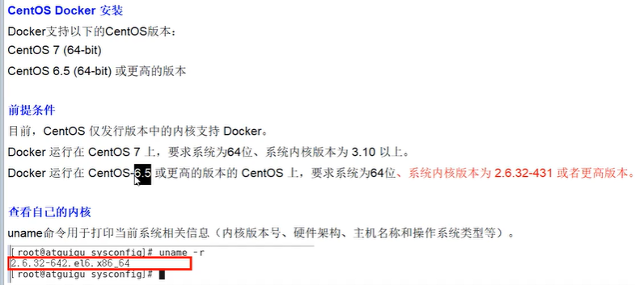

```
// 打印当前系统相关信息 uname
uname -r // 查看内核版本
cat /etc/redhat-release   // 查看操作系统版本
```

### 三要素

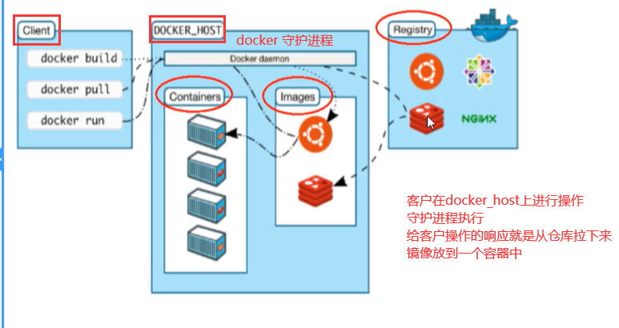

Docker镜像（image)就是一个只读的模板，镜像可以用来创建Docker容器。

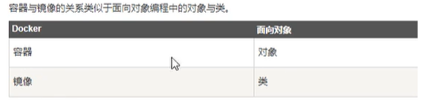

容器：

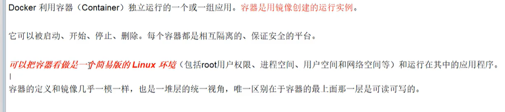

仓库：

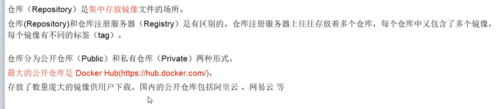


### 安装

OS： centos7.6

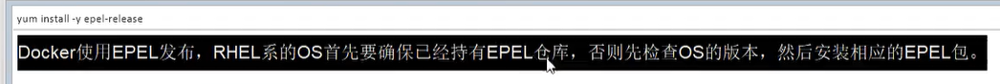


1、删除原有docker

```shell
yum remove docker \
                  docker-client \
                  docker-client-latest \
                  docker-common \
                  docker-latest \
                  docker-latest-logrotate \
                  docker-logrotate \
                  docker-engine
```

2、在新主机上首次安装Docker Engine之前，需要设置Docker存储库。之后，您可以从存储库安装和更新Docker,安装yum-utils包（提供yum-config-manager实用程序）并设置稳定的存储库。

```shell
yum install -y yum-utils

yum-config-manager \
    --add-repo \
    https://download.docker.com/linux/centos/docker-ce.repo
# 使用阿里云的仓库
yum-config-manager --add-repo=http://mirrors.aliyun.com/docker-ce/linux/centos/docker-ce.repo

# 查看是否配置好仓库
cd /etc/yum.repos.d/docker-ce.repo
```

3、安装最新docker引擎和容器

```shell
yum install docker-ce docker-ce-cli containerd.io
```

4、启动docker

```shell
 sudo systemctl start docker
```

5、验证docker是否安装成功

```shell
 sudo docker run hello-world
 
 docker version
```


### 配置镜像加速

1、创建配置目录

`mkdir -p /etc/docker`

2、配置daemon.json

`vim /etc/docker/daemon.json`

我的阿里云：

`{"registry-mirrors": ["https://zo2jb9d1.mirror.aliyuncs.com"]}`

`https://zo2jb9d1.mirror.aliyuncs.com`

3、重新加载daemon.json

```
sudo systemctl daemon-reload
```

4、重启docker

`systemctl restart docker`


daemon.json 配置出错

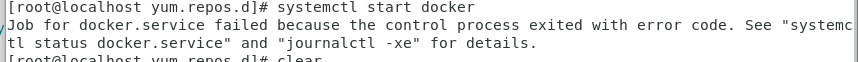


```dockerfile
docker images # 查看所有镜像

docker info # 可以查看配置镜像加速是否成功

docker search tomcat # 查找

ps -ef| grep docker # 查进程 ?
```

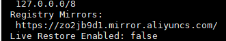


### hello,world

```
docker run hello-world
```

docker run 一个镜像，本地没有就回去远程pull

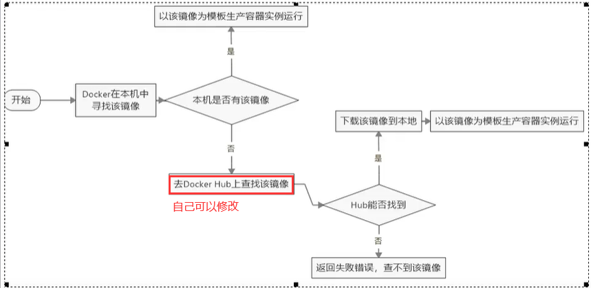


:latest 是标签，一般不写

hello-world:latest 


## Docker底层原理

Docker是一个Client-Server结构的系统，Docker守护进程运行在主机上，然后通过Socket连接从客户端访问，守护进程从客户端接收命令并管理运行在主机上的容器。


Docker：不需要使用Hypervisor实现硬件资源虚拟化

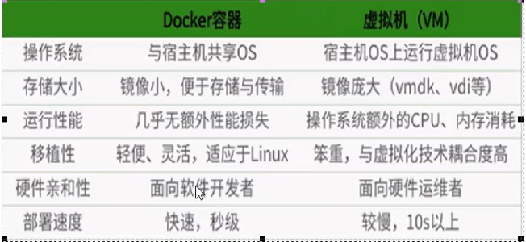


## Docker命令

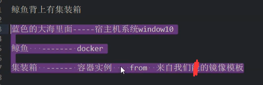

### Docker帮助命令

```shell
docker info

docker version

docker --help   # docker 帮助命令

man ls # linux 帮助命令
```


### Docker镜像命令

```shell
docker images    # 查看本地镜像模板
	           -a   # all 含有中间镜像
	           -q   # 只显示当前镜像ID
	           -qa
	           --digests # 显示摘要信息
	           --no-trunc #显示完整image_id
	                  
docker search tomcat # 在docker hub 上去查找，配置阿里云后会在阿里云下载
docker search -s 30 tomcat # stars 数大于30
              --no-trunc #显示完整信息
              
# 下载镜像
docker pull tomcat == docker pull tomcat:latest

# 删除镜像
docker rmi hello-world
docker rmi -f hello-world #强制删除
              hello-world nginx # 删除多个
              $(docker images -q) # 删除全部 -qa
```


### Docker容器命令

```shell
# 新建并启动容器
docker run [options] image [command] [args]
docker run -it (image id)  # -i: 交互  -t: 伪终端  镜像实例->容器
	                       # --name: 别名
docker run -it --name mycentos centos	                       
# 列出所有运行的容器
docker ps   # 查看docker正在运行的容器
          -l  # 上一次运行的容器
          -q  # 只显示容器编号
          -a  # 当前运行和历史运行的所有容器
          -n  # 显示最近创建的n个容器  dockers ps -n 3
          --no-trunc # 不截断输出  （输出全部信息）
          
ps -ef  # 查看linux启动的进程吧

# 退出容器
exit    # 在该容器下

ctrl p q  # 在该容器下，退出，并不关闭

# 容器启动
docker start containerId

docker restart containerId # 重启

docker stop containerId # 关闭容器
dcoker kill containerId # 强制停止

# 删除容器
docker rm containerId  # 删除容器  rmi 删除镜像
docker rm - f containerId #强制删除 （在运行的情况下）

docker rm -f $(docker ps -qa) # 删除所有容器
docker ps -qa | xargs docker rm # | linux管道符：将上一个命令的参数
                                #               传给xargs

```

**重要**

1、守护进程启动

```shell
# 以守护式进程启动
docker run -d imageNameOrId

问题：然后使用docker ps 查看，没有
           docker ps -a，发现容器已经退出
           :: Docker容器后台运行，就必须有一个前台进程
           :: 容器运行的命令如果不是那些一直挂起的命令(比如运行top，tail)
              ，就会自动退出的。


```

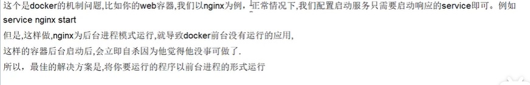

`docker run -d centos /bin/sh "while true;do echo hello;sleep 2;done"`

2、查看容器日志：

`docker logs -f -t --tail containerId`

- -t 是加入时间戳
- -f 跟随最新的日志打印,不停追加
- --tail 数字，显示最后多少条

3、查看容器内运行的进程

`docker top containerId`

4、查看容器内部细节：

`docker inspect containerId`

5、进入正在运行的容器并用命令行交互：

进入容器

`docker  attach  containerId`

直接得到结果，或者进入容器

`docker exec -t containerId ls -l /tmp`

`dokcer exec -it containerId /bin/bash`

6、从容器内拷贝内容到主机

`docker cp containerId:/tmp/yum.log /root`


## Docker 镜像

### 镜像原理

Union 联合文件系统

```
bootfs boot file system:包含bootloader、kernel,bootloader引导加载
kernel。docker的底层是bootfs，与linux一致

rootfs root file system:各种linux操作系统发行版 Ubuntu、Centos

docker共用bootfs内核，
```

分层镜像

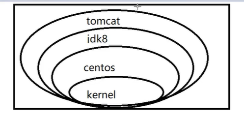

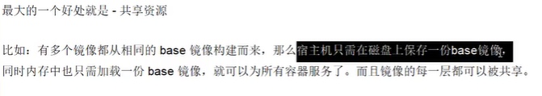

每个镜像的每一层都可以被共享


docker镜像都是只读的，当容器启动时，一个新的可写层被加载到镜像的顶部。

这一层通常被称作"容器层"，"容器层"之下的都叫"镜像层"


### 镜像commit

docker commit -m="描述" -a="作者" 容器id 要创建的目标镜像名(包名+类名):标签

`docker commit -m="tomcat without docs" -a="keqi" containerId athome/mytomcat:1.2`

```
docker run -it -p 8080:8080 tomcat 
# 第一个8080为本机端口， 注意打开防火墙
# 第二个为docker的tomcat端口
# -P 大写p随机分配端口

镜像不可更改 --- 更改的是容器，
```

后台运行tomcat：

`docker run -d -p 6666:8000 tomcat`


## 容器数据卷

#### 1、 数据卷是什么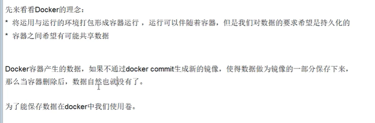

#### 2、数据卷能做什么

容器持久化

可以完成容器到主机、主机到容器、容器之间的数据通信

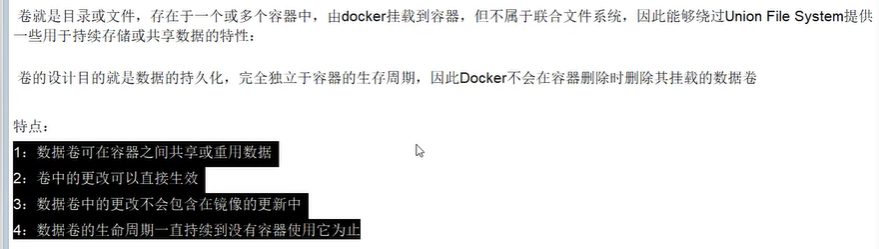

#### 3、v命令添加容器数据卷volumes

```
docker run -it centos /bin/bash

docker run -it -v 主机绝对路径:容器下的路径 镜像名字
docker run -it -v /myDataVolume:/dataVolumeContainer centos

docker inspect 容器 # 查看数据卷是否挂载成功

挂载成功后，自动创建目录且数据实现共享
容器退出后，主机修改数据仍然同步

权限:
docker run -it -v 主机绝对路径:容器下的路径:ro 镜像名字 # readonly 只读
主机上的修改可以传到容器中，
容器不能对文件进行修改，只能查看文件

```

#### 4、DockerFile添加容器数据卷

JavaEE      he.java   --->   he.class  :对.java文件的描述

Docker     image    ---->   DockerFile ：对镜像的源码级描述

1. 新建目录mydocker并进入

2. 使用VOLUME命令构建Dockerfile文件

   ```dockerfile
   #volume test
   FROM centos  # 这里基于centos镜像，类似继承
   VOLUME["/dataVolumeContainer1","/dataVolumeContainer2"]
   CMD echo "success"
   CMD /bin/bash
   ```

   

3. build成为一个新的镜像模板

   `docker build -f /mydocker/Dockerfile ` -t keqi/centos .

   docker images 查看

4. run这个镜像

   `docker run -it keqi/centos`

可以在docker inspect 查看权限和主机默认路径

`docker run -it -v /host:/container imageId --privileged=true`

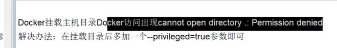


### 5、数据卷容器

简单来说就是用来实现父容器与子容器之间的数据共享

依靠`--volumes-from`实现

`docker run -it --name dc02 --volumes-from do01 keqi/centos`


## DockerFile

### 1、dcokerfile是什么

dockerfile是用来构建docker镜像的构建文件，是由一系列命令和参数构成的脚本

### 2、构建过程解析

**构建步骤：**

1 编写dockerfile  

2 docker build 执行，获取自定义镜像

3 run

**查看dockerfile文件   centos镜像**

`https://github.com/CentOS/sig-cloud-instance-images/blob/b2d195220e1c5b181427c3172829c23ab9cd27eb/docker/Dockerfile`

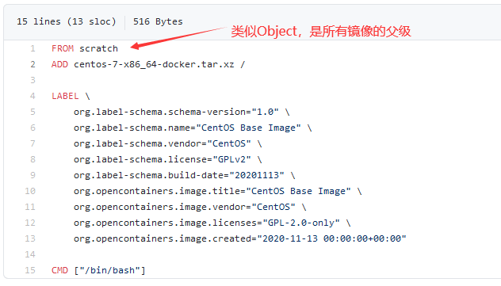

**dockerfile内容基础知识：**

每条指令都会创建一个新的镜像层，并对镜像进行提交

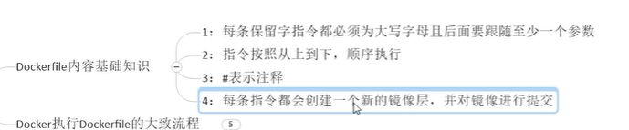

**docker执行dockerfile的大致流程：**

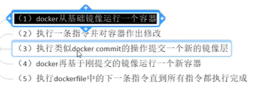


dockerfile面向开发，docker镜像成为交付标准，docker容器则涉及部署与运维，三者缺一不可，合力充当docker体系的基石。


### 3、dockerfile体系结构 （保留字指令）

#### 1.保留字指令

```
FROM: 当前镜像基于哪个镜像   Base镜像（scratch）
MAINTAINER: 镜像维护者的姓名和邮箱
RUN: 容器构建时需要运行的命令
EXPOSE: 暴露服务的端口
WORKDIR: 指定进入docker的目录地址
ENV: 设置环境中的环境变量
ADD: 拷贝 + 解压
COPY: 拷贝
VOLUME: 容器数据卷
CMD: 指定一个容器启动时要运行的命令 -- 只有最后一个生效
ENTRYPOINT: 指定一个容器启动时要运行的命令 -- 追加
ONBUILD: 当构建一个被继承的dockerfile时运行命令，父镜像          在被子镜像继承后父镜像的onbuild被触发
```


#### 2.案例 mycentos

要求： 登陆后默认路径更改、可以使用vim、支持查看网络配置ifconfig   (记得测试以下ip addr)

步骤：

1、编写dockerfile

*注意：在docker build时，所有的cmd命令都会运行；在run时，cmd命令会覆盖*

CMD ： json串格式，[" ", " "]

```dockerfile
FROM centos
MAINTAINER keqi<forgitdfff@hhe.com>

ENV MYPATH /usr/local
WORKDIR $MYPATH

RUN yum -y install vim
RUN yum -y install net-tools

EXPOSE 80

CMD echo $MYPATH
CMD echo "success"
CMD /bin/bash
```

2、build

```shell
cd /             # 到一个目录
vim  dockerfile  # 创建并修改文件
docker build -f /src/... -t mycentos:12.1 .
	-f   # dockerfile文件目录
	-t   # build的镜像名字及版本

```

3、run

```shell
docker run -it mycentos:12.1
```

4、查看镜像历史

`docker history ` iamgeId


#### 3、案例 CMD-ENTRYPOINT

##### curl命令

`curl http://www.baidu.com` 返回html

http://www.cip.cc

-s: 

 -i: 报文头

##### DockerFile文件

```dockerfile
FROM centos
RUN yum -y install curl
CMD ["curl", "s", "http://ip.cn"]

```

##### build、run

在使用docker run -it name -i

-i 会替换CMD，从而报错


将CMD改为ENTRYPOINT ，

在run后面加参数时就会将参数添加到entrypoint命令里


#### 4、案例 ONBUILD

trigger  ，  触发器

`ONBUILD RUN echo "father onbuild -- run"`

 

#### 5、案例 ADD和COPY   tomcat

```shell
FROM centos
MAINTAINER keqi<1@qq.com>
COPY c.txt /usr/local/cincont.txt
ADD jdk-8u171-linux-x64.tar.gz /usr/local/
ADD apache-tomcat-9.0.8.tar.gz /usr/local/
RUN yum -y install vim
ENV MYPATH /usr/local
WORKDIR $MYPATH
ENV JAVA_HOME /usr/local/jdk
ENV CLASSPATH $JAVA_HOME/lib/dt.jar:$JAVA_HOMT/lib/tools.jar
ENV CLASSPATH_HOME /usr/local/apache-tomcat
ENV CLASSPATH_BASE /usr/local/apache-tomcat
ENV PATH $PATH:$JAVA_HOME/bin:$CATALINA_HOME/lib:$CATALINA_HOME/bin
EXPOSE 8080
CMD /usr/local/apache-tomcat/bin/startup.sh
```

#### 6、总结

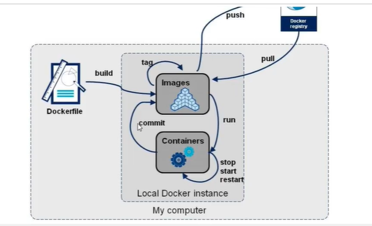


## Docker常用安装

### 1、tomcat

在tomcat下，webapps目录下没有东西，将webapps.dist下的东西赋值到webapps下     

rm -rf webapps

mv webapps.dist webapps


### 2、mysql

1、 docker pull mysql:8.0.22

2、docker run -itd --name mysql_test -p 3306:3306 -e MYSQL_ROOT_PASSWORD=123456 mysql:8.0.22

3、docker exec -it containerId /bin/bash

4、mysql -h localhost -u root -p 123456

### 3、redis

### 4、nginx


## Docker镜像推送到aliyun

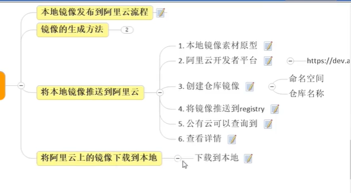

```
https://www.bilibili.com/video/BV1Ls411n7mx?p=33&spm_id_from=pageDriver
```


1、登录阿里云，创建账号，开通个人镜像服务

2、创建仓库

3、推送仓库

> ##### 1. 登录阿里云Docker Registry
>
> ```
> $ docker login --username=for**** registry.cn-hangzhou.aliyuncs.com
> ```
>
> 用于登录的用户名为阿里云账号全名，密码为开通服务时设置的密码。
>
> 您可以在访问凭证页面修改凭证密码。
>
> ##### 2. 从Registry中拉取镜像
>
> ```
> $ docker pull registry.cn-hangzhou.aliyuncs.com/keqi/test_docker:[镜像版本号]
> ```
>
> ##### 3. 将镜像推送到Registry
>
> ```
> $ docker login --username=for**** registry.cn-hangzhou.aliyuncs.com$ docker tag [ImageId] registry.cn-hangzhou.aliyuncs.com/keqi/test_docker:[镜像版本号]$ docker push registry.cn-hangzhou.aliyuncs.com/keqi/test_docker:[镜像版本号]
> ```
>
> 请根据实际镜像信息替换示例中的[ImageId]和[镜像版本号]参数。
>
> ##### 4. 选择合适的镜像仓库地址
>
> 从ECS推送镜像时，可以选择使用镜像仓库内网地址。推送速度将得到提升并且将不会损耗您的公网流量。
>
> 如果您使用的机器位于VPC网络，请使用 registry-vpc.cn-hangzhou.aliyuncs.com 作为Registry的域名登录。
>
> ##### 5. 示例
>
> 使用"docker tag"命令重命名镜像，并将它通过专有网络地址推送至Registry。
>
> ```
> $ docker imagesREPOSITORY                                                         TAG                 IMAGE ID            CREATED             VIRTUAL SIZEregistry.aliyuncs.com/acs/agent                                    0.7-dfb6816         37bb9c63c8b2        7 days ago          37.89 MB$ docker tag 37bb9c63c8b2 registry-vpc.cn-hangzhou.aliyuncs.com/acs/agent:0.7-dfb6816
> ```
>
> 使用 "docker push" 命令将该镜像推送至远程。
>
> ```
> $ docker push registry-vpc.cn-hangzhou.aliyuncs.com/acs/agent:0.7-dfb6816
> ```

## 


## Bug

1、开机没有自动启动

2、daemon.json编写错误


## Docker 部署springboot项目

1、准备jar包

2、编写dockerfile文件

```dockerfile
FROM centos:7
FROM mysql:8.0.18

MAINTAINER keqi

# 为Dockerfile中所有RUN、CMD、ENTRYPOINT、COPY和ADD指令设定工作目录
WORKDIR /usr

# 执行命令(这里创建了一个目录)
RUN mkdir /usr/local/java

# 和copy一样，复制文件到指定目录，但是copy不能解压，add自动解压
ADD jdk-8u301-linux-x64.tar.gz /usr/local/java

# 重命名(不知道文件名可以现在宿主机解压后看一下)
RUN ln -s /usr/local/java/jdk1.8.0_301 /usr/local/java/jdk 

# 设置环境变量 
ENV JAVA_HOME /usr/local/java/jdk 
ENV JRE_HOME ${JAVA_HOME}/jre 
ENV CLASSPATH .:${JAVA_HOME}/lib:${JRE_HOME}/lib 
ENV PATH ${JAVA_HOME}/bin:$PATH

EXPOSE 3306
EXPOSE 8082
# 创建一个目录
RUN mkdir /demo
# 将jar包copy到指定目录
ADD app.jar /demo/app.jar
# 启动命令
ENTRYPOINT ["java","-jar","/demo/app.jar"] 
```

3、build run


注意：run时，-p 8082:8082 ,后面的端口号要与你的项目端口号一致，

另： 如果docker run 的时候没有加 --restart=always ，然后已经运行的docker容器怎么设置自动重启？ 执行下面命令：

```powershell
docker update –-restart=always demo 
```


`docker cp /usr/local/testJavaProject/test01.war 9fccf0236619:/usr/local/tomcat/webapps`

