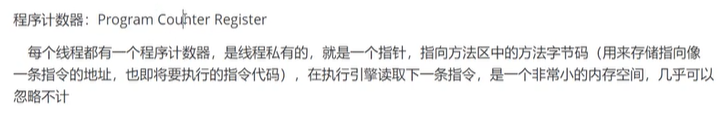
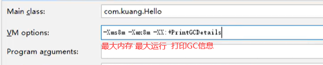
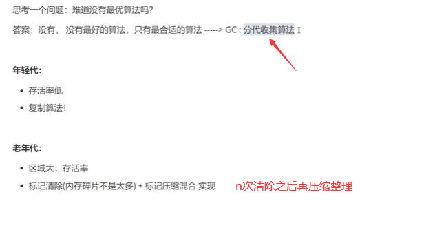

# JVM探究

 

## 1.jvm体系结构

### 1.1 jvm的位置

> jvm本身也是一个进程

 

### 1.2jvm体系结构

 

>  
>
> GC、解释器在执行引擎中。

### 1.3 类加载器

**回顾面向对象：**

 

 

> 注意：new 一个对象，对象名字在栈中，使用这个对象时会通过栈中指向堆中的地址去找堆中的数据。
>
> 

**类加载器：**

 

>  


### 1.4双亲委派机制：

 

 

 

### 1.5 沙箱安全机制

 

 基本组件：


 

### 1.6 native关键字 -- 本地方法栈

 

 

 

### 1.7 PC寄存器

 

### 1.8 方法区

 

## 2.栈

 


### 2.1 为什么main()最先执行，最后结束

 

  ### 2.2栈的生命周期


 

 ### 2.3 栈存储

 

byte + 7

### 2.4 栈原理 -- 栈帧

 

### 2.5 栈满

StackOverflowError  -- 


### 2.6 栈 堆 方法区交互

 

## 3.堆(heap)

### 3.1 三种JVM


### 3.2 heap

 

> 调节：main方法运行，idea上面 配置edit configuration
>
> ​           配置vm和程序


 存储：引用类型的真实对象，类，方法，常量，变量

 

 

### 3.3 新生区、老年区

 

### 3.4 永久区

 

  

### 3.5 代码测试

 

> 

更改默认值：

 -Xmx 最大内存   -Xms 最大运行时内存 （下面的错了）

 

### 3.6 项目OOM故障，如何排查？

 

#### MAT，Jprofiler作用：

 


#### 安装Jprofiler：

1. 官网下载

    

2. 安装插件和jprofiler

    

    

3. 注册

   没有许可证就用10天

4. executable

    

#### 代码测试

1. java代码

   ```java
   import java.util.ArrayList;
   
   public class test01 {
       byte[] bytes = new byte[1 * 1024 * 1024];
       public static void main(String[] args) {
   
           ArrayList<test01> list = new ArrayList<>();
           int count = 0;
   
           try {
               while (true) {
                   list.add(new test01());
                   count = count + 1;
               }
           } catch (Exception e) {
               System.out.println(count);
           }
           // Throwable
               // Exception
               // Error
       }
   }
   
   // oom 错误
   ```

2. 配置

    `-XX:+PrintGCDetails`

   

3. 运行导出dump文件

    

4. 工具分析

    

   ​	 

 

#### 其它


## 4.GC

### 4.1 GC是什么

GC：垃圾回收（garbage collection）

存在于：堆和方法区

 

 

### 4.2 GC算法

#### 4.2.1 引用计数法

 

> 不采用。
>
> 对每个对象设置一个计数器，每用一次就给计数器+1；
>
> 对为0的对象进行清除

#### 4.2.1 复制算法

 

 

> 新生区：主要使用复制算法
>
> - 好处：没有内存的碎片
> - 缺点：浪费内存空间，有一半空间永远是空的
>
> 最佳使用场景：对象存活度低。 -- 新生区对象存活度低

#### 4.2.3 标记清除算法

 

> - 优点：不需要额外的空间
> - 缺点：两次扫描，浪费时间，会产生内存碎片

#### 4.2.4 标记整理（标记压缩）

对标记清除算法的优化

 

 

### 4.3 总结

 

 

## 5.JMM

### 5.1 什么是JMM

Java Memory Model (java内存模型)

作用：缓存一致性协议，用于定义数据读写的规则

 

规则：

 
