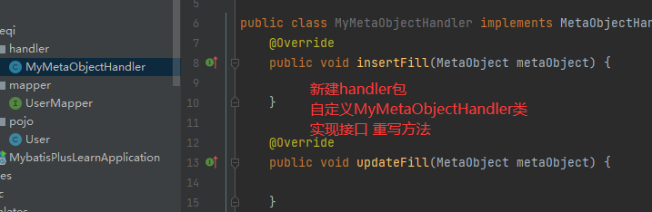
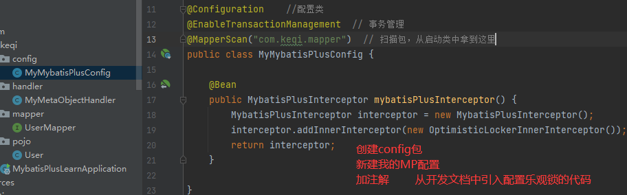
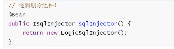
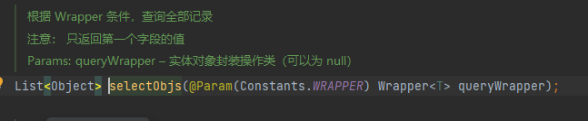

# Mybatis-Plus

>简化mybatis操作

>特性

- 无侵入
- 强大CRUD的操作
- 代码生成器
- 分页插件
- ...


## 快速入门

1、新建数据库 `mybatis_plus`和数据表

```sql
DROP TABLE IF EXISTS user;

CREATE TABLE user
(
	id BIGINT(20) NOT NULL COMMENT '主键ID',
	name VARCHAR(30) NULL DEFAULT NULL COMMENT '姓名',
	age INT(11) NULL DEFAULT NULL COMMENT '年龄',
	email VARCHAR(50) NULL DEFAULT NULL COMMENT '邮箱',
	PRIMARY KEY (id)
);

DELETE FROM user;

INSERT INTO user (id, name, age, email) VALUES
(1, 'Jone', 18, 'test1@baomidou.com'),
(2, 'Jack', 20, 'test2@baomidou.com'),
(3, 'Tom', 28, 'test3@baomidou.com'),
(4, 'Sandy', 21, 'test4@baomidou.com'),
(5, 'Billie', 24, 'test5@baomidou.com');

```


2、创建springboot项目、添加pom依赖

```xml
<dependency>
    <groupId>org.springframework.boot</groupId>
    <artifactId>spring-boot-starter-web</artifactId>
</dependency>

<dependency>
    <groupId>org.springframework.boot</groupId>
    <artifactId>spring-boot-starter-test</artifactId>
    <scope>test</scope>
</dependency>

<dependency>
    <groupId>mysql</groupId>
    <artifactId>mysql-connector-java</artifactId>
    <version>8.0.25</version>
</dependency>

<dependency>
    <groupId>com.baomidou</groupId>
    <artifactId>mybatis-plus-boot-starter</artifactId>
    <version>3.4.2</version>
</dependency>

<dependency>
    <groupId>org.projectlombok</groupId>
    <artifactId>lombok</artifactId>
    <version>1.18.20</version>
</dependency>
```

3、连接数据库（配置连接文件）

```properties
spring.datasource.driver-class-name=com.mysql.cj.jdbc.Driver
#spring.datasource.url=jdbc:mysql://localhost:3306/mybatis_plus?\
#  useSSL=false&characterEncoding=utf-8&serverTimezone=Asia/ShangHai
spring.datasource.url=jdbc:mysql://localhost:3306/mybatis_plus?useSSL=true&useUnicode=true&characterEncoding=UTF-8&serverTimezone=Asia/Shanghai
spring.datasource.username=root
spring.datasource.password=yiing123
```

4、编写pojo-mapper --> test方法

这里不在需要配置文件或者注解来写简单的sql语句了，sql和方法由mybatis_plus插件帮助完成

细节：

1. 启动类下扫描mapper文件夹

   2. mapper添加@repository注解表示持久层    (使用@Mapper注解也能跑)

   3.  test测试

      ```java
      // 这里的参数Wrapper 是条件构造器
      List<User> userList = userMapper.selectList(null);
      // 语法糖
      userList.forEach(System.out::println);
      ```

      

## 配置日志

因为sql不可见了，使用日志来看执行流程和自动生成的sql语句

```properties
# 配置日志
mybatis-plus.configuration.log-impl=org.apache.ibatis.logging.stdout.StdOutImpl
```


## CRUD拓展

### 插入及主键生成策略

```java
@Test
public void testInsert() {
    User user = new User();
    user.setAge(18);
    user.setEmail("hhh@qqq.com");
    user.setName("keqi");

    int insert = userMapper.insert(user); // 使用雪花算法自动生成主键

    System.out.println(insert); // 返回1
    System.out.println(user);   // 返回使用雪花算法自动生成的主键

}
```

#### 雪花算法

> ​	@TableId( type = IdType.ID_WORKER) 全局唯一ID，已被禁止使用

snowflake是Twitter开源的分布式ID生成算法，结果是一个long型的ID。其核心思想是：使用41bit作为毫秒数，10bit作为机器的ID（5个bit是数据中心，5个bit的机器ID），12bit作为毫秒内的流水号（意味着每个节点在每毫秒可以产生 4096 个 ID），最后还有一个符号位，永远是0。


#### 主键自增

1、实体类字段上`@TableId( type = IdType.AUTO)`

2、数据库字段要是自增


#### 其它策略

```java
// 已经取消全局唯一ID和它的字符串形式
public enum IdType {
    AUTO(0),     //自增
    NONE(1),     //未设置主键
    INPUT(2),    //手动输入主键
    ASSIGN_ID(3),//使用雪花算法
    ASSIGN_UUID(4), // 字符形式 

}

```


### 更新操作

```java
@Test
public void testUpdate() {

    User user = new User();
    user.setId(5L);
    user.setName("keqii");

    // 这里的参数是一个对象
    int i = userMapper.updateById(user);  // 可以通过条件自动拼接sql
    System.out.println(i);  // 返回1
}
```


### 自动填充

**（时间字段的初值和更新）**

时间创建、时间修改都应该是自动化的。

gmt： 格林尼治时间

阿里开发手册：几乎所有表都有gmt_create,gmt_modified，而且需要自动化


> 方式一： 数据库级别 （实际工作中，不允许修改数据库）

1、数据库表新增creat_time,update_time字段

​      默认值为当前时间戳

​      更新似乎只有update的时候才会更新（插入时没更新）

​      timestamp格式

​      设置的默认值不会对已经存在的空值进行修改

2、实体类同步更新

3、更新数据表查看结果即可


---


> 方式二： 代码级别

1、删除数据库的默认值和更新

2、给字段添加注解

```java
@TableField(fill = FieldFill.INSERT)
private Date creatTime;
@TableField(fill = FieldFill.INSERT_UPDATE)
private Date updateTime;

// 默认是不处理的
public enum FieldFill {
    // 默认不处理
    DEFAULT,
    //插入填充字段
    INSERT,
    //更新填充字段
    UPDATE,
    //插入和更新填充字段
    INSERT_UPDATE
}

```

3、自定义实现类 MyMetaObjectHandler



```java
// 注释代码为开发文档上copy，但似乎实现不了功能
@Slf4j
@Component
public class MyMetaObjectHandler implements MetaObjectHandler {
    @Override
    public void insertFill(MetaObject metaObject) {
        log.info("start insert fill ...");
        this.setFieldValByName("creatTime", new Date(), metaObject);
        this.setFieldValByName("updateTime", new Date(),metaObject);
//        this.strictInsertFill(metaObject, "creatTime", () -> LocalDateTime.now(), LocalDateTime.class);
//        this.strictInsertFill(metaObject, "updateTime", () -> LocalDateTime.now(), LocalDateTime.class);
    }

    @Override
    public void updateFill(MetaObject metaObject) {
        log.info("start update fill ...");
        this.setFieldValByName("updateTime", new Date(),metaObject);
//        this.strictInsertFill(metaObject, "updateTime", () -> LocalDateTime.now(), LocalDateTime.class);
    }
}

```

4、更新、插入测试即可

这里注意插入时需要同时给creatTime和updateTime设置值


### 乐观锁

>乐观锁：总是认为不会出现问题，无论干什么都不加锁。如果出现错误，再次更新值测试
>
>悲观锁：总是认为会出现问题，无论干什么都先加锁，再操作


当要更新一条记录的时候，希望这条记录没有被别人更新
乐观锁实现方式：

- 取出记录时，获取当前version

- 更新时，带上这个version

- 执行更新时， set version = newVersion where version = oldVersion

- 如果version不对，就更新失败


> mybatis-plus的乐观锁插件使用

1、数据库表添加字段，实体类更新

2、注册组件

- 字段添加注解

  ```
  @Version
  private Integer version;
  ```

- 添加组件

  

3、测试

```java
@Test
public void testVersion1() {
    User user = userMapper.selectById(1L);
    user.setName("keqi");
    user.setEmail("forgitfff@outlook.com");

    userMapper.updateById(user);
}

@Test
public void testVersion2() {
    User user = userMapper.selectById(1L);
    user.setName("keqi1111");
    user.setEmail("forgitfff@outlook.com");

    User user2 = userMapper.selectById(1L);
    user2.setName("keqi2222");
    user2.setEmail("forgitfff@outlook.com");
    userMapper.updateById(user2);

    userMapper.updateById(user);
}
```

**总结**：乐观锁是在对一行数据进行**更新**时，通过事先查出来的version字段数据来判断是否由其它线程先进行了更新，如果已经被更改过，就放弃执行。 而如果没有乐观锁，代码执行时遇到这种情况就会覆盖已经有了的更新。


### 查询操作

```java
@Test
public void testSelectById() {
    User user = userMapper.selectById(1L);
    System.out.println(user);
}

// Arrays.asList()
@Test
public void testSelectByBatchId() {
    List<User> users = userMapper.selectBatchIds(Arrays.asList(1,2,3));
    users.forEach(System.out::println);
}

// 条件查询 map
@Test
public void testSelectByBatchIds() {
    HashMap<String, Object> map = new HashMap<>();
    map.put("name","keqi");

    List<User> userList = userMapper.selectByMap(map);
    userList.forEach(System.out::println);

}
```

### 分页查询

分页再网站使用的很多！

1、原始的limit进行分页    （sql中的limit）

2、pageHelper第三方插件

3、MybatisPlus内置了分页插件

> 使用mybatisplus的分页插件

1、添加分页拦截器配置

```java
@Bean
public MybatisPlusInterceptor mybatisPlusInterceptor1() {
    MybatisPlusInterceptor interceptor = new MybatisPlusInterceptor();
    interceptor.addInnerInterceptor(new PaginationInnerInterceptor(DbType.H2));
    return interceptor;
}
```


2、测试分页

```java
// 分页插件
@Test
public void testPage() {
    // 第一个参数：当前页
    // 第二个参数：页面大小
    Page<User> page = new Page<>(2, 4);
    // 应该是参数作为返回值
    userMapper.selectPage(page,null);
    page.getRecords().forEach(System.out::println);
}
```


### 删除操作

```java
@Test
public void testDeleteById() {
	userMapper.deleteById(1420560613830561799L);
}

@Test
public void testDeleteByBatchId() {           	userMapper.deleteBatchIds(Arrays.asList(1420560613830561798L,1420560613830561797L));
}

@Test
public void testDeleteMap() {
    HashMap<String, Object> map = new HashMap<>();
    map.put("name","keqi");
    userMapper.deleteByMap(map);
}
```

### 逻辑删除

>物理删除：从数据库中直接删除
>
>逻辑删除：在数据库中没有被移除，而是通过一个变量来让它失效deleted = 0 or 1

管理员可以查看被删除的记录！

防止数据丢失，类似回收站

> 测试

1、数据库中新建deleted字段默认

int字段，长度1，默认0   --

2、pojo类中添加字段与注解

```java
@TableLogic
private Integer deleted;
```

3、添加配置

```properties
# 逻辑删除
mybatis-plus.global-config.db-config.logic-delete-field=deleted
mybatis-plus.global-config.db-config.logic-delete-value=1
mybatis-plus.global-config.db-config.logic-not-delete-value=0
```

其它方法：加上逻辑删除值1 和 未删0的配置 （未确认）



4、测试结果

只对自动注入的sql起效:

- 插入: 不作限制
- 查找: 追加where条件过滤掉已删除数据,且使用 wrapper.entity 生成的where条件会忽略该字段
- 更新: 追加where条件防止更新到已删除数据,且使用 wrapper.entity 生成的where条件会忽略该字段
- 删除: 转变为 更新

```sql
删除: update user set deleted=1 where id = 1 and deleted=0
查找: select id,name,deleted from user where deleted=0
```


## 性能分析插件

作用：用户输出每条sql语句及其执行时间

MybatisPlus插件：


3.X + 已被移除！


sql分析打印插件：p6spy

https://blog.csdn.net/xu2414506319/article/details/107443321


## 条件构造器

Wrapper: sql所能做的都可以使用wrapper实现

```java
@Test
public void test1() {
    // 查询name、邮箱不为空，年龄大于12的用户
    QueryWrapper<User> wrapper = new QueryWrapper<>();
    wrapper.isNotNull("name").isNotNull("email")
    .ge("age",12); //ge 大于
    userMapper.selectList(wrapper).forEach(System.out::println);
}

@Test
void test2() {
    // 查询名字等于Tom
    QueryWrapper<User> wrapper = new QueryWrapper<>();
    wrapper.eq("name","Tom");
    User user = userMapper.selectOne(wrapper);
    System.out.println(user);
}

@Test
void test3() {
    // 查询年龄在20-30岁的用户的数量
    QueryWrapper<User> wrapper = new QueryWrapper<>();
    wrapper.between("age",20,30);

    System.out.println(userMapper.selectCount(wrapper));
}

@Test
void test4() {
    // 模糊查询，
    QueryWrapper<User> wrapper = new QueryWrapper<>();
    // 左和右    t%
    wrapper
    .notLike("name","h")
    .likeRight("email","t");

    List<Map<String, Object>> maps = userMapper.selectMaps(wrapper);
    maps.forEach(System.out::println);
}

@Test
void test5() {
    // 子查询
    QueryWrapper<User> wrapper = new QueryWrapper<>();
    wrapper.inSql("id"," select id from user where id <= 3");

    // 这里返回的对象并不是User
    List<Object> list = userMapper.selectObjs(wrapper);
    list.forEach(System.out::println);

}

@Test
void test6() {
    // 排序
    QueryWrapper<User> wrapper = new QueryWrapper<>();
    wrapper.orderByDesc("id");

    userMapper.selectList(wrapper).forEach(System.out::println);

}
```





## 代码自动生成器

官方文档：

https://mp.baomidou.com/guide/generator.html#%E6%B7%BB%E5%8A%A0%E4%BE%9D%E8%B5%96


AutoGenerator 是 MyBatis-Plus 的代码生成器，通过 AutoGenerator 可以快速生成 Entity、Mapper、Mapper XML、Service、Controller 等各个模块的代码，极大的提升了开发效率。


1、添加依赖

MyBatis-Plus 从 `3.0.3` 之后移除了代码生成器与模板引擎的默认依赖，需要手动添加相关依赖：

- 添加 代码生成器 依赖

  ```xml
  <dependency>
      <groupId>com.baomidou</groupId>
      <artifactId>mybatis-plus-generator</artifactId>
      <version>3.4.1</version>
  </dependency>
  
  <!-- swagger -->
  <dependency>
      <groupId>io.springfox</groupId>
      <artifactId>springfox-swagger2</artifactId>
      <version>2.2.2</version>
  </dependency>
  <dependency>
      <groupId>io.springfox</groupId>
      <artifactId>springfox-swagger-ui</artifactId>
      <version>2.2.2</version>
  </dependency>
  ```

- 添加 模板引擎 依赖，MyBatis-Plus 支持 Velocity（默认）、Freemarker、Beetl，用户可以选择自己熟悉的模板引擎，如果都不满足您的要求，可以采用自定义模板引擎。

  Velocity（默认）：

  ```xml
  <dependency>
      <groupId>org.apache.velocity</groupId>
      <artifactId>velocity-engine-core</artifactId>
      <version>latest-velocity-version</version>
  </dependency>
  ```

  Freemarker：

  ```xml
  <dependency>
      <groupId>org.freemarker</groupId>
      <artifactId>freemarker</artifactId>
      <version>latest-freemarker-version</version>
  </dependency>
  ```

  Beetl：

  ```xml
  <dependency>
      <groupId>com.ibeetl</groupId>
      <artifactId>beetl</artifactId>
      <version>latest-beetl-version</version>
  </dependency>
  ```

  注意！如果您选择了非默认引擎，需要在 AutoGenerator 中 设置模板引擎。

  ```java
  AutoGenerator generator = new AutoGenerator();
  
  // set freemarker engine
  generator.setTemplateEngine(new FreemarkerTemplateEngine());
  
  // set beetl engine
  generator.setTemplateEngine(new BeetlTemplateEngine());
  
  // set custom engine (reference class is your custom engine class)
  generator.setTemplateEngine(new CustomTemplateEngine());
  
  // other config
  ...
  ```

2、编写配置

```java
package com.keqi;

import com.baomidou.mybatisplus.annotation.DbType;
import com.baomidou.mybatisplus.annotation.FieldFill;
import com.baomidou.mybatisplus.annotation.IdType;
import com.baomidou.mybatisplus.generator.AutoGenerator;
import com.baomidou.mybatisplus.generator.config.DataSourceConfig;
import com.baomidou.mybatisplus.generator.config.GlobalConfig;
import com.baomidou.mybatisplus.generator.config.PackageConfig;
import com.baomidou.mybatisplus.generator.config.StrategyConfig;
import com.baomidou.mybatisplus.generator.config.po.TableField;
import com.baomidou.mybatisplus.generator.config.po.TableFill;
import com.baomidou.mybatisplus.generator.config.rules.DateType;
import com.baomidou.mybatisplus.generator.config.rules.NamingStrategy;

import java.util.ArrayList;

// 代码自动生成器
public class AutoCode {
    public static void main(String[] args) {
        // 需要构建一个代码自动生成器
        AutoGenerator mpg = new AutoGenerator();

        // 1 全局配置
        GlobalConfig gc = new GlobalConfig();
        // 获取当前项目路径，设置输出路径
        String projectPath = System.getProperty("user.dir");
        gc.setOutputDir(projectPath+"/src/main/java");
        gc.setAuthor("keqi");
        gc.setOpen(false);            // 是否打开资源管理器 （windows文件夹）
        gc.setFileOverride(false);    // 是否覆盖
        gc.setIdType(IdType.ASSIGN_ID);
        gc.setDateType(DateType.ONLY_DATE);
        gc.setSwagger2(true);
        mpg.setGlobalConfig(gc);

        // 2 数据源配置
        DataSourceConfig dsc = new DataSourceConfig();
        dsc.setUrl("jdbc:mysql://localhost:3306/mybatis_plus?useSSL=true&useUnicode=true&characterEncoding=UTF-8&serverTimezone=Asia/Shanghai");
        dsc.setDriverName("com.mysql.cj.jdbc.Driver");
        dsc.setUsername("root");
        dsc.setPassword("yiing123");
        dsc.setDbType(DbType.MYSQL);
        mpg.setDataSource(dsc);

        // 3 包的配置
        PackageConfig pc = new PackageConfig();
        pc.setModuleName("test");
        pc.setParent("com.keqi");
        pc.setEntity("entity");
        pc.setMapper("mapper");
        pc.setController("controller");
        pc.setService("service");
        mpg.setPackageInfo(pc);

        // 4 策略配置
        StrategyConfig sc = new StrategyConfig();
        sc.setInclude("user");    // 要自动生成的表
        sc.setNaming(NamingStrategy.underline_to_camel); //下划线转驼峰
        sc.setColumnNaming(NamingStrategy.underline_to_camel);
        sc.setEntityLombokModel(true);

        // 设置逻辑删除
        sc.setLogicDeleteFieldName("deleted");
        // 设置自动填充
        TableFill creatTime = new TableFill("creat_time", FieldFill.INSERT);
        TableFill updateTime = new TableFill("update_time",FieldFill.INSERT_UPDATE);
        ArrayList<TableFill> list = new ArrayList<>();
        list.add(creatTime);
        list.add(updateTime);
        sc.setTableFillList(list);
        // 乐观锁
        sc.setVersionFieldName("version");
        mpg.setStrategy(sc);

        mpg.execute();

    }
```

