# nginx

## 1、windows安装与使用

### 1、官网下载nginx压缩包并解压

 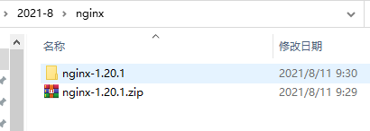

### 2、启动错误（注意是否存在中文路径）

 80端口被占用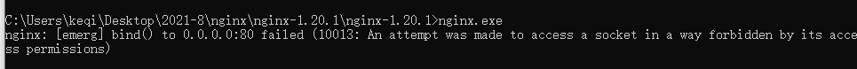

```bash
netstat -aon | findstr :80 # windows 查询进程
tasklist | findstr "4"     # windows 查看pid的详细信息
```


>  未测试
>
>  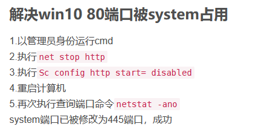

### 3、更改配置文件为8000端口并启动

`nginx.exe` 

**启动成功**

 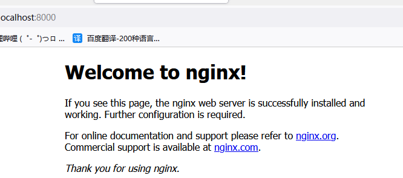


## 2、Centos 安装与使用

1、检查gcc是否安装

`gcc -v`

`yum -y install gcc`

dddd

2、安装依赖库

```bash
# pcre是一个perl库，包括perl兼容的正则表达式库，nginx的http模块使用pcre来解析正则表达式，所以需要安装pcre库
yum install -y pcre pcre-devel
# zlib库提供了很多种压缩和解压缩方式nginx使用zlib对http包的内容进行gzip，所以需要安装
yum install -y zlib zlib-devel
#openssl是web安全通信的基石，没有openssl，可以说我们的信息都是在裸奔
yum install -y openssl openssl-devel
```

3、下载nginx

 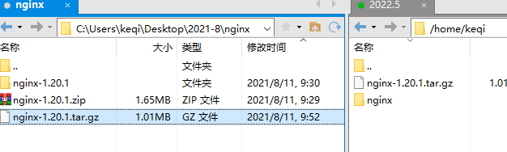

```bash
# 解压
tar -zxvf  nginx
```

4、进入该目录

 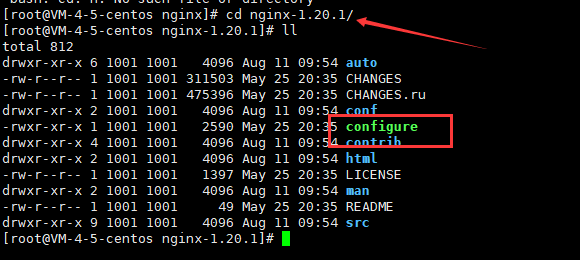

```bash
# 执行三个命令
./configure
 
make
 
make install
```

 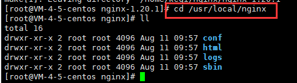

4、启动nginx

 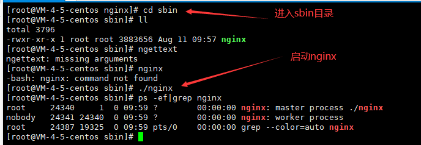

```bash
# 开启端口
firewall-cmd --zone=public --add-port=80/tcp --permanent
# 开启端口生效
firewall-cmd --reload
```

**成功访问**

 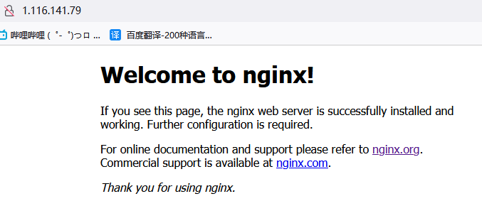

## 3、反向代理与负载均衡

### 反向代理

1、正向代理 

代理客户端  eg：vpn

 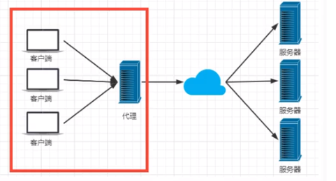

2、反向代理 -- 当访问量增加时，可以用来让我们的服务分别挂载到不同服务器上

代理服务器 eg：访问百度

 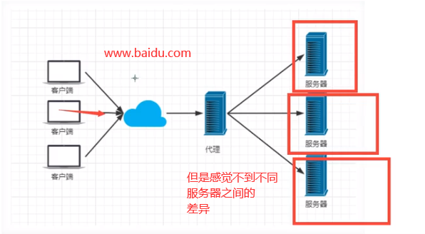

### 负载均衡

1、轮询

nginx代理的服务器依次接收请求

 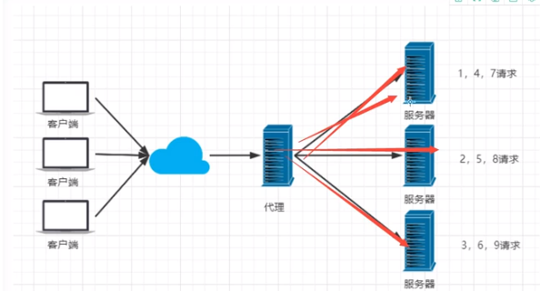

2、加权轮询

设置nginx代理不同服务器的权重

 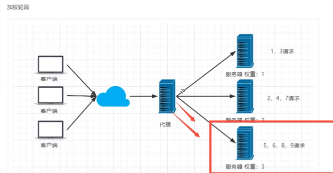

3、iphash

**解决多个tomcatsession不共享的问题，之后多使用redis解决**

 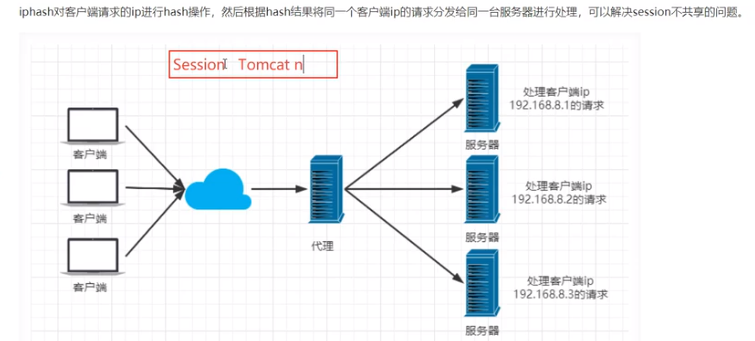

## 4、常用nginx命令

```bash
cd /usr/local/nginx/sbin
#启动
./nginx
#停止
./nginx -s stop
#安全退出
./nginx -s quit
#重新加载配置文件
./nginx -s reload
#查看nginx进程
ps -ef | grep nginx
```

## 5、简单使用

1、目的

 用户访问80端口，nginx拦截用户请求，按照权重

分发请求给各个服务器


2、nginx.conf配置

 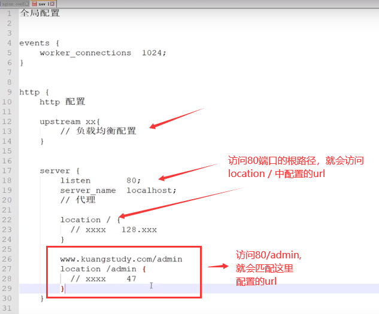

配置：

 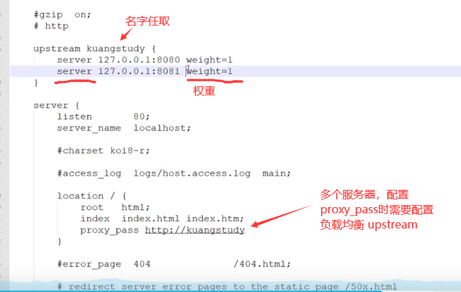