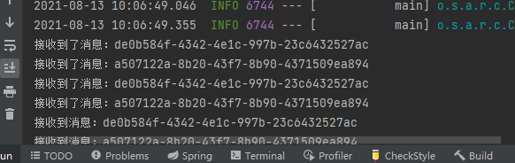

# RabbitMQ

## 1 MQ引言

### 1.1 什么是MQ

MQ(Message Queue) :  翻译为`消息队列`,通过典型的生产者和消费者模型,生产者不断向消息队列中生产消息，消费者不断的从队列中获取消息。因为消息的生产和消费都是异步的，而且只关心消息的发送和接收，没有业务逻辑的侵入,轻松的实现系统间解耦。别名为 `消息中间件`通过利用高效可靠的消息传递机制进行平台无关的数据交流，并基于数据通信来进行分布式系统的集成。

### 1.2 MQ有哪些

当今市面上有很多主流的消息中间件，如老牌的`ActiveMQ`,`RabbitMQ`，炙手可热的`Kafka`，阿里巴巴自主开发`RocketMQ`等。

### 1.3 不同MQ的特点

> 1.`ActiveMQ`
> 		`ActiveMQ` 是Apache出品，最流行的，能力强劲的**开源**消息总线。它是一个完全支持`JMS`规范的的消息中间件。丰富的API,多种集群架构模式让`ActiveMQ`在业界成为老牌的消息中间件,在中小型企业 颇受欢迎!
>
> 2.`Kafka`
> 		Kafka是`LinkedIn`开源的**分布式发布-订阅消息系统**，目前归属于Apache顶级项目。Kafka主要特点是基于Pull的模式来处理消息消费，追求高吞吐量，一开始的目的就是用于日志收集和传输。0.8版本开始支持复制，不支持事务，对消息的重复、丢失、错误没有严格要求，**适合产生大量数据的互联网服务的数据收集业务**。
>
> 3.`RocketMQ`
>
> ​        `RocketMQ`是**阿里开源的消息中间件**，它是**纯Java开发**，具有高吞吐量、高可用性、适合**大规模分布式系统应用**的特点。`RocketMQ`思路起源于Kafka，但并不是Kafka的一个Copy，它对消息的可靠传输及事务性做了优化，目前在阿里集团被广泛应用于交易、充值、流计算、消息推送、日志流式处理、`binglog`分发等场景。
>
> 4.`RabbitMQ`
> 		`RabbitMQ`是使用**Erlang语言**开发的开源消息队列系统，基于`AMQP`协议来实现。`AMQP`的主要特征是**面向消息、队列、路由（包括点对点和发布/订阅）、可靠性、安全**。`AMQP`协议更多用在**企业系统内对数据一致性、稳定性和可靠性要求很高的场景，对性能和吞吐量的要求还在其次**。
>
> `RabbitMQ`比`Kafka`**可靠**，Kafka更适合IO高吞吐的处理，一般应用在大数据日志处理或对实时性（少量延迟），可靠性（少量丢数据）要求稍低的场景使用，比如ELK日志收集。	


> `JMS`
>
> JMS，全称为Java Message Service，即Java消息服务，是JavaEE中13个核心工业规范标准之一。其他的核心工业规范标准是：JDBC、JNDI(Java的命名和目录接口)、EJB、RMI(远程方法调用)、Java IDL/CORBA(Java接口定义语言/公共对象请求代理程序体系结构)、JSP、Servlet、XML(可扩展标记语言)、JTA(Java事务API)、JTS(Java事务服务)、JavaMail、JAF。
>
> 什么是Java消息服务呢？Java消息服务指的是两个应用程序之间进行异步通信的API，它为标准消息协议和消息服务提供了一组通用接口，包括创建、发送、读取消息等，用于支持Java应用程序开发。在JavaEE中，当两个应用程序使用JMS进行通信时，他们之间并不是直接相连的，而是通过一个共同的消息收发服务组件关联起来以达到解耦、异步、削峰的目的。d
>
>  
>
> 实现了JMS的产品称为消息中间件。

> `AMQP`
>
> AMQP，即Advanced Message Queuing Protocol，一个提供统一消息服务的应用层标准高级[消息](https://baike.baidu.com/item/消息/1619218)队列协议，是[应用层](https://baike.baidu.com/item/应用层/4329788)协议的一个开放标准，为面向消息的中间件设计。基于此协议的客户端与消息中间件可传递消息，并不受客户端/[中间件](https://baike.baidu.com/item/中间件/452240)不同产品，不同的开发语言等条件的限制。[Erlang](https://baike.baidu.com/item/Erlang)中的实现有[RabbitMQ](https://baike.baidu.com/item/RabbitMQ)等。

> `ELK`
>
> ELK是三个开源软件的缩写，分别表示：Elasticsearch , Logstash, Kibana ,  它们都是开源软件。新增了一个FileBeat，它是一个轻量级的日志收集处理工具(Agent)，Filebeat占用资源少，适合于在各个服务器上搜集日志后传输给Logstash，官方也推荐此工具。
>
> Elasticsearch是个**开源分布式搜索引擎**，提供**搜集、分析、存储数据**三大功能。它的特点有：分布式，零配置，自动发现，索引自动分片，索引副本机制，restful风格接口，多数据源，自动搜索负载等。
>
> Logstash 主要是用来**日志的搜集、分析、过滤日志的工具**，支持大量的数据获取方式。**一般工作方式为c/s架构**，client端安装在需要收集日志的主机上，server端负责将收到的各节点日志进行过滤、修改等操作在一并**发往elasticsearch上去**。
>
> Kibana 也是一个开源和免费的工具，Kibana可以为 Logstash 和 ElasticSearch 提供的日志分析**友好的 Web 界面**，可以帮助汇总、分析和搜索重要数据日志。
>
> Filebeat隶属于Beats。目前Beats包含四种工具：
>
> 1. 1. Packetbeat（搜集网络流量数据）
>    2. Topbeat（搜集系统、进程和文件系统级别的 CPU 和内存使用情况等数据）
>    3. Filebeat（搜集文件数据）
>    4. Winlogbeat（搜集 Windows 事件日志数据）


## 2 RabbitMQ 的引言

### 2.1 RabbitMQ

基于AMQP协议，erlang语言开发，是部署最广泛的开源消息中间件,是最受欢迎的开源消息中间件之一。

erlang语言:`通用的面向并发的编程语言`

> `AMQP 协议`
>  	AMQP（advanced message queuing protocol）在2003年时被提出，最早用于解决金融领不同平台之间的消息传递交互问题。顾名思义，AMQP是一种协议，更准确的说是一种binary wire-level protocol（链接协议）。这是其和JMS的本质差别，AMQP不从API层进行限定，而是直接定义网络交换的数据格式。这使得实现了AMQP的provider天然性就是跨平台的。以下是AMQP协议模型:
>
>  


## 3 RabbitMQ 的安装

### 1、安装erlang

```bash
# 安装  3.9.2的RabbitMQ需要23.2+的erlang
wget http://erlang.org/download/otp_src_24.0.tar.gz
# 解压
tar -zxvf otp_src...
# 移走
mv otp_src_24.0 /usr/local
# 切换目录
cd /usr/local/otp_src_24.0/
# 创建即将安装的目录
mkdir ../erlang
# 配置安装路径
./configure --prefix=/usr/local/erlang
# 安装
make
make install
# 检查是否安装成功
/usr/local/erlang/bin
# 添加环境变量
echo 'export PATH=$PATH:/usr/local/erlang/bin' >> /etc/profile
# 刷新环境变量
source /etc/profile
# 测试
erl
# 退出
halt().
```

> Error: No curses library functions found    == ./configure ...
>
> `yum -y install ncurses-devel`

### 2、安装rabbitMQ

```bash
# 下载
wget https://github.com/rabbitmq/rabbitmq-server/releases/download/v3.9.2/rabbitmq-server-generic-unix-3.9.2.tar.xz
# xz
yum install -y xz
# 第一次解压
/bin/xz -d rabbitmq-server-generic-unix-3.9.2.tar.xz
# 第二次解压
tar -xvf rabbitmq-server-generic-unix-3.9.2.tar
# 移走
mv rabbitmq_server-3.7.15/ /usr/local/
# 改名  ?
mv /usr/local/rabbitmq_server-3.7.15  rabbitmq
# 配置环境变量
echo 'export PATH=$PATH:/usr/local/rabbitmq/sbin' >> /etc/profile
# 刷新环境变量
source /etc/profile
```

> error: GitHub Unable to establish SSL connection.
>
> 以管理员权限打开`/etc/hosts`文件，在里面加入以下内容:
>
> ```properties
> 199.232.28.133 raw.githubusercontent.com
> ```

### 3、启动命令

```bash
# 启动
rabbitmq-server -detached
# 停止
rabbitmqctl stop
# 状态
rabbitmqctl status
```

> ```markdown
> # RabbitMQ的服务
> 	systemctl start rabbitmq-server
> 	systemctl restart rabbitmq-server
> 	systemctl stop rabbitmq-server
> 	systemctl status rabbitmq-server
> 	
> # 1.服务启动相关
> 	systemctl start|restart|stop|status rabbitmq-server
> 
> # 2.管理命令行  用来在不使用web管理界面情况下命令操作RabbitMQ
> 	rabbitmqctl  help  可以查看更多命令
> 
> # 3.插件管理命令行
> 	rabbitmq-plugins enable|list|disable 
> 
> ```

开启15672端口，

### 4、开启web插件

`rabbitmq-plugins enable rabbitmq_management`


`默认账号密码：guest guest（这个账号只允许本机访问）`

**rabbitmq-plugins disable rabbitmq_management**

### 5、用户管理

```bash
# 查看所有用户
rabbitmqctl list_users
# 添加一个用户
rabbitmqctl add_user keqi 415263
# 配置权限
rabbitmqctl set_permissions -p "/" keqi ".*" ".*" ".*"
# 查看用户权限
rabbitmqctl list_user_permissions keqi
# 设置tag
rabbitmqctl set_user_tags admin administrator
# 删除用户
rabbitmqctl delete_user guest
```

tag：

 

新建用户登录：

 

 

### 6、docker安装

```bash
# 拉取rabbitmq镜像
docker pull rabbitmq
docker images
# 创建容器 、启动容器
docker run -d -p 15672:15672 --hostname myRabbit -p 5672:5672 c83f5838192a
docker ps
# 进入容器配置web管理、用户
docker exec -it containerId /bin/bash
rabbitmq-plugins enable rabbitmq_management
rabbitmqctl add_user admin admin
rabbitmqctl set_user_tags admin administrator
```

### 7、角色分类

`set_user_tags`

> 超级管理员(administrator)
>
> 可登陆管理控制台，可查看所有的信息，并且可以对用户，策略(policy)进行操作。
>
> 监控者(monitoring)
>
> 可登陆管理控制台，同时可以查看rabbitmq节点的相关信息(进程数，内存使用情况，磁盘使用情况等)
>
> 策略制定者(policymaker)
>
> 可登陆管理控制台, 同时可以对policy进行管理。但无法查看节点的相关信息(上图红框标识的部分)。
>
> 普通管理者(management)
>
> 仅可登陆管理控制台，无法看到节点信息，也无法对策略进行管理。
>
> 其他
>
> 无法登陆管理控制台，通常就是普通的生产者和消费者。

## 4 RabbitMQ 入门

### 1、simple

 

#### maven 项目，导包

```xml
<!-- https://mvnrepository.com/artifact/com.rabbitmq/amqp-client -->
<dependency>
    <groupId>com.rabbitmq</groupId>
    <artifactId>amqp-client</artifactId>
    <version>5.13.0</version>
</dependency>
```

#### 生产者

```java
package com.keqi.mq.simple;

// simple 简单模式
// 生产者 -->  消息队列 --> 消费者

import com.rabbitmq.client.Channel;
import com.rabbitmq.client.Connection;
import com.rabbitmq.client.ConnectionFactory;

public class Producer {
    public static void main(String[] args) {
        // 所有的中间件都是基于tcp/ip协议的基础上构建的，只不过rabbitmq是rmqp协议
        // 离不开ip port

        // 1.创建连接工程
        ConnectionFactory connectionFactory = new ConnectionFactory();
        connectionFactory.setHost("1.116.141.79");
        connectionFactory.setPort(5672);
        connectionFactory.setUsername("admin");
        connectionFactory.setPassword("Admin97.");
        connectionFactory.setVirtualHost("/");

        Connection connection = null;
        Channel channel = null;
        try {
            // 2.创建连接Connection
            connection = connectionFactory.newConnection("生产者");
            // 3.通过连接获取通道Channel
            channel = connection.createChannel();
            // 4.通过通道创建交换机、声明队列、绑定关系、路由key、发送消息和接收消息
            String queueName = "queue1";
            /*
              * @param1 队列的名称
              * @param2 是否要持久化 
              * @param3 排他性，是否是独占独立
              * @param4 是否自动删除，随着最后一个消费者消息完毕消息以后是否把队列自动删除
              * @param5 携带附属参数
             */
            channel.queueDeclare(queueName,false,false,false,null);
            // 5.准备消息内容
            String msg = "keqi coming";
            // 6.发送消息给队列queue      ---  第二个参数为路由key
            channel.basicPublish("",queueName,null,msg.getBytes());

            System.out.println("消息发送成功");
        } catch (Exception e) {
            e.printStackTrace();
        } finally {
            // 7.关闭通道
            if (channel != null && channel.isOpen()) {
                try {
                    channel.close();
                } catch (Exception e) {
                    e.printStackTrace();
                }
            }
            // 8.关闭连接
            if (connection != null && connection.isOpen()) {
                try {
                    connection.close();
                } catch (Exception e) {
                    e.printStackTrace();
                }
            }
        }
    }
}
```

 

> error: Stats in management UI are disabled on this node
>
> 原因：
>
> The reason is that the default image disables metrics collector in the management_agent plugin
>
> 修改：
>
> ```bash
> docker exec -it cid /bin/bash
> cd /etc/rabbitmq/conf.d/
> 
> echo management_agent.disable_metrics_collector = false > management_agent.disable_metrics_collector.conf
> 
> exit
> docker restart {rabbitmq容器id}
> ```

#### 消费者

```java
package com.keqi.mq.simple;

import com.rabbitmq.client.*;

import java.io.IOException;

public class Consumer {
    public static void main(String[] args) {
        // 所有的中间件都是基于tcp/ip协议的基础上构建的，只不过rabbitmq是rmqp协议
        // 离不开ip port

        // 1.创建连接工程
        ConnectionFactory connectionFactory = new ConnectionFactory();
        connectionFactory.setHost("1.116.141.79");
        connectionFactory.setPort(5672);
        connectionFactory.setUsername("admin");
        connectionFactory.setPassword("Admin97.");
        connectionFactory.setVirtualHost("/");

        Connection connection = null;
        Channel channel = null;
        try {
            // 2.创建连接Connection
            connection = connectionFactory.newConnection("生产者");
            // 3.通过连接获取通道Channel
            channel = connection.createChannel();
            // 4.通过通道创建交换机、声明队列、绑定关系、路由key、发送消息和接收消息

            channel.basicConsume("queue1", true, new DeliverCallback() {
                @Override
                public void handle(String consumerTag, Delivery message) throws IOException {
                    System.out.println("收到消息是：" + new String(message.getBody(), "UTF-8"));
                }
            }, new CancelCallback() {
                @Override
                public void handle(String consumerTag) throws IOException {
                    System.out.println("接受消息失败...");
                }
            });

            System.out.println("开始接受消息");
            // 程序不往下执行，开始接收消息
            System.in.read();

        } catch (Exception e) {
            e.printStackTrace();
        } finally {
            // 7.关闭通道
            if (channel != null && channel.isOpen()) {
                try {
                    channel.close();
                } catch (Exception e) {
                    e.printStackTrace();
                }
            }
            // 8.关闭连接
            if (connection != null && connection.isOpen()) {
                try {
                    connection.close();
                } catch (Exception e) {
                    e.printStackTrace();
                }
            }
        }
    }
}
```

 

> 持久化队列：随着服务器重启不会被移除
>
> 非持久化队列：随着服务器重启被移除，数据会存盘，但也会随着服务器重启而消失

### 2、AMQP协议

>  

 

 

> broker : 节点，代理等...
>
> Basic ack：ack确认消息被消费者可靠消费了

### 3、RabbitMQ组件和架构 

#### 1.核心组成


> virture host: 虚拟机节点，用来隔离和区分消息

 

 

#### 2.整体架构

 

#### 3.运行流程

 

#### 4.消息模式

|                | 类型    | 特点                            |
| :------------- | ------- | ------------------------------- |
| 简单模式Simple | /       | /                               |
| 工作模式work   | 无      | 分发机制                        |
| 发布订阅模式   | fanout  | 发布订阅，类似广播，没有路由key |
| 路由模式       | direct  | 有routing-key的匹配方式         |
| 主题topic模式  | topic   | 模糊routing-key匹配             |
| 参数模式       | headers | 参数匹配模式                    |

## 5 消息模式

> 如果代码没有指定交换机，那么就会使用默认的交换机
>
> 默认交换机是direct模式

### 消息模式理解

#### 1、简单模式

> 任何消息都是生产者投递到交换机，再有交换机通过分发策略(routing-keys)交付给消息队列
>
> web模拟操作：
>
> - nack ack，确认机制
> - queue操作

#### 2、fanout模式

 

> 这个模式没有routing-key，通过交换机发布消息会直接同步到绑定的队列中
>
> fanout模式指定路由key没有意义

#### 3、Direct模式

 

> direct模式，就是在fanout模式上增加了路由key，并且把路由key当作选择条件来判断是否把消息
>
> 发送给这个消息队列。
>
> 同一个消息队列可以有多个路由key。

#### 4、Topic模式

 

> topic模式，在direct模式上，增加了对路由key的模糊搜索
>
> #.x.# :    #.    可以有0个、1个、多个点形成的多级
>
> \*.x.\* :   *.    有且只有一个. 形成的一级
>
> .    在匹配#是可以省略,在匹配*是不可省略。

#### 5、Headers模式

> 参数模式：交换机模式设置为headers，绑定队列时设置参数，publish消息时带上参数。

 

publish：

 

### 消息模式案例

#### 1、fanout模式

**生产者**

```java
package com.keqi.mq.fanout;

// simple 简单模式
// 生产者 -->  消息队列 --> 消费者

import com.rabbitmq.client.Channel;
import com.rabbitmq.client.Connection;
import com.rabbitmq.client.ConnectionFactory;

public class Producer {
    public static void main(String[] args) {
        // 所有的中间件都是基于tcp/ip协议的基础上构建的，只不过rabbitmq是rmqp协议
        // 离不开ip port

        // 1.创建连接工程
        ConnectionFactory connectionFactory = new ConnectionFactory();
        connectionFactory.setHost("1.116.141.79");
        connectionFactory.setPort(5672);
        connectionFactory.setUsername("admin");
        connectionFactory.setPassword("Admin97.");
        connectionFactory.setVirtualHost("/");

        Connection connection = null;
        Channel channel = null;
        try {
            // 2.创建连接Connection
            connection = connectionFactory.newConnection("生产者");
            // 3.通过连接获取通道Channel
            channel = connection.createChannel();
            // 4.通过通道创建交换机、声明队列、绑定关系、路由key、发送消息和接收消息


            // 5.准备消息内容
            String msg = "keqi coming";
            // 6.准备交换机
            String exchange = "fanout_exchange";
            // 7.类型
            String type = "fanout";
            // routing-key
            String routing_key = "";

            // 6.发送消息给队列queue
            channel.basicPublish(exchange,routing_key,null,msg.getBytes());

            System.out.println("消息发送成功");

        } catch (Exception e) {
            e.printStackTrace();
        } finally {
            // 7.关闭通道
            if (channel != null && channel.isOpen()) {
                try {
                    channel.close();
                } catch (Exception e) {
                    e.printStackTrace();
                }
            }
            // 8.关闭连接
            if (connection != null && connection.isOpen()) {
                try {
                    connection.close();
                } catch (Exception e) {
                    e.printStackTrace();
                }
            }
        }

    }
}

```

> 注意： 队列、交换机已经在web操作中创建，这里就不再声明
>
> 发送消息给队列的第二个参数为routing-key，而不是队列名

**消费者**

```java
package com.keqi.mq.fanout;

import com.rabbitmq.client.*;

import java.io.IOException;

public class Consumer {

    private static Runnable runnable = new Runnable() {
        @Override
        public void run() {
            // 所有的中间件都是基于tcp/ip协议的基础上构建的，只不过rabbitmq是rmqp协议
            // 离不开ip port

            // 1.创建连接工程
            ConnectionFactory connectionFactory = new ConnectionFactory();
            connectionFactory.setHost("1.116.141.79");
            connectionFactory.setPort(5672);
            connectionFactory.setUsername("admin");
            connectionFactory.setPassword("Admin97.");
            connectionFactory.setVirtualHost("/");

            // 通过线程名获取队列名
            String queueName = Thread.currentThread().getName();
            Connection connection = null;
            Channel channel = null;
            try {
                // 2.创建连接Connection
                connection = connectionFactory.newConnection("生产者");
                // 3.通过连接获取通道Channel
                channel = connection.createChannel();
                // 4.通过通道创建交换机、声明队列、绑定关系、路由key、发送消息和接收消息

                channel.basicConsume(queueName, true, new DeliverCallback() {
                    @Override
                    public void handle(String consumerTag, Delivery message) throws IOException {
                        System.out.println("收到消息是：" + new String(message.getBody(), "UTF-8"));
                    }
                }, new CancelCallback() {
                    @Override
                    public void handle(String consumerTag) throws IOException {
                        System.out.println("接受消息失败...");
                    }
                });

                System.out.println("开始接受消息");
                // 程序不往下执行，开始接收消息
                System.in.read();

            } catch (Exception e) {
                e.printStackTrace();
            } finally {
                // 7.关闭通道
                if (channel != null && channel.isOpen()) {
                    try {
                        channel.close();
                    } catch (Exception e) {
                        e.printStackTrace();
                    }
                }
                // 8.关闭连接
                if (connection != null && connection.isOpen()) {
                    try {
                        connection.close();
                    } catch (Exception e) {
                        e.printStackTrace();
                    }
                }
            }

        }
    };


    public static void main(String[] args) {
        new Thread(runnable,"queue2").start();
        new Thread(runnable,"queue3").start();
    }
}

```

> 为什么System.in.read 会执行回调函数？
>
> 


> 消费者开启之后便一直获取消息队列中的消息！！

#### 2、direct模式

> 代码与fanout模式大致相同
>
> 消费者完全相同
>
> 生产者：更改配置即可
>
> ```java
> // 5.准备消息内容
> String msg = "keqi coming";
> // 6.准备交换机
> String exchange = "direct_exchange";
> // 7.类型
> String type = "direct";
> // routing-key
> String routing_key = "email";
> ```

#### 3、topic模式

> 代码与fanout模式大致相同
>
> 消费者完全相同
>
> 生产者：更改配置即可
>
> ```java
> // 5.准备消息内容
> String msg = "keqi coming";
> // 6.准备交换机
> String exchange = "topic_exchange";
> // 7.类型
> String type = "topic";
> // routing-key    支持模糊匹配
> String routing_key = "email";
> ```

#### 4、work模式

1. 轮询模式：按均分配

   ```java
   // 消费者代码相同
   
   // 注意点，本次代码未运行生产者之前没有队列。
   // work模式，先启动消费者，后启动生产者，看到效果。
   
   channel.queueDeclare(queueName,true,false,false,null);
       // 5.准备消息内容
       for (int i = 0; i < 20; i++) {
           String msg = "keqi coming " + i;
           // 6.发送消息给队列queue
           channel.basicPublish("",queueName,null,msg.getBytes());
   }
   ```

2. 公平分发：按照能力大小分配

   ```java
   // qos ，一次取多少条消息
   
   Channel finalChannel = channel;
   finalChannel.basicQos(1);
   channel.basicConsume("queue1", false, new DeliverCallback() {
       @Override
       public void handle(String consumerTag, Delivery message) throws IOException {
           try {
               System.out.println("收到消息是：" + new String(message.getBody(), "UTF-8"));
               Thread.sleep(200);
               finalChannel.basicAck(message.getEnvelope().getDeliveryTag(),false);
           } catch (InterruptedException e) {
               e.printStackTrace();
           }
   
       }
   }, new CancelCallback() {
       @Override
       public void handle(String consumerTag) throws IOException {
           System.out.println("接受消息失败...");
       }
   });
   ```

### 声明交换机、队列并绑定

 

## 6 RabbitMQ使用场景

1. java同步代码，要实现并发必须使用多线程
2. 使用多线程，实现并发，需要自己维护线程池，并且考虑可用性、存盘IO等
3. 于是借助MQ来实现异步的消息发送

> MQ相比于java同步代码，异步使得对多种消息的发送实间变短 -- 流量削峰
>
> MQ增加一个消费者就不需要与消息生产者有关联  -- 解耦（高内聚，低耦合）
>
> MQ也是并发机制，-- 异步处理


 

## 7 SpringBoot整合RabbitMQ

```
模拟用户下单操作，并通过MQ给用户不同设备发送短信
```

 

### 1、fanout模式

#### 生产者

##### 1.环境

> spring_boot项目
>
> 依赖：web，RabbitMQ

##### 2.yml配置

```yml
server:
  port: 8080

spring:
  rabbitmq:
    username: admin
    password: Admin97.
    host: 1.116.141.79
    port: 5672
    virtual-host: /
```

##### 3.业务逻辑 (生产者)

```java
public void makeOrder(String userid, String productid, int num) {
    // 1. 根据商品id判断库存是否充足
    // 2. 保存订单
    String orderId = UUID.randomUUID().toString();
    System.out.println("订单生成成功:" + orderId);
    // 3. 通过MQ来完成消息的分发
    // 参数一： 交换机， 参数二：路由key/queue队列名称 参数三：消息内容
    String exchange = "fanout_order_exchange";
    String routing_key = "";
    rabbitTemplate.convertAndSend(exchange, routing_key, orderId);

}
```

##### 4.配置交换机、队列、绑定关系

```java
// 配置类

package com.keqi.config;

import org.springframework.amqp.core.Binding;
import org.springframework.amqp.core.BindingBuilder;
import org.springframework.amqp.core.FanoutExchange;
import org.springframework.amqp.core.Queue;
import org.springframework.context.annotation.Bean;
import org.springframework.context.annotation.Configuration;

@Configuration
public class RabbitMqConfiguration {

    // 1: 声明注册fanout模式的交换机
    @Bean
    public FanoutExchange fanoutExchange() {
        return new FanoutExchange("fanout_order_exchange",true,false);
    }
    // 2: 声明注册sms.fanout.queue队列 duanxin email
    @Bean
    public Queue smsQueue() {
        return new Queue("sms.fanout.queue",true);
    }
    @Bean
    public Queue duanxinQueue() {
        return new Queue("duanxin.fanout.queue",true);
    }
    @Bean
    public Queue emailQueue() {
        return new Queue("email.fanout.queue",true);
    }
    // 3: 配置binding
    @Bean
    public Binding smsBinding() {
        return BindingBuilder.bind(smsQueue()).to(fanoutExchange());
    }
    @Bean
    public Binding duanxinBinding() {
        return BindingBuilder.bind(duanxinQueue()).to(fanoutExchange());
    }
    @Bean
    public Binding emailBinding() {
        return BindingBuilder.bind(emailQueue()).to(fanoutExchange());
    }
}
```

##### 5.测试（生产者）

```java
@Autowired
private OrderService orderService;

@Test
void contextLoads() {
    orderService.makeOrder("1", "1", 10);
}
```

#### 消费者

##### 1.环境

> springboot项目，
>
> web，rabbitmq依赖

##### 2.yml配置

```yml
server:
  port: 8081

spring:
  rabbitmq:
    username: admin
    password: Admin97.
    host: 1.116.141.79
    port: 5672
    virtual-host: /
```

##### 3.业务逻辑

`email --- duanxin 与sms消费者相同`

两个注解：`@RabbitListener(queues = {"sms.fanout.queue"})`

​                   `@RabbitHandler`

```java
package com.keqi.service;

import org.springframework.amqp.rabbit.annotation.RabbitHandler;
import org.springframework.amqp.rabbit.annotation.RabbitListener;
import org.springframework.stereotype.Service;

@RabbitListener(queues = {"sms.fanout.queue"})
@Service
public class FanoutSMSConsumer {

    @RabbitHandler
    public void reciveMessage(String msg) {
        System.out.println("接收到消息：" + msg);
    }
}
```

##### 4.启动即可

 

### 2、direct模式

#### 1.配置类

```java
package com.keqi.config;

import org.springframework.amqp.core.*;
import org.springframework.context.annotation.Bean;
import org.springframework.context.annotation.Configuration;

@Configuration
public class DirectRabbitMQConfiguration {
    // 1: 声明注册fanout模式的交换机
    @Bean
    public DirectExchange directExchange() {
        return new DirectExchange("direct_order_exchange",true,false);
    }
    // 2: 声明注册sms.direct.queue队列 duanxin email
    @Bean
    public Queue smsQueue() {
        return new Queue("sms.direct.queue",true);
    }
    @Bean
    public Queue duanxinQueue() {
        return new Queue("duanxin.direct.queue",true);
    }
    @Bean
    public Queue emailQueue() {
        return new Queue("email.direct.queue",true);
    }
    // 3: 配置binding
    @Bean
    public Binding smsBinding() {
        return BindingBuilder.bind(smsQueue()).to(directExchange()).with("sms");
    }
    @Bean
    public Binding duanxinBinding() {
        return BindingBuilder.bind(duanxinQueue()).to(directExchange()).with("duanxin");
    }
    @Bean
    public Binding emailBinding() {
        return BindingBuilder.bind(emailQueue()).to(directExchange()).with("email");
    }
}

```

#### 2.生产者业务逻辑

```java
public void makeOrderDirect(String userid, String productid, int num) {
    // 1. 根据商品id判断库存是否充足
    // 2. 保存订单
    String orderId = UUID.randomUUID().toString();
    System.out.println("订单生成成功:" + orderId);
    // 3. 通过MQ来完成消息的分发
    // 参数一： 交换机， 参数二：路由key/queue队列名称 参数三：消息内容
    String exchange = "direct_order_exchange";
    //        String routing_key = "";
    rabbitTemplate.convertAndSend(exchange, "email", orderId);
    rabbitTemplate.convertAndSend(exchange, "sms", orderId);

}
```

#### 3.消费者业务逻辑

```java
package com.keqi.service.direct;

import org.springframework.amqp.rabbit.annotation.RabbitHandler;
import org.springframework.amqp.rabbit.annotation.RabbitListener;
import org.springframework.stereotype.Service;

@RabbitListener(queues = {"sms.direct.queue"})
@Service
public class DirectSMSConsumer {

    @RabbitHandler
    public void reciveMessage(String msg) {
        System.out.println("接收到消息：" + msg);
    }
}

```

> 配置队列、交换机、bingding，最好在消费者中配置。

### 3、 topic模式

`使用注解在消费者 创建交换机、队列和绑定关系`

```java
package com.keqi.service.topic;

import org.springframework.amqp.core.ExchangeTypes;
import org.springframework.amqp.rabbit.annotation.*;
import org.springframework.stereotype.Service;

@Service
@RabbitListener(bindings = @QueueBinding(
        value = @Queue(value = "email.topic.queue", durable = "true", autoDelete = "false"),
        exchange = @Exchange(value = "topic_order_exchange", type = ExchangeTypes.TOPIC),
        key = "#.email.#"
))
public class TopicEmailConsumer {

    @RabbitHandler
    public void reviceMessage(String message) {
        System.out.println("接收到了消息：" + message);
    }
}
```

> 生产者业务
>
> ```java
> public void makeOrderTopic(String userid, String productid, int num) {
>     // 1. 根据商品id判断库存是否充足
>     // 2. 保存订单
>     String orderId = UUID.randomUUID().toString();
>     System.out.println("订单生成成功:" + orderId);
>     // 3. 通过MQ来完成消息的分发
>     // 参数一： 交换机， 参数二：路由key/queue队列名称 参数三：消息内容
>     String exchange = "topic_order_exchange";
>     //        String routing_key = "";
>     rabbitTemplate.convertAndSend(exchange, "email.sms.duanxin", orderId);
> 
> }
> ```

## 8 RabbitMQ - 高级

### 1.ttl队列

`通过设置x-message-ttl属性，让队列中的消息只会存在对应的时间`

```java
// 配置类
package com.keqi.config;

import org.springframework.amqp.core.Binding;
import org.springframework.amqp.core.BindingBuilder;
import org.springframework.amqp.core.DirectExchange;
import org.springframework.amqp.core.Queue;
import org.springframework.context.annotation.Bean;
import org.springframework.context.annotation.Configuration;

import java.util.HashMap;

@Configuration
public class TTLRabbitMQConfiguration {

    @Bean
    public DirectExchange ttlDirectExchange() {
        return new DirectExchange("ttl_exchange",true,false);
    }

    @Bean
    public Queue ttlQueue() {
        HashMap<String, Object> map = new HashMap<>();
        map.put("x-message-ttl", 6000);   // 这里的参数是int类型，单位ms
        return new Queue("ttl_queue",true, false,false, map);
    }

    @Bean
    public Binding ttlBinding() {
        return BindingBuilder.bind(ttlQueue()).to(ttlDirectExchange()).with("ttl");
    }
}

```

> 注意：当完成队列创建后，因为没有加上map参数，在未删除队列时，重新创建队列，会报错。
>
> 实际开发中如果需要增加队列参数，最好添加一个新的队列，而不是把队列删除之后重新创建。

### 2.ttl消息

`设置消息的过期时间`

`配置普通队列即可`

```java
public void ttl_message() {
    MessagePostProcessor messagePostProcessor = new MessagePostProcessor() {
        @Override
        public Message postProcessMessage(Message message) throws AmqpException {
            message.getMessageProperties().setExpiration("3000"); //字符串
            message.getMessageProperties().setContentEncoding("UTF-8");
            return message;
        }
    };

    // 重载，用来设置消息格式
    rabbitTemplate.convertAndSend("ttl_exchange", "ttl_message", "ttl_test", messagePostProcessor);
}
```

> 如果ttl队列中有ttl消息，以小的时间为准。
>
> ttl队列中的过期消息可以转移到死信队列中，但是ttl消息不可以。

### 3.死信队列

概述：`Dead-Letter-Exchange 死信交换机` 

​            `绑定DLX的队列就叫做死信队列`

 

设置死信队列：

- 一个正常的ttl队列    --->   去绑定死信交换机和私信队列的routing-key
- 一个死信交换机、死信队列和binding  （与正常配置一致）

$$
ttlexchange-->ttlqueue--消息过期或者超过最大长度-->
deadexchange--routringkey-->deadqueue-->deadconsumer
$$

```java
@Bean
public Queue ttlQueue_d() {
    HashMap<String, Object> map = new HashMap<>();
    map.put("x-message-ttl", 6000);   // 这里的参数是int类型，单位ms
    map.put("x-dead-letter-exchange", "dead_exchange");
    map.put("x-dead-letter-routing-key", "dead");   // 如果私信交换机是fanout，可以不配置
    return new Queue("ttl_queue_dead",true, false,false, map);
}
```

```java
package com.keqi.config;

import org.springframework.amqp.core.Binding;
import org.springframework.amqp.core.BindingBuilder;
import org.springframework.amqp.core.DirectExchange;
import org.springframework.amqp.core.Queue;
import org.springframework.context.annotation.Bean;
import org.springframework.context.annotation.Configuration;

@Configuration
public class DeadConfiguration {
    @Bean
    public DirectExchange deadExchange() {
        return new DirectExchange("dead_exchange",true,false);
    }

    @Bean
    public Queue deadQueue() {
        return new Queue("dead_queue",true);
    }

    @Bean
    public Binding deadBinding() {
        return BindingBuilder.bind(deadQueue()).to(deadExchange()).with("dead");
    }

}

```

> x-max-length  （队列属性：最大长度）

### 4.内存磁盘监控

**内存监控**

当内存使用超过配置的阈值或者磁盘空间剩余空间对于配置的阈值时，RabbitMQ会暂时阻塞客户端的连接,并且停止接收从客户端发来的消息，以此避免服务器的崩溃,客户端与服务端的心态检测机制也会失效。

```bash
# 代码
rabbitmqctl set_vm_memory_high_watermark <fraction>
rabbitmqctl set_vm_memory_high_watermark absolute <memory_limit>

# 配置文件
vm_memory_high_watermark.relative = 0.4  建议0.4-0.6
vm_memory_high_watermark.absolute = 1024MB 
```


**内存换页**

在某个Broker节点及内存阻塞生产者之前，它会尝试将队列中的消息换页到磁盘以释放内存空间,持久化和非持久化的
消息都会写入磁盘中，其中持久化的消息本身就在磁盘中有一个副本，所以在转移的过程中持久化的消息会先从内存中
清除掉。

默认情况下，内存到达的阈值是50%时就会换页处理。
也就是说，在默认情况下该内存的阈值是0.4的情况下，当内存超过0.4*0.5=0.2时， 会进行换页动作。

比如有1000MB内存，当内存的使用率达到了400MB,已经达到了极限，但是因为配置的换页内存0.5,这个时候会在达
到极限400mb之前，会把内存中的200MB进行转移到磁盘中。从而达到稳健的运行。

`vm_memory_high_watermark_paging_ratio = 0.75`

设置小于1的，不然没有意义


**磁盘预警**

当磁盘的剩余空间低于确定的阈值时，RabbitMQ同样会阻塞生产者，这样可以避免因非持久化的消息持续换页而耗尽磁盘空间导致服务器崩溃。

默认情况下:磁盘预警为50MB的时候会进行预警。表示当前磁盘空间第50MB的时候会阻塞生产者并且停止内存消
息换页到磁盘的过程。

这个阈值可以减小，但是不能完全的消除因磁盘耗尽而导致崩清的可能性。比如在两次磁盘空间的检查空隙内，第一次检查是: 60MB，第二检查可能就是1MB,就会出现警告。
 

### 5.集群搭建

 

#### 1.安装rabbitmq

```bash
# 解压erlang包
rpm -Uvh erlang-solutions-2.0-1.noarch.rpm
yum install -y erlang
erlang -v  # 测试

# rabbitmq 依赖 socat
yum isntall -y socat
# 解压rabbitmq
rpm -Uvh rabbitmq-server-3.8.13-el8.noarch.rpm

# 安装成功
```

#### 2.关闭普通的rabbitmq-server

在配置集群中，不需要传统的方式启动服务，

会有相应启动集群的服务。

```bash
ps -ef|grep rabbitmq-server
rabbitmqctl stop rabbitmq-server
```


#### 3.启动集群

```bash
# 首先看一下服务列表里有没有这个服务：
systemctl list-unit-files --type=service
# 如果有的话：
systemctl daemon-reload
```

> systemctl 中没有rabbitmq-server服务


如果权限不够，命令 + sudo:

```bash
# 启动第一个节点
RABBITMQ_NODE_PORT=5672 RABBITMQ_NODENAME=rabbit-1 rabbitmq-server start &
# 启动第二个节点
RABBITMQ_NODE_PORT=5673 RABBITMQ_SERVER_START_ARGS="-rabbitmq_management listener [{port,15673}]" RABBITMQ_NODENAME=rabbit-2 rabbitmq-server start &
# 查看是否启动成功
ps -ef|grep rabbitmq-server

# 停止应用   -n  节点名字
rabbitmqctl -n rabbit-1 stop_app
# 清除节点上的历史数据（不清除无法加入集群）
rabbitmqctl -n rabbit-1 reset
# 启动应用
rabbitmqctl -n rabbit-1 start_app

# 停止应用
rabbitmqctl -n rabbit-2 stop_app
# 清除节点上的历史数据（不清除无法加入集群）
rabbitmqctl -n rabbit-2 reset
# 将rabbit-2加入到集群中，
rabbitmqctl -n rabbit-2 join_cluster rabbit-1@VM-4-5-centos
# 启动应用
rabbitmqctl -n rabbit-2 start_app

# 验证集群是否生效
rabbitmqctl cluster_status -n rabbit-1

```

> 成功部署一机多应用。
>
> 但是在这种情况下，一旦主节点挂了，从节点应用也会被锁住。
>
> >  
>
> 在以后实际应用中，`lvs`+` keepalive` (负载均衡中间件)
>
>  


#### 4.Web监控

```bash
rabbitmq-plugins enable rabbitmq_management
```

> 注意: 4369，5672，15672，25672，5673，15673，25673端口都要打开

```bash
rabbitmqctl -n rabbit-1 add_user admin Admin97.
rabbitmqctl -n rabbit-1 set_user_tags admin administrator
rabbitmqctl -n rabbit-1 set_permissions -p / admin ".*" ".*" ".*"

rabbitmqctl -n rabbit-2 add_user admin1 Admin97.
rabbitmqctl -n rabbit-2 set_user_tags admin1 administrator
rabbitmqctl -n rabbit-2 set_permissions -p / admin1 ".*" ".*" ".*"

 
# 测试  （3的结果，主机挂，从机无法正常使用）
rabbitmqctl -n rabbit-2 stop_app
rabbitmqctl -n rabbit-2 start_app  # 开启
```


#### 5.多机部署多应用

 

> .erlang.cookie文件中的数据要一致

 


## 9 分布式事务

不同数据库，jvm，业务要实现事务一致性。

 

### 1.可靠生产

 

### 2.可靠消费

 

 

 


## 端口号解析

```
-   4369 (epmd), 25672 (Erlang distribution)-   5672, 5671 (AMQP 0-9-1 without and with TLS)-   15672 (if management plugin is enabled)-   61613, 61614 (if STOMP is enabled)-   1883, 8883 (if MQTT is enabled)
```

1. **4369 (epmd), 25672 (Erlang distribution)**

   Epmd 是 Erlang Port Mapper Daemon 的缩写，在 Erlang 集群中相当于 dns 的作用，绑定在4369端口上。

   25672端口用于节点间和CLI工具通信（Erlang分发服务器端口），并从动态范围分配

2. **5672, 5671 (AMQP 0-9-1 without and with TLS)**

   AMQP 是 Advanced Message Queuing Protocol  的缩写，一个提供统一消息服务的应用层标准高级消息队列协议，是应用层协议的一个开放标准，专为面向消息的中间件设计。基于此协议的客户端与消息中间件之间可以传递消息，并不受客户端/中间件不同产品、不同的开发语言等条件的限制。Erlang 中的实现有 RabbitMQ 等。

3. **15672 (if management plugin is enabled)**

   通过 `http://serverip:15672` 访问 RabbitMQ 的 Web 管理界面，默认用户名密码都是 guest。（注意：RabbitMQ 3.0之前的版本默认端口是55672，下同）

4. **61613, 61614 (if STOMP is enabled)**

   Stomp 是一个简单的消息文本协议，它的设计核心理念就是简单与可用性，[官方文档](http://stomp.github.com/stomp-specification-1.1.html)，实践一下 Stomp 协议需要：

   1. 一个支持 stomp 消息协议的 messaging server (譬如activemq，rabbitmq）；
   2. 一个终端（譬如linux shell);
   3. 一些基本命令与操作（譬如nc，telnet)

5. **1883, 8883 (if MQTT is enabled)**
   MQTT 只是 IBM 推出的一个消息协议，基于 TCP/IP 的。两个 App 端发送和接收消息需要中间人，这个中间人就是消息服务器（比如ActiveMQ/RabbitMQ），三者通信协议就是 MQTT


检查端口是否被占用和占用的`pid`：

`netstat -lnp | grep 25672`

