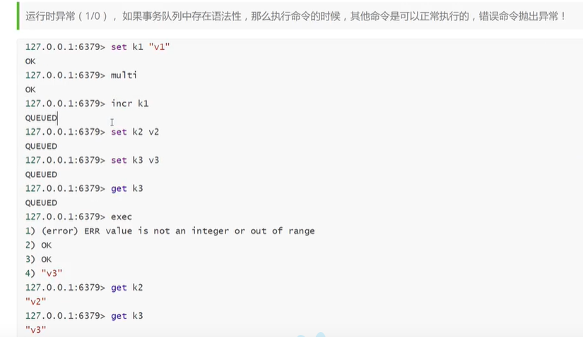
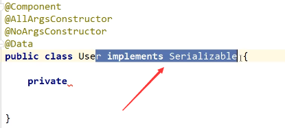
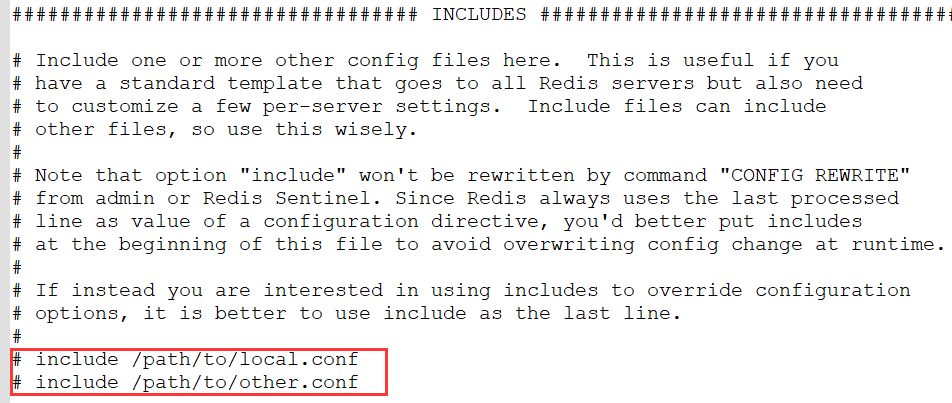
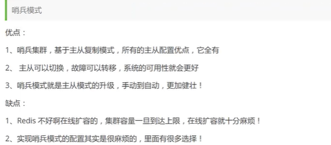

# NoSQL概述

## Mysql历史

1、一个服务器一个mysql 数据量不大

2、数据量大了之后，为了解决读写问题

​      读：缓存          写：分区，使用jdbc等连接多个数据库

3、分库分表、集群：

​      MyISAM：表锁，效率低

​      Innodb： 行锁

4、当前，个人位置，信息等实时更新，mysql等关系型数据卷不够用了。

​      数据量多，变化很快。

## NoSql

NoSQL = Not Only SQL 不仅仅是SQL

泛指非关系型数据库，

> 特点：
>
> - 方便拓展 （数据之间没有关系，很好扩展）
>
> - 大数据量高性能 （1s 写8w次，读11w次，是一种细粒度的缓存，性能会比较高
>
> - 数据类型多样
>
> - 传统RDBMS 和Nosql
>
>   RDBMS：结构化组织，SQL，表，数据定义语言，基础的事务，严格的一致性
>
>   Nosql：没有固定的查询语言，CAP和BASE （异地多活），高性能，

   

## alibaba


## NoSQL四大分类


# Redis入门

## 概述

> Redis是什么？

Redis（Remote Dictionary Server), 远程字典服务

是一个开源的使用ANSI C语言编写、支持网络、可基于内存亦可持久化的日志型、Key-Value数据库，并提供多种语言接口。 

Redis会周期性的把更新的数据写入磁盘或者把修改的操作写入追加的记录文件，并且在此基础上实现了master-slave（主从）同步。

免费和开源！当下最热门的NoSQL技术之一！也被称作结构化数据库

> Redis能干嘛？


> Redis特性：


> 学习：

1、狂神

2、官网：https://redis.io/

3、中文网：https://www.redis.cn/

4、下载地址：官网下载即可

​      Windows在Github上下载（停更很久，基于linux学习，不建议）


## Linux安装

现在最新稳定6.2.5

**1、下载安装配置**

```shell
# wget http://download.redis.io/releases/redis-6.0.8.tar.gz
# tar xzf redis-6.0.8.tar.gz
# cd redis-6.0.8
# make

# make install   #确认 ，使得/usr/local/bin下有
```

 


将redis.conf复制到/usr/local/bin/kconfig下

```shell
mkdir kconfig
cd kconfig
cp /home/keqi/redis/redis-6.2.5/redis.conf kredis.conf
```


更改为后台启动：no  ---> yes

 


**2、启动服务**

执行完 make 命令后，redis-6.0.8 的 src 目录下会出现编译后的 redis 服务程序 redis-server，还有用于测试的客户端程序 redis-cli：

下面启动 redis 服务：

```shell
# cd src
# ./redis-server
```

注意这种方式启动 redis 使用的是默认配置。也可以通过启动参数告诉 redis 使用指定配置文件使用下面命令启动。

```shell
# cd src
# ./redis-server ../redis.conf
```

**redis.conf** 是一个默认的配置文件。我们可以根据需要使用自己的配置文件。


 


启动 redis 服务进程后，就可以使用测试客户端程序 redis-cli 和 redis 服务交互了。 比如：

```shell
# cd src
# ./redis-cli
redis> set foo bar
OK
redis> get foo
"bar"
```


**3、关闭服务**


使用exit直接退出，只会关闭客户端，不会关闭服务器

```
shutdown    # 关闭服务器
exit        # 关闭客户端
```


## Redis-Benchmark性能测试

redis 性能测试工具可选参数如下所示：

| 序号 | 选项                      | 描述                                       | 默认值    |
| ---- | ------------------------- | ------------------------------------------ | --------- |
| 1    | **-h**                    | 指定服务器主机名                           | 127.0.0.1 |
| 2    | **-p**                    | 指定服务器端口                             | 6379      |
| 3    | **-s**                    | 指定服务器 socket                          |           |
| 4    | **-c**                    | 指定并发连接数                             | 50        |
| 5    | **-n**                    | 指定请求数                                 | 10000     |
| 6    | **-d**                    | 以字节的形式指定 SET/GET 值的数据大小      | 2         |
| 7    | **-k**                    | 1=keep alive 0=reconnect                   | 1         |
| 8    | **-r**                    | SET/GET/INCR 使用随机 key, SADD 使用随机值 |           |
| 9    | **-P**                    | 通过管道传输 <numreq> 请求                 | 1         |
| 10   | **-q**                    | 强制退出 redis。仅显示 query/sec 值        |           |
| 11   | **--csv**                 | 以 CSV 格式输出                            |           |
| 12   | ***-l\*（L 的小写字母）** | 生成循环，永久执行测试                     |           |
| 13   | **-t**                    | 仅运行以逗号分隔的测试命令列表。           |           |
| 14   | ***-I\*（i 的大写字母）** | Idle                                       |           |

```shell
# 测试100并发连接数 100000请求数
redis-benchmark -p 6379 -c 100 -n 100000
```


## 基础知识

```sh
# redis有16个数据库 默认使用的是第0个
# redis是单线程的：redis很快；官方表示，redis是基于内存操作，CPU不是Redis性能瓶颈，redis的瓶颈是根据机器的内存和网络带宽，既然可以使用单线程实现，就是用单线程了。


# 可以使用select n 切换数据库
# 可以使用dbsize 查看数据库数据量
# 可以使用keys *查看所有K
# flushdb   清空当前数据库
# flushall  清空全部数据库


[root@keqi bin]# redis-cli -p 6379
127.0.0.1:6379> keys *
1) "myhash"
2) "name"
3) "mylist"
4) "key:__rand_int__"
5) "counter:__rand_int__"
127.0.0.1:6379> get myhash
(error) WRONGTYPE Operation against a key holding the wrong kind of value
127.0.0.1:6379> get name
"keqi"
127.0.0.1:6379> dbsize
(integer) 5
127.0.0.1:6379> select 2
OK
127.0.0.1:6379[2]> select 1
OK
127.0.0.1:6379[1]> dbsize
(integer) 0
127.0.0.1:6379[1]> 

```

 

# 五大数据类型

## Redis-key

```shell
# 判断key为 name的是否存在，存在 返回1 不存在返回0
127.0.0.1:6379[1]> exists name
(integer) 1
127.0.0.1:6379[1]> exists name1
(integer) 0

# move key db   db 1 -- 0
# expire 设置过期时间
# ttl key  查看该数据剩余时间
127.0.0.1:6379[1]> move name 1
(error) ERR source and destination objects are the same
127.0.0.1:6379[1]> keys *
1) "name"
2) "age"
127.0.0.1:6379[1]> move age 2
(integer) 1
127.0.0.1:6379[1]> keys *
1) "name"
127.0.0.1:6379[1]> expire name 5
(integer) 1
127.0.0.1:6379[1]> ttl name
(integer) 3
127.0.0.1:6379[1]> ttl name
(integer) 1
127.0.0.1:6379[1]> keys *
(empty array)
127.0.0.1:6379[1]> 

# type keyname 获取key的类型
127.0.0.1:6379> type name
string

```


## String

| 1    | [SET key value](https://www.runoob.com/redis/strings-set.html)  设置指定 key 的值 |
| ---- | ------------------------------------------------------------ |
| 2    | [GET key](https://www.runoob.com/redis/strings-get.html)  获取指定 key 的值。 |
| 3    | [GETRANGE key start end](https://www.runoob.com/redis/strings-getrange.html)  返回 key 中字符串值的子字符 |
| 4    | [GETSET key value](https://www.runoob.com/redis/strings-getset.html) 将给定 key 的值设为 value ，并返回 key 的旧值(old value)。 |
| 5    | [GETBIT key offset](https://www.runoob.com/redis/strings-getbit.html) 对 key 所储存的字符串值，获取指定偏移量上的位(bit)。 |
| 6    | [MGET key1 [key2..\]](https://www.runoob.com/redis/strings-mget.html) 获取所有(一个或多个)给定 key 的值。 |
| 7    | [SETBIT key offset value](https://www.runoob.com/redis/strings-setbit.html) 对 key 所储存的字符串值，设置或清除指定偏移量上的位(bit)。 |
| 8    | [SETEX key seconds value](https://www.runoob.com/redis/strings-setex.html) 将值 value 关联到 key ，并将 key 的过期时间设为 seconds (以秒为单位)。 |
| 9    | [SETNX key value](https://www.runoob.com/redis/strings-setnx.html) 只有在 key 不存在时设置 key 的值。 |
| 10   | [SETRANGE key offset value](https://www.runoob.com/redis/strings-setrange.html) 用 value 参数覆写给定 key 所储存的字符串值，从偏移量 offset 开始。 |
| 11   | [STRLEN key](https://www.runoob.com/redis/strings-strlen.html) 返回 key 所储存的字符串值的长度。 |
| 12   | [MSET key value [key value ...\]](https://www.runoob.com/redis/strings-mset.html) 同时设置一个或多个 key-value 对。 |
| 13   | [MSETNX key value [key value ...\]](https://www.runoob.com/redis/strings-msetnx.html)  同时设置一个或多个 key-value 对，当且仅当所有给定 key 都不存在。 |
| 14   | [PSETEX key milliseconds value](https://www.runoob.com/redis/strings-psetex.html) 这个命令和 SETEX 命令相似，但它以毫秒为单位设置 key 的生存时间，而不是像 SETEX 命令那样，以秒为单位。 |
| 15   | [INCR key](https://www.runoob.com/redis/strings-incr.html) 将 key 中储存的数字值增一。 |
| 16   | [INCRBY key increment](https://www.runoob.com/redis/strings-incrby.html) 将 key 所储存的值加上给定的增量值（increment） 。 |
| 17   | [INCRBYFLOAT key increment](https://www.runoob.com/redis/strings-incrbyfloat.html) 将 key 所储存的值加上给定的浮点增量值（increment） 。 |
| 18   | [DECR key](https://www.runoob.com/redis/strings-decr.html) 将 key 中储存的数字值减一。 |
| 19   | [DECRBY key decrement](https://www.runoob.com/redis/strings-decrby.html)  key 所储存的值减去给定的减量值（decrement） 。 |
| 20   | [APPEND key value](https://www.runoob.com/redis/strings-append.html) 如果 key 已经存在并且是一个字符串， APPEND 命令将指定的 value 追加到该 key 原来值（value）的末尾。 |

## List

| 序号 | 命令及描述                                                   |
| ---- | ------------------------------------------------------------ |
| 1    | [BLPOP key1 [key2 \] timeout](https://www.runoob.com/redis/lists-blpop.html)  移出并获取列表的第一个元素， 如果列表没有元素会阻塞列表直到等待超时或发现可弹出元素为止。 |
| 2    | [BRPOP key1 [key2 \] timeout](https://www.runoob.com/redis/lists-brpop.html)  移出并获取列表的最后一个元素， 如果列表没有元素会阻塞列表直到等待超时或发现可弹出元素为止。 |
| 3    | [BRPOPLPUSH source destination timeout](https://www.runoob.com/redis/lists-brpoplpush.html)  从列表中弹出一个值，将弹出的元素插入到另外一个列表中并返回它； 如果列表没有元素会阻塞列表直到等待超时或发现可弹出元素为止。 |
| 4    | [LINDEX key index](https://www.runoob.com/redis/lists-lindex.html)  通过索引获取列表中的元素 |
| 5    | [LINSERT key BEFORE\|AFTER pivot value](https://www.runoob.com/redis/lists-linsert.html)  在列表的元素前或者后插入元素 |
| 6    | [LLEN key](https://www.runoob.com/redis/lists-llen.html)  获取列表长度 |
| 7    | [LPOP key](https://www.runoob.com/redis/lists-lpop.html)  移出并获取列表的第一个元素 |
| 8    | [LPUSH key value1 [value2\]](https://www.runoob.com/redis/lists-lpush.html)  将一个或多个值插入到列表头部 |
| 9    | [LPUSHX key value](https://www.runoob.com/redis/lists-lpushx.html)  将一个值插入到已存在的列表头部 |
| 10   | [LRANGE key start stop](https://www.runoob.com/redis/lists-lrange.html)  获取列表指定范围内的元素 |
| 11   | [LREM key count value](https://www.runoob.com/redis/lists-lrem.html)  移除列表元素 |
| 12   | [LSET key index value](https://www.runoob.com/redis/lists-lset.html)  通过索引设置列表元素的值 |
| 13   | [LTRIM key start stop](https://www.runoob.com/redis/lists-ltrim.html)  对一个列表进行修剪(trim)，就是说，让列表只保留指定区间内的元素，不在指定区间之内的元素都将被删除。 |
| 14   | [RPOP key](https://www.runoob.com/redis/lists-rpop.html)  移除列表的最后一个元素，返回值为移除的元素。 |
| 15   | [RPOPLPUSH source destination](https://www.runoob.com/redis/lists-rpoplpush.html)  移除列表的最后一个元素，并将该元素添加到另一个列表并返回 |
| 16   | [RPUSH key value1 [value2\]](https://www.runoob.com/redis/lists-rpush.html)  在列表中添加一个或多个值 |
| 17   | [RPUSHX key value](https://www.runoob.com/redis/lists-rpushx.html)  为已存在的列表添加值 |

## Set

**共同好友**   并集

| 序号 | 命令及描述                                                   |
| ---- | ------------------------------------------------------------ |
| 1    | [SADD key member1 [member2\]](https://www.runoob.com/redis/sets-sadd.html)  向集合添加一个或多个成员 |
| 2    | [SCARD key](https://www.runoob.com/redis/sets-scard.html)  获取集合的成员数 |
| 3    | [SDIFF key1 [key2\]](https://www.runoob.com/redis/sets-sdiff.html)  返回第一个集合与其他集合之间的差异。 |
| 4    | [SDIFFSTORE destination key1 [key2\]](https://www.runoob.com/redis/sets-sdiffstore.html)  返回给定所有集合的差集并存储在 destination 中 |
| 5    | [SINTER key1 [key2\]](https://www.runoob.com/redis/sets-sinter.html)  返回给定所有集合的交集 |
| 6    | [SINTERSTORE destination key1 [key2\]](https://www.runoob.com/redis/sets-sinterstore.html)  返回给定所有集合的交集并存储在 destination 中 |
| 7    | [SISMEMBER key member](https://www.runoob.com/redis/sets-sismember.html)  判断 member 元素是否是集合 key 的成员 |
| 8    | [SMEMBERS key](https://www.runoob.com/redis/sets-smembers.html)  返回集合中的所有成员 |
| 9    | [SMOVE source destination member](https://www.runoob.com/redis/sets-smove.html)  将 member 元素从 source 集合移动到 destination 集合 |
| 10   | [SPOP key](https://www.runoob.com/redis/sets-spop.html)  移除并返回集合中的一个随机元素 |
| 11   | [SRANDMEMBER key [count\]](https://www.runoob.com/redis/sets-srandmember.html)  返回集合中一个或多个随机数 |
| 12   | [SREM key member1 [member2\]](https://www.runoob.com/redis/sets-srem.html)  移除集合中一个或多个成员 |
| 13   | [SUNION key1 [key2\]](https://www.runoob.com/redis/sets-sunion.html)  返回所有给定集合的并集 |
| 14   | [SUNIONSTORE destination key1 [key2\]](https://www.runoob.com/redis/sets-sunionstore.html)  所有给定集合的并集存储在 destination 集合中 |
| 15   | [SSCAN key cursor [MATCH pattern\] [COUNT count]](https://www.runoob.com/redis/sets-sscan.html)  迭代集合中的元素 |

## Hash

| 序号 | 命令及描述                                                   |
| ---- | ------------------------------------------------------------ |
| 1    | [HDEL key field1 [field2\]](https://www.runoob.com/redis/hashes-hdel.html)  删除一个或多个哈希表字段 |
| 2    | [HEXISTS key field](https://www.runoob.com/redis/hashes-hexists.html)  查看哈希表 key 中，指定的字段是否存在。 |
| 3    | [HGET key field](https://www.runoob.com/redis/hashes-hget.html)  获取存储在哈希表中指定字段的值。 |
| 4    | [HGETALL key](https://www.runoob.com/redis/hashes-hgetall.html)  获取在哈希表中指定 key 的所有字段和值 |
| 5    | [HINCRBY key field increment](https://www.runoob.com/redis/hashes-hincrby.html)  为哈希表 key 中的指定字段的整数值加上增量 increment 。 |
| 6    | [HINCRBYFLOAT key field increment](https://www.runoob.com/redis/hashes-hincrbyfloat.html)  为哈希表 key 中的指定字段的浮点数值加上增量 increment 。 |
| 7    | [HKEYS key](https://www.runoob.com/redis/hashes-hkeys.html)  获取所有哈希表中的字段 |
| 8    | [HLEN key](https://www.runoob.com/redis/hashes-hlen.html)  获取哈希表中字段的数量 |
| 9    | [HMGET key field1 [field2\]](https://www.runoob.com/redis/hashes-hmget.html)  获取所有给定字段的值 |
| 10   | [HMSET key field1 value1 [field2 value2 \]](https://www.runoob.com/redis/hashes-hmset.html)  同时将多个 field-value (域-值)对设置到哈希表 key 中。 |
| 11   | [HSET key field value](https://www.runoob.com/redis/hashes-hset.html)  将哈希表 key 中的字段 field 的值设为 value 。 |
| 12   | [HSETNX key field value](https://www.runoob.com/redis/hashes-hsetnx.html)  只有在字段 field 不存在时，设置哈希表字段的值。 |
| 13   | [HVALS key](https://www.runoob.com/redis/hashes-hvals.html)  获取哈希表中所有值。 |
| 14   | [HSCAN key cursor [MATCH pattern\] [COUNT count]](https://www.runoob.com/redis/hashes-hscan.html)  迭代哈希表中的键值对。 |

## Zset 

**排行榜**

| 序号 | 命令及描述                                                   |
| ---- | ------------------------------------------------------------ |
| 1    | [ZADD key score1 member1 [score2 member2\]](https://www.runoob.com/redis/sorted-sets-zadd.html)  向有序集合添加一个或多个成员，或者更新已存在成员的分数 |
| 2    | [ZCARD key](https://www.runoob.com/redis/sorted-sets-zcard.html)  获取有序集合的成员数 |
| 3    | [ZCOUNT key min max](https://www.runoob.com/redis/sorted-sets-zcount.html)  计算在有序集合中指定区间分数的成员数 |
| 4    | [ZINCRBY key increment member](https://www.runoob.com/redis/sorted-sets-zincrby.html)  有序集合中对指定成员的分数加上增量 increment |
| 5    | [ZINTERSTORE destination numkeys key [key ...\]](https://www.runoob.com/redis/sorted-sets-zinterstore.html)  计算给定的一个或多个有序集的交集并将结果集存储在新的有序集合 destination 中 |
| 6    | [ZLEXCOUNT key min max](https://www.runoob.com/redis/sorted-sets-zlexcount.html)  在有序集合中计算指定字典区间内成员数量 |
| 7    | [ZRANGE key start stop [WITHSCORES\]](https://www.runoob.com/redis/sorted-sets-zrange.html)  通过索引区间返回有序集合指定区间内的成员 |
| 8    | [ZRANGEBYLEX key min max [LIMIT offset count\]](https://www.runoob.com/redis/sorted-sets-zrangebylex.html)  通过字典区间返回有序集合的成员 |
| 9    | [ZRANGEBYSCORE key min max [WITHSCORES\] [LIMIT]](https://www.runoob.com/redis/sorted-sets-zrangebyscore.html)  通过分数返回有序集合指定区间内的成员 |
| 10   | [ZRANK key member](https://www.runoob.com/redis/sorted-sets-zrank.html)  返回有序集合中指定成员的索引 |
| 11   | [ZREM key member [member ...\]](https://www.runoob.com/redis/sorted-sets-zrem.html)  移除有序集合中的一个或多个成员 |
| 12   | [ZREMRANGEBYLEX key min max](https://www.runoob.com/redis/sorted-sets-zremrangebylex.html)  移除有序集合中给定的字典区间的所有成员 |
| 13   | [ZREMRANGEBYRANK key start stop](https://www.runoob.com/redis/sorted-sets-zremrangebyrank.html)  移除有序集合中给定的排名区间的所有成员 |
| 14   | [ZREMRANGEBYSCORE key min max](https://www.runoob.com/redis/sorted-sets-zremrangebyscore.html)  移除有序集合中给定的分数区间的所有成员 |
| 15   | [ZREVRANGE key start stop [WITHSCORES\]](https://www.runoob.com/redis/sorted-sets-zrevrange.html)  返回有序集中指定区间内的成员，通过索引，分数从高到低 |
| 16   | [ZREVRANGEBYSCORE key max min [WITHSCORES\]](https://www.runoob.com/redis/sorted-sets-zrevrangebyscore.html)  返回有序集中指定分数区间内的成员，分数从高到低排序 |
| 17   | [ZREVRANK key member](https://www.runoob.com/redis/sorted-sets-zrevrank.html)  返回有序集合中指定成员的排名，有序集成员按分数值递减(从大到小)排序 |
| 18   | [ZSCORE key member](https://www.runoob.com/redis/sorted-sets-zscore.html)  返回有序集中，成员的分数值 |
| 19   | [ZUNIONSTORE destination numkeys key [key ...\]](https://www.runoob.com/redis/sorted-sets-zunionstore.html)  计算给定的一个或多个有序集的并集，并存储在新的 key 中 |
| 20   | [ZSCAN key cursor [MATCH pattern\] [COUNT count]](https://www.runoob.com/redis/sorted-sets-zscan.html)  迭代有序集合中的元素（包括元素成员和元素分值 |

# 三大特殊类型

## Geospatial地理位置

Redis GEO 主要用于存储地理位置信息，并对存储的信息进行操作，该功能在 Redis 3.2 版本新增。

Redis GEO 操作方法有：

- geoadd：添加地理位置的坐标。
- geopos：获取地理位置的坐标。
- geodist：计算两个位置之间的距离。
- georadius：根据用户给定的经纬度坐标来获取指定范围内的地理位置集合。
- georadiusbymember：根据储存在位置集合里面的某个地点获取指定范围内的地理位置集合。
- geohash：返回一个或多个位置对象的 geohash 值。


### georadius、georadiusbymember

georadius 以给定的经纬度为中心， 返回键包含的位置元素当中， 与中心的距离不超过给定最大距离的所有位置元素。

georadiusbymember 和 GEORADIUS 命令一样， 都可以找出位于指定范围内的元素， 但是 georadiusbymember 的中心点是由给定的位置元素决定的， 而不是使用经度和纬度来决定中心点。

参数说明：

- m  ：米，默认单位。
- km  ：千米。
- mi ：英里。
- ft ：英尺。
- WITHDIST: 在返回位置元素的同时， 将位置元素与中心之间的距离也一并返回。 
- WITHCOORD: 将位置元素的经度和维度也一并返回。
- WITHHASH: 以 52 位有符号整数的形式， 返回位置元素经过原始 geohash 编码的有序集合分值。 这个选项主要用于底层应用或者调试， 实际中的作用并不大。
- COUNT 限定返回的记录数。
- ASC: 查找结果根据距离从近到远排序。
- DESC: 查找结果根据从远到近排序。


底层是ZSet，

所以可以使用ZRANGE 查询，ZREM删除


## Hyperloglog基数统计

> 什么是基数？
>
> 空集的基数也记作0。于是有限集的基数也就是传统概念下的“个数”


PV：PV 是Page Views的缩写，即页面浏览量，用户每一次对网站中的每个网页访问均被记录一次。注意，访客每刷新一次页面，pv就增加一次。

UV：UV是Unique Visitor的缩写，即独立访客数。指访问某个站点的不同IP地址的人数。在同一天的00:00-24:00内，uv只记录第一次进入网站的具有独立IP的访问者，

在同一天内再次或多次访问该网站则不计数。

IP：一个独立IP访问网页，IP就增加一次，同一个IP多次访问该网站不计在内。

通过PV、UV和IP之间的数据对比关系，可以分析出一个站点的质量以及运营情况


下表列出了 redis HyperLogLog 的基本命令：

| 序号 | 命令及描述                                                   |
| ---- | ------------------------------------------------------------ |
| 1    | [PFADD key element [element ...\]](https://www.runoob.com/redis/hyperloglog-pfadd.html)  添加指定元素到 HyperLogLog 中。 |
| 2    | [PFCOUNT key [key ...\]](https://www.runoob.com/redis/hyperloglog-pfcount.html)  返回给定 HyperLogLog 的基数估算值。 |
| 3    | [PFMERGE destkey sourcekey [sourcekey ...\]](https://www.runoob.com/redis/hyperloglog-pfmerge.html)  将多个 HyperLogLog 合并为一个 HyperLogLog |

## Bitmap位图场景详解


三个命令：

``` bash
setbit sign 0 1
setbit sign 1 0 # sign key, 0 那天， 0 1 数据

getbit sign 0

bitcount sign  # 统计1，可以自己选择区间
```

# Redis事务


redis事务：

- 开始事务（multi)
- 命令入队（...）
- 执行事务（exec）

正常执行事务：


放弃事务：discard 





# Jedis


### 空项目

1、建立空项目

2、创建module--- 选择maven

### 连接远程redis

1、编写redis配置文件

```
# bind 127.0.0.1
# protect_mode no
```

2、开启服务器防火墙

```bash
firewall-cmd --query-ports
firewall-cmd reload
firewall-cmd --zone-public=6379/tcp --permanent
```

3、编写代码

**这里注意导包**

```java
public class TestPing {
    public static void main(String[] args) {
        Jedis jedis = new Jedis("1.116.141.79",6379);

        System.out.println(jedis.ping());
    }
}

```

```xml
<dependencies>
    <!-- https://mvnrepository.com/artifact/redis.clients/jedis -->
    <dependency>
        <groupId>redis.clients</groupId>
        <artifactId>jedis</artifactId>
        <version>3.2.0</version>
    </dependency>
    <dependency>
        <groupId>com.alibaba</groupId>
        <artifactId>fastjson</artifactId>
        <version>1.2.58</version>
    </dependency>

</dependencies>
```


### base类型检测

#### String

```java
package com.keqi.redis.base;

import redis.clients.jedis.Jedis;

import java.util.concurrent.TimeUnit;

public class TestString {
    public static void main(String[] args) {
        Jedis jedis = new Jedis("1.116.141.79", 6379);

        jedis.flushDB();
        System.out.println("----增加数据-----");
        System.out.println(jedis.set("key1", "value1"));
        System.out.println(jedis.set("key2","value2"));
        System.out.println(jedis.set("key3", "value3"));
        System.out.println("删除键key2:" + jedis.del("key2"));
        System.out.println("获取键key2:" + jedis.get("key2"));
        System.out.println("修改key1：" + jedis.set("key1", "change1"));
        System.out.println("获取key1：" + jedis.get("key1"));
        System.out.println("在key3后加入值：" + jedis.append("key3", "end"));
        System.out.println("key3:" + jedis.get("key3"));
        System.out.println("增加多个键值对:" + jedis.mset("key01", "value01", "key02", "value02"));
        System.out.println("获取多个键值对:" + jedis.mget("key01","key1"));
        System.out.println("删除多个键值对：" + jedis.del("key01","key02"));
        System.out.println("获取多个键值对：" + jedis.mget("key01", "key02"));


        jedis.flushDB();
        System.out.println("----- 新增键值对防止覆盖原先值------");
        System.out.println(jedis.setnx("key1", "value1"));
        System.out.println(jedis.setnx("key2", "value2"));
        System.out.println(jedis.setnx("key2", "vn"));
        System.out.println(jedis.get("key1"));
        System.out.println(jedis.get("key2"));

        System.out.println("----  新增键值对设置有效时间 ----");
        System.out.println(jedis.setex("key3", 2, "value3"));
        System.out.println(jedis.get("key3"));
        try {
            TimeUnit.SECONDS.sleep(3);
        } catch (InterruptedException e) {
            e.printStackTrace();
        }
        System.out.println(jedis.get("key3"));

        System.out.println("---- 获取原值，更新为新值 ----");
        System.out.println(jedis.getSet("key2", "key2GetSet"));
        System.out.println(jedis.get("key2"));

        System.out.println(jedis.getrange("key2",2, 4));
    }

}

```

#### List

```java
// sort 排序，并不会改变原本的list中的顺序
package com.keqi.redis.base;

import redis.clients.jedis.Jedis;

public class List {
    public static void main(String[] args) {
        Jedis jedis = new Jedis("1.116.141.79", 6379);

        jedis.flushDB();

        System.out.println("---- 添加一个List -----");
        System.out.println(jedis.lpush("collections", "ArrayList", "Vector", "Stack"));
        System.out.println(jedis.lpush("collections", "HashSet"));
        System.out.println(jedis.lpush("collections", "TreeSet"));
        System.out.println(jedis.lpush("collections", "TreeMap"));
        System.out.println(jedis.lrange("collections", 0, -1));
        System.out.println(jedis.lrange("collections", 0, 3));
        System.out.println(" ======================= ");
        // 删除列表指定的值 ，第二个参数为删除的个数（有重复时），后add进去的值先被删，类似于出栈
        System.out.println(jedis.lrem("collections", 2, "Stack"));
        System.out.println(jedis.lrange("collections", 0, -1));
        System.out.println(jedis.ltrim("collections", 0, 3));
        System.out.println(jedis.lrange("collections", 0, -1));
        System.out.println(jedis.lpop("collections"));
        System.out.println(jedis.lrange("collections", 0, -1));
        System.out.println(jedis.rpush("collections", "EnumMap"));
        System.out.println(jedis.lrange("collections", 0, -1));
        System.out.println(jedis.rpop("collections"));
        System.out.println(jedis.lrange("collections", 0, -1));
        System.out.println(jedis.lset("collections", 1, "LinkedAL"));
        System.out.println(jedis.lrange("collections", 0, -1));
        System.out.println("==========================");
        System.out.println(jedis.llen("collections"));
        System.out.println(jedis.lindex("collections", 2));
        System.out.println("=====================");
        System.out.println(jedis.lpush("sortedList", "3", "6", "2", "0"));
        System.out.println(jedis.lrange("sortedList", 0, -1));
        System.out.println(jedis.sort("sortedList"));
        System.out.println(jedis.lrange("sortedList", 0, -1));

    }
}

```

#### Set

```java
package com.keqi.redis.base;

import redis.clients.jedis.Jedis;

public class TestSet {
    public static void main(String[] args) {
        Jedis jedis = new Jedis("1.116.141.79", 6379);
        jedis.flushDB();
        System.out.println("============向集合中添加元素（不重复）============");
        System.out.println(jedis.sadd("eleSet", "e1","e2","e4","e3","e0","e8","e7","e5"));
        System.out.println(jedis.sadd("eleSet", "e6"));
        System.out.println(jedis.sadd("eleSet", "e6"));
        System.out.println("eleSet的所有元素为："+jedis.smembers("eleSet"));
        System.out.println("删除一个元素e0："+jedis.srem("eleSet", "e0"));
        System.out.println("eleSet的所有元素为："+jedis.smembers("eleSet"));
        System.out.println("删除两个元素e7和e6："+jedis.srem("eleSet", "e7","e6"));
        System.out.println("eleSet的所有元素为："+jedis.smembers("eleSet"));
        System.out.println("随机的移除集合中的一个元素："+jedis.spop("eleSet"));
        System.out.println("随机的移除集合中的一个元素："+jedis.spop("eleSet"));
        System.out.println("eleSet的所有元素为："+jedis.smembers("eleSet"));
        System.out.println("eleSet中包含元素的个数："+jedis.scard("eleSet"));
        System.out.println("e3是否在eleSet中："+jedis.sismember("eleSet", "e3"));
        System.out.println("e1是否在eleSet中："+jedis.sismember("eleSet", "e1"));
        System.out.println("e1是否在eleSet中："+jedis.sismember("eleSet", "e5"));
        System.out.println("=================================");
        System.out.println(jedis.sadd("eleSet1", "e1","e2","e4","e3","e0","e8","e7","e5"));
        System.out.println(jedis.sadd("eleSet2", "e1","e2","e4","e3","e0","e8"));
        System.out.println("将eleSet1中删除e1并存入eleSet3中："+jedis.smove("eleSet1", "eleSet3", "e1"));//移到集合元素
        System.out.println("将eleSet1中删除e2并存入eleSet3中："+jedis.smove("eleSet1", "eleSet3", "e2"));
        System.out.println("eleSet1中的元素："+jedis.smembers("eleSet1"));
        System.out.println("eleSet3中的元素："+jedis.smembers("eleSet3"));
        System.out.println("============集合运算=================");
        System.out.println("eleSet1中的元素："+jedis.smembers("eleSet1"));
        System.out.println("eleSet2中的元素："+jedis.smembers("eleSet2"));
        System.out.println("eleSet1和eleSet2的交集:"+jedis.sinter("eleSet1","eleSet2"));
        System.out.println("eleSet1和eleSet2的并集:"+jedis.sunion("eleSet1","eleSet2"));
        System.out.println("eleSet1和eleSet2的差集:"+jedis.sdiff("eleSet1","eleSet2"));//eleSet1中有，eleSet2中没有
        jedis.sinterstore("eleSet4","eleSet1","eleSet2");//求交集并将交集保存到dstkey的集合
        System.out.println("eleSet4中的元素："+jedis.smembers("eleSet4"));
    }
}
```

#### Hash

```java
package com.keqi.redis.base;

import redis.clients.jedis.Jedis;

import java.util.HashMap;
import java.util.Map;

public class TestHash {
    public static void main(String[] args) {
        Jedis jedis = new Jedis("1.116.141.79", 6379);
        jedis.flushDB();
        Map<String,String> map = new HashMap<String,String>();
        map.put("key1","value1");
        map.put("key2","value2");
        map.put("key3","value3");
        map.put("key4","value4");
        //添加名称为hash（key）的hash元素
        jedis.hmset("hash",map);
        //向名称为hash的hash中添加key为key5，value为value5元素
        jedis.hset("hash", "key5", "value5");
        System.out.println("散列hash的所有键值对为："+jedis.hgetAll("hash"));//return Map<String,String>
        System.out.println("散列hash的所有键为："+jedis.hkeys("hash"));//return Set<String>
        System.out.println("散列hash的所有值为："+jedis.hvals("hash"));//return List<String>
        System.out.println("将key6保存的值加上一个整数，如果key6不存在则添加key6："+jedis.hincrBy("hash", "key6", 6));
        System.out.println("散列hash的所有键值对为："+jedis.hgetAll("hash"));
        System.out.println("将key6保存的值加上一个整数，如果key6不存在则添加key6："+jedis.hincrBy("hash", "key6", 3));
        System.out.println("散列hash的所有键值对为："+jedis.hgetAll("hash"));
        System.out.println("删除一个或者多个键值对："+jedis.hdel("hash", "key2"));
        System.out.println("散列hash的所有键值对为："+jedis.hgetAll("hash"));
        System.out.println("散列hash中键值对的个数："+jedis.hlen("hash"));
        System.out.println("判断hash中是否存在key2："+jedis.hexists("hash","key2"));
        System.out.println("判断hash中是否存在key3："+jedis.hexists("hash","key3"));
        System.out.println("获取hash中的值："+jedis.hmget("hash","key3"));
        System.out.println("获取hash中的值："+jedis.hmget("hash","key3","key4"));
    }
}
```

### Multi 事务

```java
package com.keqi.redis.multi;

import com.alibaba.fastjson.JSONObject;
import redis.clients.jedis.Jedis;
import redis.clients.jedis.Transaction;

public class TestMulti {
    public static void main(String[] args) {
        //创建客户端连接服务端，redis服务端需要被开启
        Jedis jedis = new Jedis("1.116.141.79", 6379);
        jedis.flushDB();

        JSONObject jsonObject = new JSONObject();
        jsonObject.put("hello", "world");
        jsonObject.put("name", "java");
        //开启事务
        Transaction multi = jedis.multi();
        String result = jsonObject.toJSONString();
        try{
            //向redis存入一条数据
            multi.set("json", result);
            //再存入一条数据
            multi.set("json2", result);
            //这里引发了异常，用0作为被除数
            int i = 100/0;
            //如果没有引发异常，执行进入队列的命令
            multi.exec();
        }catch(Exception e){
            e.printStackTrace();
            //如果出现异常，回滚
            multi.discard();
        }finally{
            System.out.println(jedis.get("json"));
            System.out.println(jedis.get("json2"));
            //最终关闭客户端
            jedis.close();
        }
    }
}

```


# SpringBoot整合

 

### 测试：

1、创建模块，注意路径

2、依赖pom

```xml
  <dependencies>
        <dependency>
            <groupId>org.springframework.boot</groupId>
            <artifactId>spring-boot-starter-data-redis</artifactId>
        </dependency>
        <dependency>
            <groupId>org.springframework.boot</groupId>
            <artifactId>spring-boot-starter-web</artifactId>
        </dependency>
        <dependency>
            <groupId>org.springframework.experimental</groupId>
            <artifactId>spring-native</artifactId>
            <version>${spring-native.version}</version>
        </dependency>

        <dependency>
            <groupId>org.springframework.boot</groupId>
            <artifactId>spring-boot-devtools</artifactId>
            <scope>runtime</scope>
            <optional>true</optional>
        </dependency>
        <dependency>
            <groupId>org.springframework.boot</groupId>
            <artifactId>spring-boot-configuration-processor</artifactId>
            <optional>true</optional>
        </dependency>
        <dependency>
            <groupId>org.projectlombok</groupId>
            <artifactId>lombok</artifactId>
            <optional>true</optional>
        </dependency>
        <dependency>
            <groupId>org.springframework.boot</groupId>
            <artifactId>spring-boot-starter-test</artifactId>
            <scope>test</scope>
        </dependency>
    </dependencies>
```

3、配置properties

```properties
spring.redis.host=1.116.141.79
spring.redis.port=6379
```

4、代码

 

```java
RedisConnection connection = redisTemplate.getConnectionFactory().getConnection();
connection.flushAll();
connection.flushDb();
```

```java
package com.example.springboot_redis2;

import org.junit.jupiter.api.Test;
import org.springframework.beans.factory.annotation.Autowired;
import org.springframework.boot.test.context.SpringBootTest;
import org.springframework.data.redis.core.RedisTemplate;

@SpringBootTest
class SpringbootRedis2ApplicationTests {

    @Autowired
    private RedisTemplate<String, String> redisTemplate;

    @Test
    void contextLoads() {
        redisTemplate.opsForValue().set("k1", "在这");
        System.out.println(redisTemplate.opsForValue().get("k1"));
    }

}
```

### RedisTemplate模板

序列化：

 

没有序列化，报错：（使用上面的方法序列化也可以解决问题）

 


模板：

工具类：

redis文件目录下。


测试：

```java
package com.example.springboot_redis2;


import com.example.springboot_redis2.pojo.User;
import com.example.springboot_redis2.utils.RedisUtil;
import com.fasterxml.jackson.core.JsonProcessingException;
import com.fasterxml.jackson.databind.ObjectMapper;
import org.junit.jupiter.api.Test;
import org.springframework.beans.factory.annotation.Autowired;
import org.springframework.beans.factory.annotation.Qualifier;
import org.springframework.boot.test.context.SpringBootTest;
import org.springframework.data.redis.core.RedisTemplate;

@SpringBootTest
class SpringbootRedis2ApplicationTests {

    @Autowired
    @Qualifier("redisTemplate")
    private RedisTemplate redisTemplate;

    @Autowired
    private RedisUtil redisUtil;

    @Test
    void test1() {
        redisUtil.set("name", "test9");
        System.out.println(redisUtil.get("name"));
    }

    @Test
    void contextLoads() {
        redisTemplate.opsForValue().set("k1", "在这");
        System.out.println(redisTemplate.opsForValue().get("k1"));
    }

    @Test
    public void test() throws JsonProcessingException {
        // 导入springboot，
        User user = new User("keqi", 2);
//        String s = new ObjectMapper().writeValueAsString(user);
        redisTemplate.opsForValue().set("user", user);
        System.out.println(redisTemplate.opsForValue().get("user"));
    }

}

```


# Redis.conf详解

### 1、设置memory


### 2、包含其它配置文件



### 3、网络配置

需要接收来自其它pc的访问，关闭保护模式，注释bind

  

### 4、通用General

 

### 5、快照SNAPSHOTTING

持久化，在规定的时间内，执行了多少次操作，则会持久化到文件.rdb .aof

redis是内存数据库，如果没有持久化，那么数据断电就会消失

 

### 6、复制REPLICATION

### 7、安全SECURITY

reids默认没有密码，可以自己设置

```bash
# config set requirepass "pwd"
requirepass "pwd"
# auth "pwd"    先登录
```

### 8、clients 客户端

 

### 9、append only模式，aof配置

 


# Redis持久化

Redis是内存数据库，如果不能将内存中的数据库状态保存到磁盘，那么一旦服务器进程退出，那么数据就会丢失，因此，redis提供了持久化功能。


RDB （redis database）


redis会单独创建（fork）一个子进程进行持久化。主进程是不进行任何IO操作的。

RDB缺点：最后一次持久化的数据可能会丢失。

默认配置就是RDB，一般情况下不需要修改这个配置。

存储文件名：

  

配置： 

  

  


一般会对dump.rdb进行备份！！


AOF（Append Only File)

 

以日志的形式记录每个写操作，不记录读操作。只许追加，不可修改。

启动时会读取该文件重新构建数据。执行一次所有的写操作完成数据恢复。


配置：

 

修复：`redis-check-aof --fix`

 

 

# Redis发布订阅


| 序号 | 命令及描述                                                   |
| ---- | ------------------------------------------------------------ |
| 1    | [PSUBSCRIBE pattern [pattern ...\]](https://www.runoob.com/redis/pub-sub-psubscribe.html)  订阅一个或多个符合给定模式的频道。 |
| 2    | [PUBSUB subcommand [argument [argument ...\]]](https://www.runoob.com/redis/pub-sub-pubsub.html)  查看订阅与发布系统状态。 |
| 3    | [PUBLISH channel message](https://www.runoob.com/redis/pub-sub-publish.html)  将信息发送到指定的频道。 |
| 4    | [PUNSUBSCRIBE [pattern [pattern ...\]]](https://www.runoob.com/redis/pub-sub-punsubscribe.html)  退订所有给定模式的频道。 |
| 5    | [SUBSCRIBE channel [channel ...\]](https://www.runoob.com/redis/pub-sub-subscribe.html)  订阅给定的一个或多个频道的信息。 |
| 6    | [UNSUBSCRIBE [channel [channel ...\]]](https://www.runoob.com/redis/pub-sub-unsubscribe.html)  指退订给定的频道。 |


# Redis主从复制


**环境配置：**

只需要配置从库，不用配置主库。因为reids默认时主库。

`info replication` : 查看复制配置信息

修改配置：

 

## 一主两从

代码配置：

 

代码配置：暂时的。

文件配置：

 

主机有密码，还需配置密码。


测试：

   


 


另一种部署模型：也可以完成主从复制

 


 


## 哨兵模式

自动选取老大的模式

 

测试：

1、配置文件

2、启动redis-sentinel


 


哨兵配置：

```bash
# 很多配置

集群： 端口
监听： 监听主机
```


# Redis缓存穿透和雪崩


## 缓存穿透

同一时间，并发请求数据库的用户太多，造成mysql崩了，以至于整个服务崩溃。

eg：很多用户同时请求user 2，因为没有缓存，就会去请求mysql。

 


解决方法：

- 布隆过滤器：是一种数据结构，对所有可能查询的参数以hash形式存储，在控制层先校验，不符合则丢弃，从而避免对底层存储系统的查询压力。
- 缓存空对象：当存储层不命中后，即使返回的空对象也将其缓存起来，同时设置一个过期时间，之后再访问这个数据将会从缓存中获取，保护了后端数据源。
  - 空值过多，消耗空间
  - 设置了过期时间，这里就会有与存储层的数据有一段时间窗口不一致。


 ## 缓存击穿


## 缓存雪崩

 


 


 


