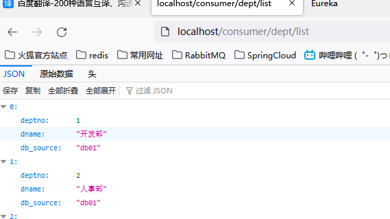

# SpringCloud

 

## 1 微服务和微服务架构

#### 1.微服务

 

#### 2.微服务与微服务架构

 

#### 3.微服务优缺点

 

 

#### 4.微服务技术栈有哪些

 

#### 5.为什么选择SpringCloud作为微服务架构

##### 1.选型依据

 

##### 2.当前各大IT公司使用的微服务架构有哪些？

 

##### 3.各微服务框架对比

 

 


```
微服务要解决那些问题？
	1. 服务很多，客户端怎么访问
	2. 服务之间如何通信？
	3. 如何治理服务？
	4. 服务挂了怎么办？如何保证高可用？

解决方案：
	SpringCloud生态 
	
	1. Spring Cloud NetFlix 一站式解决方案
	   api 网关，zuul组件   （实现客户端的访问）
	   Feign -- httpClient -- Http通信方式，同步，阻塞 （实现服务之间的通信）
	   服务注册发现： Eureka  （Zookeeper）
	   熔断机制： Hystrix
	
	2. Apache Dubbo Zookeeper 半自动，需要自己整合
	   API：没有，（自己实现或第三方组件）
	   Dubbo （rpc通信框架）
	   Zookeeper
	   没有：借助Hystrix
	   
	3. Spring Cloud Alibaba 一站式解决方案！更简单
```

## 2 SpringCloud入门概述

### 1.SpringCloud是什么

 

 

 

### 2.Springboot和Springcloud的关系

 


### 3. Dubbo和SpringCloud技术选型

#### 1.分布式+服务治理Dubbo

目前成熟的互联网架构：应用服务化拆分 + 消息中间件

 

#### 2.Dubbo和SpringCloud对比

 

 

 

### 4.SpringCloud能干啥

 

### 5. SpringCloud下载

版本号：

 SNATSHOP 快照版本，不建议使用  GA 通用稳定版本

 

 

## 3 环境搭建 -- Rest学习

### 1.maven父项目

1. 创建maven工程

2. 删除src文件

3. 编写pom文件 （管理作用）

   ```xml
   <?xml version="1.0" encoding="UTF-8"?>
   <project xmlns="http://maven.apache.org/POM/4.0.0"
            xmlns:xsi="http://www.w3.org/2001/XMLSchema-instance"
            xsi:schemaLocation="http://maven.apache.org/POM/4.0.0 http://maven.apache.org/xsd/maven-4.0.0.xsd">
       <modelVersion>4.0.0</modelVersion>
   
       <groupId>com.keqi</groupId>
       <artifactId>code</artifactId>
       <version>1.0-SNAPSHOT</version>
       <modules>
           <module>springcloud-api</module>
       </modules>
   
       <!-- 打包方式 pom -->
       <packaging>pom</packaging>
   
       <!-- 定义版本号  -->
       <properties>
           <project.build.sourceEncoding>UTF-8</project.build.sourceEncoding>
           <maven.compiler.target>8</maven.compiler.target>
           <maven.compiler.source>8</maven.compiler.source>
           <junit-version>4.13</junit-version>
           <lombok-version>1.18.20</lombok-version>
           <log4j-versin>1.2.17</log4j-versin>
       </properties>
   
       <!-- 父项目 -->
       <dependencyManagement>
           <dependencies>
               <!-- spring cloud 依赖 -->
               <!-- https://mvnrepository.com/artifact/org.springframework.cloud/spring-cloud-dependencies -->
               <dependency>
                   <groupId>org.springframework.cloud</groupId>
                   <artifactId>spring-cloud-dependencies</artifactId>
                   <version>Hoxton.SR8</version>
                   <type>pom</type>
                   <scope>import</scope>
               </dependency>
   
               <!-- spring boot 依赖 -->
               <dependency>
                   <groupId>org.springframework.boot</groupId>
                   <artifactId>spring-boot-dependencies</artifactId>
                   <version>2.5.2</version>
                   <type>pom</type>
                   <scope>import</scope>
               </dependency>
   
               <!-- 数据库 -->
               <dependency>
                   <groupId>mysql</groupId>
                   <artifactId>mysql-connector-java</artifactId>
                   <version>8.0.25</version>
               </dependency>
               <dependency>
                   <groupId>com.alibaba</groupId>
                   <artifactId>druid</artifactId>
                   <version>1.2.4</version>
               </dependency>
               <!-- SpringBoot 启动器-->
               <dependency>
                   <groupId>org.mybatis.spring.boot</groupId>
                   <artifactId>mybatis-spring-boot-starter</artifactId>
                   <version>2.1.4</version>
               </dependency>
   
               <!-- junit -->
               <dependency>
                   <groupId>junit</groupId>
                   <artifactId>junit</artifactId>
                   <version>${junit-version}</version>
               </dependency>
               <dependency>
                   <groupId>org.projectlombok</groupId>
                   <artifactId>lombok</artifactId>
                   <version>${lombok-version}</version>
               </dependency>
   
               <!-- log4j -->
               <dependency>
                   <groupId>log4j</groupId>
                   <artifactId>log4j</artifactId>
                   <version>${log4j-versin}</version>
               </dependency>
           </dependencies>
       </dependencyManagement>
   
       <!-- 可能需要build ， resource -->
   </project>
   ```

   

   > 三种文件的特点
   >
   > 　　1、pom是maven依赖文件
   >
   > 　　2、jar是java普通项目打包文件
   >
   > 　　3、war是javaweb项目打包文件
   >
   > 具体应用
   >
   > 　　1、pom打包方式可以作为其他项目的maven依赖，构建maven项目时可用在父级工程或者聚合工程中，用来做jar包的版本控制；
   >
   > 　　2、jar包通常是开发时需要应用的类，当需要某些功能时就导入相应的jar包,在构建maven时作为子类；
   >
   > 　　3、war包用来发布服务，打成war包后部署到服务器访问。

   

   

### 2.实体类api 创建

1. 创建子模块 （项目- 右键 - module）

   > 注意groupId，
   >
   > 这个时候父工程的依赖不会进来，如果要使用需要自己导入

2. 导入依赖

   >  

3. 创建数据库：

   >  

   ```mysql
   # 插入数据
   INSERT into dept (dname,db_source) VALUES ('人事部',DATABASE());
   INSERT into dept (dname,db_source) VALUES ('财务部',DATABASE());
   INSERT into dept (dname,db_source) VALUES ('运维部',DATABASE());
   INSERT into dept (dname,db_source) VALUES ('市场部',DATABASE());
   ```

4. 创建实体类（注意包名一致、序列化）：

   ```java
   # com.keqi.springcloud
   package com.keqi.springcloud.pojo;
   
   import lombok.AllArgsConstructor;
   import lombok.Data;
   import lombok.NoArgsConstructor;
   import lombok.experimental.Accessors;
   
   import java.io.Serializable;
   
   @Data
   @NoArgsConstructor
   //   @AllArgsConstructor   有有参构造了
   @Accessors(chain = true)   // 支持链式写法   new Dept().setDeptno(1).setDName("1")...
   public class Dept implements Serializable {
       // 实体类，     orm   类表关系映射，对象关系映射
   
       private Long deptno;
       private String dname;
   
       // 显示当前数据库名字的字段
       // 微服务，一个服务对应一个数据库，同一信息可能存在不同数据库
       private String db_source;
   
       public Dept(String dname) {
           this.dname = dname;
       }
   }
   
   ```

   

### 3.服务提供者

1. 新建服务提供模块（因为多个服务，带上服务开启的端口）

2. 添加依赖

   ```xml
       <dependencies>
           <!-- 首先要拿到实体类 -->
           <dependency>
               <groupId>com.keqi</groupId>
               <artifactId>springcloud-api</artifactId>
               <version>1.0-SNAPSHOT</version>
           </dependency>
   
           <dependency>
               <groupId>junit</groupId>
               <artifactId>junit</artifactId>
               <scope>test</scope>
           </dependency>
           <dependency>
               <groupId>mysql</groupId>
               <artifactId>mysql-connector-java</artifactId>
           </dependency>
   
           <dependency>
               <groupId>org.projectlombok</groupId>
               <artifactId>lombok</artifactId>
           </dependency>
   
           <dependency>
               <groupId>com.alibaba</groupId>
               <artifactId>druid</artifactId>
           </dependency>
           <dependency>
               <groupId>org.mybatis.spring.boot</groupId>
               <artifactId>mybatis-spring-boot-starter</artifactId>
           </dependency>
   
           <!-- test -->
           <dependency>
               <groupId>org.springframework.boot</groupId>
               <artifactId>spring-boot-test</artifactId>
           </dependency>
           <!-- web -->
           <dependency>
               <groupId>org.springframework.boot</groupId>
               <artifactId>spring-boot-starter-web</artifactId>
           </dependency>
           <!-- 热部署 -->
           <dependency>
               <groupId>org.springframework.boot</groupId>
               <artifactId>spring-boot-devtools</artifactId>
           </dependency>
   
           <!-- jetty 功能类似tomcat-->
           <dependency>
               <groupId>org.springframework.boot</groupId>
               <artifactId>spring-boot-starter-jetty</artifactId>
           </dependency>
   
       </dependencies>
   ```

3. yml配置

   ```yml
   server:
     port: 8001
   
   # 这里的classpath就是指向resources目录下的文件
   mybatis:
     type-aliases-package: com.keqi.springcloud.pojo
     # mybatis 核心配置
     config-location: classpath:mybatis/mybatis-config.xml
     # mapper 配置
     mapper-locations: classpath:mybatis/mapper/*.xml
   
   spring:
     application:
       # 项目名字
       name: springcloud-provider-dept
     datasource:
       type: com.alibaba.druid.pool.DruidDataSource
       driver-class-name: com.mysql.cj.jdbc.Driver
       url: jdbc:mysql://localhost:3306/db01?useUnicode=true$characterEncoding=utf-8&serverTimezone=Asia/shanghai
       username: root
       password: yiing123
   
   ```

   mybatis-config.xml

   ```xml
   <?xml version="1.0" encoding="UTF-8" ?>
   <!DOCTYPE configuration
           PUBLIC "-//mybatis.org//DTD Config 3.0//EN"
           "http://mybatis.org/dtd/mybatis-3-config.dtd">
   <configuration>
       <settings>
           <!-- 开启二级缓存 -->
           <setting name="cacheEnabled" value="true"/>
       </settings>
   </configuration>
   ```

4. 编写dao/mapper层、service层、controller层

   ```java
   package com.keqi.springcloud.controller;
   
   import com.keqi.springcloud.pojo.Dept;
   import com.keqi.springcloud.service.DeptService;
   import org.springframework.beans.factory.annotation.Autowired;
   import org.springframework.stereotype.Service;
   import org.springframework.web.bind.annotation.GetMapping;
   import org.springframework.web.bind.annotation.PathVariable;
   import org.springframework.web.bind.annotation.PostMapping;
   import org.springframework.web.bind.annotation.RestController;
   
   import java.util.List;
   
   // 提供RestFul服务
   @RestController
   public class DeptController {
   
       @Autowired
       private DeptService deptService;
   
       @PostMapping("/dept/add")
       public boolean addDept(Dept dept) {
           return deptService.addDept(dept);
       }
   
       @GetMapping("/dept/get/{id}")
       public Dept addDept(@PathVariable("id") Long id) {
           return deptService.queryById(id);
       }
   
       @GetMapping("/dept/list")
       public List<Dept> addDept() {
           return deptService.queryAll();
       }
   }
   
   ```

5. 编写启动类

   ```java
   package com.keqi.springcloud;
   
   import org.springframework.boot.SpringApplication;
   import org.springframework.boot.autoconfigure.SpringBootApplication;
   
   @SpringBootApplication
   public class DeptProvider_8001 {
       public static void main(String[] args) {
           SpringApplication.run(DeptProvider_8001.class, args);
       }
   }
   ```

   

   

### 4.服务消费者

1. 新module （服务，用户访问，一般都是80端口）

2. pom依赖

   ```xml
       <!-- 依赖 -->
       <dependencies>
           <dependency>
               <groupId>com.keqi</groupId>
               <artifactId>springcloud-api</artifactId>
               <version>1.0-SNAPSHOT</version>
           </dependency>
           <dependency>
               <groupId>org.springframework.boot</groupId>
               <artifactId>spring-boot-starter-web</artifactId>
           </dependency>
           <dependency>
               <groupId>org.springframework.boot</groupId>
               <artifactId>spring-boot-devtools</artifactId>
           </dependency>
       </dependencies>
   ```

3. yml:  

   ```yml
   server:
     port: 80
   ```

4. consumercontroller

   ```java
   package com.keqi.springcloud.controller;
   
   import com.keqi.springcloud.pojo.Dept;
   import org.springframework.beans.factory.annotation.Autowired;
   import org.springframework.web.bind.annotation.PathVariable;
   import org.springframework.web.bind.annotation.RequestMapping;
   import org.springframework.web.bind.annotation.RestController;
   import org.springframework.web.client.RestTemplate;
   
   import java.util.List;
   
   @RestController
   public class DeptConsumerController {
       // 消费者不应该有service层
       // RestFul    RestTemplate 直接调用
   
       // (url, 实体： Map , Class<T> responseType)
       @Autowired
       private RestTemplate restTemplate;  // 提供多种便捷访问远程http服务的方法，简单的restful服务模板。 get/post
   
       private static final String REST_FUL_PREFIX = "http://localhost:8001";
   
       @RequestMapping("/consumer/dept/get/{id}")
       public Dept get(@PathVariable("id") Long id) {
           // 第一个参数url，指向服务提供者
           // 第二个参数，为访问需要提供的参数
           // 第三个参数，为返回值 -- 参数即返回值
           return restTemplate.getForObject(REST_FUL_PREFIX + "/dept/get/" + id, Dept.class);
       }
   
       @RequestMapping("/consumer/dept/add")
       public boolean add(Dept dept) {
           return restTemplate.postForObject(REST_FUL_PREFIX + "/dept/add", dept, Boolean.class);
       }
   
       @RequestMapping("/consumer/dept/list")
       public List<Dept> list() {
           return restTemplate.getForObject(REST_FUL_PREFIX + "/dept/list",List.class);
       }
   
   }
   
   ```

5. 配置类

   ```java
   package com.keqi.springcloud.config;
   
   import org.springframework.context.annotation.Bean;
   import org.springframework.context.annotation.Configuration;
   import org.springframework.web.client.RestTemplate;
   
   @Configuration
   public class MyRestTemplateConfig {
   
       @Bean
       public RestTemplate restTemplate() {
           return new RestTemplate();
       }
   }
   
   ```

   

## 4 Eureka服务注册与发现

 

### 1.什么是Eureka

 

### 2.原理

 

  

 

### 3.服务端

1. pom依赖(注意版本问题boot-cloud)

   `https://docs.spring.io/spring-cloud/docs/Hoxton.SR8/reference/html/`

2. yml配置

   ```yml
   server:
     port: 7001
   
   # Eureka配置
   eureka:
     instance:
       hostname: localhost #Eureka服务端的实例名称
     client:
       register-with-eureka: false #表示是否向eureka中心注册自己，（服务器不注册，本身就是中心）
       fetch-registry: false #false 表示自己为注册中心
       service-url: # 监控页面
         defaultZone: http://${eureka.instance.hostname}:${server.port}/eureka/
   ```

3. 主启动类

   ```java
   package com.keqi.springcloud;
   
   import org.springframework.boot.SpringApplication;
   import org.springframework.boot.autoconfigure.SpringBootApplication;
   import org.springframework.cloud.netflix.eureka.server.EnableEurekaServer;
   
   @SpringBootApplication
   @EnableEurekaServer // 服务端的启动类，可以接收别人注册
   public class EurekaServer_7001 {
       public static void main(String[] args) {
           SpringApplication.run(EurekaServer_7001.class,args);
       }
   }
   
   ```

4. 访问测试

    

### 4.服务注册、信息配置、自我保护机制

#### 1、服务注册

1. 导包

   ```xml
   <dependency>
       <groupId>org.springframework.cloud</groupId>
       <artifactId>spring-cloud-starter-netflix-eureka-client</artifactId>
       <version>2.2.5.RELEASE</version>
   </dependency>
   ```

   

2. 配置eureka客户端 yml

   ```yml
   #Eureka,服务注册到哪里
   eureka:
     client:
       service-url:
         defaultZone: http://localhost:7001/eureka/
     instance:
       # 修改eureka上的默认显示信息
       instance-id: springcloud-provider-dept8001
   ```

   

3. 配置主启动类

   ```java
   package com.keqi.springcloud;
   
   import org.springframework.boot.SpringApplication;
   import org.springframework.boot.autoconfigure.SpringBootApplication;
   import org.springframework.cloud.netflix.eureka.EnableEurekaClient;
   
   @SpringBootApplication
   @EnableEurekaClient  // 自动注册到eureka中
   public class DeptProvider_8001 {
       public static void main(String[] args) {
           SpringApplication.run(DeptProvider_8001.class, args);
       }
   }
   
   ```

   

#### 2、信息配置

1. pom依赖

   ```xml
   <!--actuator-->
   <dependency>
       <groupId>org.springframework.boot</groupId>
       <artifactId>spring-boot-starter-actuator</artifactId>
       <version>2.3.3.RELEASE</version>
   </dependency>
   ```

2. 配置yml

   ```yml
   # info 配置
   info:
     app.name: com.keqi
     company.name: hb
   ```

>    这时就可以在http://desktop-es7h7db:8001/actuator/info访问到配置的信息


**服务发现**：

1. controller

   ```java
   
   @Autowired
   private DiscoveryClient client;
   
   @GetMapping("/dept/discovery")
   public Object discover() {
       List<String> services = client.getServices();
       System.out.println("发现的服务列表：" + services);
   
       List<ServiceInstance> instances = client.getInstances("SPRINGCLOUD-PROVIDER-DEPT");
       for (ServiceInstance instance:instances) {
           System.out.println(
               instance.getHost() + "\t" +
               instance.getPort() + "\t" +
               instance.getUri() + "\t" +
               instance.getServiceId()
           );
       }
       return client;
   }
   ```

   

2. 配置主启动类

   `@EnableDiscoveryClient // 服务发现`

#### 3、自我保护

 

 

### 5.Eureka集群

1. 创建三个eureka注册中心 （server）

   > maven项目--复制pom依赖--复制yml配置--复制启动类---测试新开的端口能否访问

2. 集群配置

   - 模拟不同ip （`C:\Windows\System32\drivers\etc\hosts`）

      

   - 配置yml-- server

     ```yml
     # 单机： defaultZone: http://${eureka.instance.hostname}:${server.port}/eureka/
     # 集群（关联）：
     defaultZone: http://eureka7002.com:7002/eureka/,http://eureka7003.com:7003/eureka/
     ```

   - 配置yml -- 服务提供者

     ```yml
     #Eureka,服务注册到哪里
     eureka:
       client:
         service-url:
           defaultZone: http://eureka7001.com:7001/eureka/,http://eureka7002.com:7002/eureka/,http://eureka7003.com:7003/eureka/
       instance:
         # 修改eureka上的默认显示信息
         instance-id: springcloud-provider-dept8001
     ```

3. 测试

  

### 6.对比Zookeeper

 

 

 

**这里描述的时eureka。**

 

 

### 7.隐藏localhost

 

```yml
#Eureka,服务注册到哪里
eureka:
  client:
    service-url:
      defaultZone: http://eureka7001.com:7001/eureka/,http://eureka7002.com:7002/eureka/,http://eureka7003.com:7003/eureka/
  instance:
    # 修改eureka上的默认显示信息
    instance-id: springcloud-provider-hystrix-dept8001
    prefer-ip-address: true # 将localhost改为 ip地址
```


## 5 Ribbon负载均衡

### 1.ribbon是什么

 

### 2.ribbon能干嘛

 

### 3.客户端开启ribbon

> 这里只有一个数据库，一个服务提供者，
>
> 所以无论怎么均衡，都只使用8001提供的服务

1. 依赖

   ```xml
   <dependency>
       <groupId>org.springframework.cloud</groupId>
       <artifactId>spring-cloud-starter-netflix-ribbon</artifactId>
       <version>2.2.5.RELEASE</version>
   </dependency>
   <!--要从eureka中发现服务-->
   <dependency>
       <groupId>org.springframework.cloud</groupId>
       <artifactId>spring-cloud-starter-netflix-eureka-client</artifactId>
       <version>2.2.5.RELEASE</version>
   </dependency>
   ```

2. yml配置

   ```yml
   eureka:
     client:
       register-with-eureka: false
       service-url:
         defaultZone: http://eureka7001.com:7001/eureka/,http://eureka7002.com:7002/eureka/,http://eureka7003.com:7003/eureka/
         
   ```

3. 主启动类--启动eureka

   `@EnableEurekaClient`

4. 添加负载均衡config

   ```java
   // 客户端通过restTemplate访问某个server中的ip
   
   @Configuration
   public class MyRestTemplateConfig {
   
       @Bean
       @LoadBalanced
       public RestTemplate restTemplate() {
           return new RestTemplate();
       }
   }
   ```

5. controller更改

   ```java
   //    private static final String REST_FUL_PREFIX = "http://localhost:8001";
   // 这里不应该是通过固定ip访问了，（应该是一个变量），而是通过服务名字访问
   private static final String REST_FUL_PREFIX = "http://SPRINGCLOUD-PROVIDER-DEPT";
   ```

6. 测试

    

> 配置好eureka和ribbon之后，客户端不再关系ip和port

### 4.ribbon实现负载均衡

**消费者也会注册自己？？？？**

 

1. 创建数据库db02、db03

2. 创建服务提供者8002、8003 -- 三个服务名字需要一致

3. 测试

    

    

### 5.自定义负载均衡算法

 #### 1.了解源码

**轮询源码：**

 

负载均衡算法：

 


#### 2.更改默认算法

默认算法：轮询

**更改默认算法：**

```java
/**
 * @desc 自定义负载均衡策略(用于替换默认的RoundRobinRule轮询策略)
 */
@Configuration
public class MyLoadBalanceRule {

  /**
   * @desc 自定义负载均衡规则，默认是轮询规则
   * @return
   */
  @Bean
  public IRule myRule(){
    return new RandomRule(); // 改为随机算法规则
  }

}
```

#### 3.使用ribbon（*）

 

 

 #### 4.自定义算法

 

## 6 Feign

`停更`

### 1.简介

 

 

### 2.Feign使用

> 消费者、客户端实现负载均衡

1. api中增加service

   > feign依赖 -- 注入容器
   >
   > ```java
   > package com.keqi.springcloud.service;
   > 
   > 
   > import com.keqi.springcloud.pojo.Dept;
   > import org.springframework.cloud.openfeign.FeignClient;
   > import org.springframework.stereotype.Component;
   > import org.springframework.web.bind.annotation.GetMapping;
   > import org.springframework.web.bind.annotation.PathVariable;
   > import org.springframework.web.bind.annotation.PostMapping;
   > 
   > import java.util.List;
   > 
   > @Component
   > @FeignClient(value = "SPRINGCLOUD-PROVIDER-DEPT")
   > public interface DeptClientService {
   > 
   >     @GetMapping("/dept/list")
   >     public List<Dept> queryAll();
   > 
   >     @GetMapping("/dept/get/{id}")
   >     public Dept queryById(@PathVariable("id") Long id);
   > 
   >     @PostMapping("/dept/add")
   >     public void addDept(Dept dept);
   > }
   > ```

2. 创建新module--feign

   - 依赖  --附上ribbon依赖--

   - yml配置  --向注册中心注册

   - 启动类 -- feign的扫描包，eureka客户端的配置

   - IRule配置 -- 配置负载均衡策略

   - controller 

     ```java
     package com.keqi.springcloud.controller;
     
     import com.keqi.springcloud.pojo.Dept;
     import com.keqi.springcloud.service.DeptClientService;
     import org.springframework.beans.factory.annotation.Autowired;
     import org.springframework.web.bind.annotation.GetMapping;
     import org.springframework.web.bind.annotation.PathVariable;
     import org.springframework.web.bind.annotation.RequestMapping;
     import org.springframework.web.bind.annotation.RestController;
     
     import java.util.List;
     
     @RestController
     public class DeptController {
     
         @Autowired
         private DeptClientService service;
     
         @RequestMapping("/consumer/dept/add")
         public boolean addDept(Dept dept) {
             return service.addDept(dept);
         }
     
         @RequestMapping("/consumer/dept/get/{id}")
         public Dept get(@PathVariable("id") Long id) {
             return service.queryById(id);
         }
     
         @RequestMapping("/consumer/dept/list")
         public List<Dept> list() {
             return service.queryAll();
         }
     }
     ```

3. 测试（轮询策略）

    

## 7 Hystrix

 

 


### 1.服务熔断

 ####  1、是什么


#### 2、开启服务熔断

1. 创建普通的服务提供者

2. 添加依赖

   ```xml
   <!-- https://mvnrepository.com/artifact/org.springframework.cloud/spring-cloud-starter-netflix-hystrix -->
   <dependency>
       <groupId>org.springframework.cloud</groupId>
       <artifactId>spring-cloud-starter-netflix-hystrix</artifactId>
       <version>2.2.5.RELEASE</version>
   </dependency>
   ```

3. 添加yml配置

   > 更改instance-id

4. 编写controller

   ```java
   package java.com.keqi.springcloud.controller;
   
   import com.keqi.springcloud.pojo.Dept;
   
   import com.netflix.hystrix.contrib.javanica.annotation.HystrixCommand;
   import org.springframework.beans.factory.annotation.Autowired;
   import org.springframework.cloud.client.ServiceInstance;
   import org.springframework.cloud.client.discovery.DiscoveryClient;
   import org.springframework.web.bind.annotation.GetMapping;
   import org.springframework.web.bind.annotation.PathVariable;
   import org.springframework.web.bind.annotation.PostMapping;
   import org.springframework.web.bind.annotation.RestController;
   
   import java.com.keqi.springcloud.service.DeptService;
   import java.util.List;
   
   // 提供RestFul服务
   @RestController
   public class DeptController {
   
       @Autowired
       private DeptService deptService;
   
   
       @GetMapping("/dept/get/{id}")
       @HystrixCommand(fallbackMethod = "hystrixGet")
       public Dept addDept(@PathVariable("id") Long id) {
           // 1
           // id为空，就会返回null -- 没有这个id的情况
           // return deptService.queryById(id);
   
           // 2
           Dept dept = deptService.queryById(id);
           if (dept == null) {
               throw new RuntimeException("id>=" + id + "不存在，信息没有找到");
           }
           return dept;
       }
   
       // 3 熔断版
       public Dept hystrixGet(@PathVariable("id") Long id) {
           return new Dept().setDeptno(id).setDname("id>=" + id + "不存在，信息没有找到(hystrix)");
       }
   
   
   }
   
   ```

5. 主启动类开启熔断

   `@EnableCircuitBreaker // 添加对熔断的支持   CircuitBreaker断路器`

6. 测试

     

### 2.服务降级

 

> 客户端 降级
>
> 使用的是feign中的hystrix 

1. springcloud-api中添加实现类

     

2. DeptClientService配置fallback

   `@FeignClient(value = "SPRINGCLOUD-PROVIDER-DEPT",fallbackFactory = DeptClientServiceFallbackFactory.class)`

3. 编写实现类

   ```java
   package com.keqi.springcloud.service;
   
   import com.keqi.springcloud.pojo.Dept;
   import feign.hystrix.FallbackFactory;
   import org.springframework.stereotype.Component;
   
   import java.util.List;
   
   @Component
   public class DeptClientServiceFallbackFactory implements FallbackFactory {
       @Override
       public DeptClientService create(Throwable throwable) {
           return new DeptClientService() {
               @Override
               public List<Dept> queryAll() {
                   return null;
               }
   
               @Override
               public Dept queryById(Long id) {
                   return new Dept()
                           .setDeptno(id)
                           .setDname("客户端提供了服务降级，服务已经被关闭了")
                           .setDb_source("没有数据");
               }
   
               @Override
               public boolean addDept(Dept dept) {
                   return false;
               }
           };
       }
   }
   
   ```

4. 配置yml

    

5. 测试

    

 

> 默认时间延迟1s，启动降级
>
> 未解决！！！！

 


### 3.Dashboard流量监控

> 客户端的监控插件

1. 创建dashboard模块

2. 依赖

   ```xml
   <dependency>
       <groupId>org.springframework.cloud</groupId>
       <artifactId>spring-cloud-starter-netflix-hystrix</artifactId>
       <version>2.2.5.RELEASE</version>
   </dependency>
   
   <dependency>
       <groupId>org.springframework.cloud</groupId>
       <artifactId>spring-cloud-starter-netflix-hystrix-dashboard</artifactId>
       <version>2.2.5.RELEASE</version>
   </dependency>
   ```

3. 启动类

   `@EnableHystrixDashboard // 开启监控`

4. 保证服务提供者有依赖

   ```xml
   <!--actuator-->
   <dependency>
       <groupId>org.springframework.boot</groupId>
       <artifactId>spring-boot-starter-actuator</artifactId>
       <version>2.3.3.RELEASE</version>
   </dependency>
   ```

5. 测试

    `localhost:9001/hystrix`

服务提供者配置：

1. pom依赖

   ```xml
   <dependency>
       <groupId>org.springframework.cloud</groupId>
       <artifactId>spring-cloud-starter-netflix-hystrix</artifactId>
       <version>2.2.5.RELEASE</version>
   </dependency>
   ```

2. 主启动类配置servlet

   ```java
   // 增加一个servlet，配置一个dashboard监控页面
   @Bean
   public ServletRegistrationBean hystrixMetricsStreamServlet() {
       ServletRegistrationBean servletRegistrationBean = new ServletRegistrationBean(new HystrixMetricsStreamServlet());
       servletRegistrationBean.addUrlMappings("/actuator/hystrix.stream");
       return servletRegistrationBean;
   
   }
   ```

> 结果：普通的8001访问不到，改用hystrix_8001
>
> ```yml
> # dashboard增加配置
> hystrix:
>   dashboard:
>     proxy-stream-allow-list: "localhost"
> ```
>
>  
>
> 


## 8 Zuul路由管理

### 1.概述

 

### 2.使用

1. 依赖

   ```xml
   <!-- https://mvnrepository.com/artifact/org.springframework.cloud/spring-cloud-starter-netflix-zuul -->
   <dependency>
       <groupId>org.springframework.cloud</groupId>
       <artifactId>spring-cloud-starter-netflix-zuul</artifactId>
       <version>2.2.5.RELEASE</version>
   </dependency>
   ```

2. 配置yml

   ```yml
   server:
     port: 9527
   
   spring:
     application:
       name: springcloud-zuul
   
   eureka:
     client:
       service-url:
         defaultZone: http://eureka7001.com:7001/eureka,http://eureka7002.com:7002/eureka,http://eureka7003.com:7003/eureka
         
     instance:
       # 修改eureka上的默认显示信息
       instance-id: springcloud-zuul
       prefer-ip-address: true
   info:
     app.name: keqi
   ```

3. 配置主启动类

   `@EnableZuulProxy`

4. 测试-- 访问路径要小写服务名字

    

### 3.zuul配置

yml：

```yml
zuul:
  routes:
    mydept.serviceId: springcloud-provider-dept
    mydept.path: /mydept/**  #设置访问path，
  ignored-services: springcloud-provider-dept # 关闭从这里来的访问  # "*" 忽略全部
  #prefix: # 前缀，访问时路径都要加上这个前缀
```

